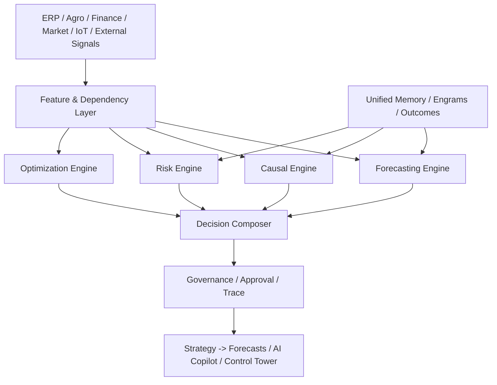

# HLD: Decision Intelligence Layer and `data_scientist`

## 1. Назначение

RAI не должен строить "витрину прогнозов". Целевой слой системы - это `Decision Intelligence`: контур, который оценивает будущее, объясняет факторы, моделирует эффект действий, оптимизирует план и показывает риск.

Архитектурный вывод:
- `data_scientist` не является только агентом ML-предсказаний.
- `data_scientist` является гибридом `Data Scientist + Operations Research Analyst + Decision Analyst`.
- одна модель не может считаться канонической для всех бизнес-задач.

## 2. Архитектурные принципы

### 2.1. No False Determinism

Система не должна выдавать ложную определенность.

Любой high-impact прогноз должен содержать:
- базовый прогноз
- диапазон неопределенности
- ключевые драйверы
- ограничения модели
- условия, при которых прогноз теряет силу

### 2.2. Predictive + Causal + Prescriptive

Decision Intelligence состоит из пяти контуров:
- `Forecasting`: что вероятнее всего произойдет
- `Causal`: что изменится, если предпринять действие
- `Optimization`: какой план лучший при ограничениях
- `Risk`: насколько опасны хвостовые сценарии
- `Memory`: что уже работало или проваливалось в аналогичных условиях

### 2.3. Human Control for High-Impact Paths

Если рекомендация влияет на деньги, обязательства, продажу урожая, закупки, критические агрономические действия или exposure к риску, финальное решение остается за человеком.

### 2.4. Champion/Challenger by Default

Нельзя строить критический decision layer на одной "лучшей" модели.
Обязательны:
- `champion/challenger`
- backtesting
- calibration checks
- drift monitoring
- decision-value evaluation

## 3. Роль `data_scientist`

`data_scientist` в RAI отвечает за:
- постановку аналитической задачи в терминах бизнеса
- выбор класса моделей под тип решения
- оценку неопределенности
- моделирование эффекта действий
- оптимизацию при ограничениях
- валидацию качества решения по факту
- накопление знаний о сработавших и провалившихся сценариях

`data_scientist` не должен:
- подменять бухгалтерию и ERP-источники "умной догадкой"
- выдавать single-point answer без confidence/range
- принимать write-decision без governance и approval

## 4. Методы по классам задач

### 4.1. Forecasting

Подходит для:
- спроса
- выручки
- затрат
- cash flow
- урожайности
- цен
- supply-demand imbalance

Основные классы методов:
- probabilistic time series
- hierarchical forecasting
- state-space models
- quantile and distributional models
- global/local ensembles

### 4.2. Causal and Intervention Analysis

Подходит для вопросов вида "что будет, если мы изменим X":
- цену
- норму внесения
- график операций
- маршрут логистики
- лимит бюджета
- структуру портфеля

Основные классы методов:
- causal inference
- uplift modeling
- difference-in-differences
- synthetic control
- causal forests
- Bayesian structural time series

### 4.3. Optimization

Подходит для выбора лучшего плана при ограничениях:
- бюджет
- техника
- персонал
- сроки
- мощности
- нормативные ограничения
- риск-лимиты

Основные классы методов:
- linear programming
- mixed-integer programming
- stochastic programming
- robust optimization
- network optimization

### 4.4. Sequential Control

Подходит для задач, где есть состояние и цепочка действий во времени:
- жизненный цикл клиента
- риск дебиторки
- состояние оборудования
- динамика отклонений по полю
- многошаговое сезонное управление

Основные классы методов:
- Markov chains
- MDP / POMDP
- constrained reinforcement learning

Примечание:
- цепи Маркова являются одним из инструментов.
- цепи Маркова не являются базовой универсальной моделью всей платформы.

### 4.5. Risk Simulation

Подходит для stress-test и downside control:
- tail risk
- liquidity stress
- crop failure scenarios
- supply disruption
- bad weather exposure

Основные классы методов:
- Monte Carlo simulation
- scenario stress testing
- survival and hazard models
- anomaly detection
- CVaR / expected shortfall

## 5. Матрица доменов

| Домен | Основной вопрос | Методы |
| --- | --- | --- |
| Агрономия | Что будет с урожайностью и риском поля | Probabilistic forecast, causal, simulation |
| Экономика | Что будет с unit economics и маржой | Forecast, causal, optimization |
| Финансы | Что будет с cash flow, exposure, платежами | Forecast, risk, stochastic optimization |
| Стратегия | Какие портфельные решения лучше | Scenario analysis, optimization, simulation |
| Логистика/операции | Как распределить ресурсы и графики | Network optimization, scheduling, MIP |
| Риски | Где downside и что нас ломает | Stress test, EVT, CVaR, anomaly models |

## 6. Компоненты архитектуры



### 6.1. Feature and Dependency Layer

Назначение:
- сбор сигналов из доменов
- вычисление признаков
- явная фиксация зависимостей между бизнес-факторами

Требования:
- tenant isolation
- versioned feature definitions
- reproducible snapshot for every forecast run

### 6.2. Forecasting Engine

Назначение:
- baseline and probabilistic forecasts
- multi-horizon planning
- hierarchy reconciliation

### 6.3. Causal Engine

Назначение:
- оценка эффекта управленческого воздействия
- support для counterfactual analysis

### 6.4. Optimization Engine

Назначение:
- выбор плана при ограничениях
- возврат не только "best plan", но и violated constraints / tradeoffs

### 6.5. Risk Engine

Назначение:
- downside analysis
- stress scenarios
- sensitivity analysis

### 6.6. Decision Composer

Назначение:
- собрать итоговый вывод для продукта
- нормализовать выходы движков в единый response contract

Единый output обязан содержать:
- `baseline`
- `range`
- `drivers`
- `recommendedAction`
- `expectedUpside`
- `expectedDownside`
- `constraints`
- `evidence`

## 7. Интеграция с памятью

Память используется не как "декор", а как рабочий источник сигналов:
- episodes для исторических аналогов
- engrams для паттернов "действие -> исход"
- negative engrams для предупреждений и блокировок
- profile/policy для tenant-specific ограничений

Memory layer не должна:
- silently override structured financial truth
- подменять model lineage
- создавать скрытую cross-tenant leakage

## 8. Governance and Truthfulness

High-impact recommendation обязана проходить через:
- provenance
- explainability
- confidence/range disclosure
- trace id
- policy check
- approval path при high-risk

Запрещено:
- показывать рекомендацию без disclosure ограничений
- скрывать uncertainty для управленческих решений
- рекомендовать action без видимых tradeoffs

## 9. Контракт продукта

Для пользовательского интерфейса Decision Intelligence должен отдавать:

```ts
type DecisionIntelligenceResult = {
  horizon: string;
  baseline: { value: number; unit: string };
  range: { p10: number; p50: number; p90: number };
  drivers: Array<{ name: string; direction: "up" | "down"; strength: number }>;
  scenarios: Array<{ name: string; deltaValue: number; deltaRisk: number }>;
  recommendedAction?: string;
  constraints: string[];
  evidence: string[];
  riskTier: "low" | "medium" | "high";
  traceId: string;
};
```

## 10. Метрики качества

Нельзя ограничиваться `MAPE/RMSE`.

Обязательные классы метрик:
- forecast accuracy
- probabilistic calibration
- stability over time
- drift sensitivity
- decision value
- realized outcome vs predicted outcome

## 11. Non-goals

В этот HLD не входят:
- выбор конкретной ML-библиотеки
- визуальный дизайн интерфейса
- финальный API schema по каждому домену
- low-level storage implementation

## 12. Связанные документы

- `RAI_EP_SYSTEM_AUDIT.md`
- `docs/01_ARCHITECTURE/PRINCIPLES/MEMORY_CANON.md`
- `docs/03_PRODUCT/OFS_LEVEL_D_FEATURES.md`
- `docs/04_ENGINEERING/ADVISORY_EXPLAINABILITY_CONTRACT.md`
- `docs/07_EXECUTION/MEMORY_SYSTEM/MEMORY_IMPLEMENTATION_CHECKLIST.md`
