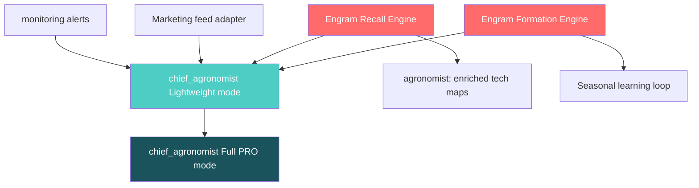

# 🧠 Память + Мега-Агроном: Аудит, Приоритеты, Чеклист

## Статус памяти — честный аудит

### Что ЕСТЬ (реализовано и работает)

| Компонент | Файл | Статус |
|---|---|---|
| Memory Canon (архитектурный стандарт) | `docs/01_ARCHITECTURE/PRINCIPLES/MEMORY_CANON.md` | ✅ Утверждён |
| 3 Prisma-модели: `MemoryInteraction`, `MemoryEpisode`, `MemoryProfile` | `schema.prisma` | ✅ В БД |
| `DefaultMemoryAdapter` (appendInteraction, retrieve, getProfile, updateProfile) | `shared/memory/default-memory-adapter.service.ts` | ✅ Работает |
| `EpisodicRetrievalService` (vector search + outcome) | `shared/memory/episodic-retrieval.service.ts` | ✅ Работает |
| `engram-rules.ts` (POSITIVE/NEGATIVE/UNKNOWN разметка) | `shared/memory/engram-rules.ts` | ✅ Работает, но примитивный |
| S-Tier write path (appendInteraction → MemoryInteraction + MemoryEpisode) | `default-memory-adapter.service.ts` | ✅ |
| M-Tier read path (vector recall) | `episodic-retrieval.service.ts` | ✅ |
| L-Tier read/write path (profile upsert) | `default-memory-adapter.service.ts` | ✅ |
| SupervisorAgent использует profile context | `supervisor-agent.service.ts` | ✅ |
| Memory отладочная панель в чате | `memoryUsed` в response | ✅ |

### Что ОТСУТСТВУЕТ (не реализовано)

| Компонент | Legacy-концепция | Статус |
|---|---|---|
| **Engram Registry** (реестр агро/бизнес/клиент/системных энграмм) | `Концепция энграмм.md` | ❌ |
| **Engram Formation Engine** (автоформирование из успешного кейса) | `EngramFormationEngine` | ❌ |
| **Synaptic Network** (связи между энграммами, правило Хебба) | `SynapticNetwork` | ❌ |
| **Memory Consolidation** (ночная консолидация, сжатие, обобщение) | `MemoryConsolidationService` | ❌ |
| **Engram Recall с весами** (взвешенный поиск с synaptic_weight + success_rate) | `EngramRecallEngine` | ❌ (есть примитивный vector search) |
| **Агрономические энграмы** (culture → disease → treatment → outcome) | Пример: `engram_agro_sclerotinia_bbch31` | ❌ |
| **Типизация энграмм** (AGRO/BUSINESS/CLIENT/SYSTEM) | `engram.type` | ❌ |
| **Continuous Consolidation** (S→M автосжатие) | MEMORY_CANON §3 | ❌ |
| **Profile extraction** (M→L автоизвлечение фактов) | MEMORY_CANON §3 | ❌ |

### Было ли отложено?

> [!IMPORTANT]
> **Нет явного решения об отсрочке энграмм.** Ситуация:
> - Phase Gamma Sprint 3 закрыл `engram-rules` (примитивная разметка) — и на этом **остановился**.
> - MEMORY_CANON (S5.2) утверждён, Prisma-модели (S5.3) созданы, adapter (S5.4-S5.6) работает.
> - Но **Engram Formation/Recall/Synaptic/Consolidation** — просто **не были запланированы** в текущих спринтах.
> - В `TECHNICAL_DEVELOPMENT_PLAN.md` Section 9.2 стоит `[ ] Graph DB Integration` и `[ ] Ontology Construction` — это **не закрыто** и относится к когнитивной памяти.
> - Концепция энграмм живёт в `09_ARCHIVE/LEGACY/` — то есть формально архивирована, но не отменена.

**Резюме: память НЕ откладывали сознательно. Просто приоритет был на agent runtime (Stage 2), и до «полноценной когнитивки» руки не дошли. Скелет стоит, мясо не наращено.**

---

## Приоритеты: память vs Мега-Агроном

### Зависимости



### Вердикт: СНАЧАЛА ПАМЯТЬ

> [!CAUTION]
> **Без памяти Мега-Агроном — это просто дорогой ChatGPT-wrapper.** Вот почему:

1. **Lightweight mode** (мини-типсы, анализ алертов) — полностью зависит от **Engram Recall**: без базы энграмм нечего подсказывать.
2. **Knowledge enrichment** для `agronomist` — зависит от **Engram Formation**: без формирования энграмм нечего передавать.
3. **Seasonal learning loop** — зависит от **Memory Consolidation**: без сжатия и обобщения данные просто копятся.
4. **Evidence-based рекомендации** — зависят от **типизированных энграмм**: «47 успешных применений» требует кумулятивного подсчёта.
5. **Engram-backed доверие для банков** — без реальных энграмм это пустые слова.

**Мега-Агроном без памяти = красивый профиль, но пустая оболочка.**

---

## Чеклист реализации

### PHASE 1: Engram Foundation (приоритет 🔴) ✅ DONE

Цель: подготовить инфраструктуру памяти для всех агентов, включая будущего `chief_agronomist`.

- [x] **MEM-1.1: Engram Prisma Model** ← `schema.prisma` + `SemanticFact` (L3)
  - Модели: `Engram` (L4) + `SemanticFact` (L3)
  - Индексы: companyId+type, companyId+category, isActive+synapticWeight, HNSW vector, GIN JSONB
  - Миграция: `20260310230000_cognitive_memory_engrams_semantic_facts`

- [x] **MEM-1.2: EngramService** ← `engram.service.ts`
  - `formEngram()` — Formation из кейса
  - `strengthenEngram()` / `weakenEngram()` — правило Хебба + деактивация
  - Типы: `engram.types.ts` (EngramCaseStudy, RankedEngram, Evidence, etc.)

- [x] **MEM-1.3: EngramRecallService** ← интегрировано в `engram.service.ts`
  - `recallEngrams(context)` — vector search + composite score (weight*0.4+rate*0.3+sim*0.3)
  - Фильтры: type, category + tenant isolation (свои + глобальные)
  - Auto-increment activationCount при recall

- [x] **MEM-1.4: Consolidation Worker** ← `consolidation.worker.ts`
  - `consolidate()` — группировка S-Tier по session → M-Tier (MemoryEpisode v2)
  - `pruneConsolidatedInteractions()` — удаление старых S-Tier (7 дней retention)
  - Классификация: CONVERSATION/DECISION/DEVIATION/HARVEST/ALERT_RESPONSE

- [x] **MEM-1.5: Agro-Engram Formation Rules** ← `engram-formation.worker.ts`
  - `processCompletedTechMaps()` — TechMap → Engram (категоризация, инсайты)
  - Категории: DISEASE_TREATMENT, NUTRITION, SOWING, HARVEST, PEST_CONTROL, WEATHER_RESPONSE, DEVIATION_OUTCOME
  - Определение успешности: yield ratio vs план

- [x] **MEM-1.6: Working Memory (L1)** ← `working-memory.service.ts` [БОНУС]
  - Redis typed Working Memory + Alert Cache + Hot Engram Cache (L4→L1 promotion)
  - `getFullAgentContext()` — всё за один вызов

- [x] **MEM-1.7: Memory Facade** ← `memory-facade.service.ts` [БОНУС]
  - `fullRecall()` — параллельный запрос L1+L2+L4+L5
  - Auto-promotion hot engrams
  - `getMemoryHealth()` — healthcheck

### PHASE 2: Agent Engram Integration (приоритет 🟡)

Цель: подключить живую память к текущим runtime-агентам.

- [ ] **MEM-2.1: agronomist ← Engram Recall**
  - При `tech_map_draft` — recall релевантных агро-энграмм для контекста
  - При `compute_deviations` — recall негативных энграмм для предупреждений
  - Format: enrichment в system prompt или через tool call

- [ ] **MEM-2.2: monitoring ← Negative Engram Alerts**
  - При `emit_alerts` — проверка: есть ли негативная энграмма для текущей ситуации
  - Формат: `"⚠️ Энграмма: в прошлом сезоне такое отклонение привело к потерям X%"`

- [ ] **MEM-2.3: economist ← Business Engrams**
  - При `compute_plan_fact` — recall бизнес-энграмм для сценарного анализа
  - `"Похожая ситуация у партнёра X привела к экономии Y₽/га"`

### PHASE 3: Chief Agronomist (приоритет 🟢) ✅ DONE

Цель: реализация expert-tier агента, который использует полноценную память.

- [x] **CA-3.1: Expert Invocation Engine** ← `expert/expert-invocation.engine.ts`
  - Отдельный execution path вне orchestration spine
  - On-demand + alert-triggered + scheduled invocation
  - PRO-модель selection + cost control (MAX_PRO_CALLS_PER_DAY)
  - Audit trail в AiAuditEntry

- [x] **CA-3.2: Lightweight Mode (Engram Curator)** ← `expert/chief-agronomist.service.ts`
  - `generateAlertTips()` — мини-типсы на основе алертов + энграмм
  - `enrichTechMapContext()` — обогащение техкарт энграммами
  - Дешёвая модель, фоновый

- [x] **CA-3.3: Full PRO Mode (Deep Expert)** ← `expert/chief-agronomist.service.ts`
  - `deepExpertise()` — полная экспертиза через ExpertInvocationEngine
  - Structured recommendations + evidence + confidence

- [ ] **CA-3.4: Marketing Feed Integration** (будет позже, зависит от marketer agent)
  - Adapter для consumption данных от `marketer`

- [x] **CA-3.5: Ethical Guardrail (COMMERCIAL_TRANSPARENCY)** ← `chief-agronomist.service.ts`
  - `generateAlternatives()` — ТОП-3 альтернативы
  - Тег [ПАРТНЁР] на коммерческих продуктах
  - Evidence trail для каждого варианта

- [ ] **CA-3.6: Human Collaboration Interface** (frontend, будет позже)
  - Split-screen совместная работа (UI)

### PHASE 4: Seasonal Loop & Network Effect (приоритет 🔵) ✅ DONE

- [x] **SL-4.1: End-of-Season Engram Formation** ← `expert/seasonal-loop.service.ts`
  - `processEndOfSeason()` — batch TechMap→Engram (form/strengthen/weaken)
  - Поддержка yield ratio vs план

- [x] **SL-4.2: Cross-Partner Knowledge Sharing** ← `expert/seasonal-loop.service.ts`
  - `shareCrossPartnerKnowledge()` — анонимизированные энграммы (companyId=null)
  - Фильтр: synapticWeight ≥ 0.8, successRate ≥ 0.85, activationCount ≥ 5

- [x] **SL-4.3: Engram-Backed Trust Score** ← `expert/seasonal-loop.service.ts`
  - `calculateTrustScore()` — композитная метрика (quantity*0.2 + success*0.35 + weight*0.25 + evidence*0.2)
  - API для банков/страховых

### PHASE 5: Data Scientist Agent (приоритет 🟣) ✅ DONE

Цель: реализация expert-tier аналитического агента.

Профиль: `docs/11_INSTRUCTIONS/AGENTS/AGENT_PROFILES/INSTRUCTION_AGENT_PROFILE_DATA_SCIENTIST.md`

#### Phase 5.1: Core Analytics Service ✅

- [x] **DS-5.1.1: DataScientistService** ← `expert/data-scientist.service.ts`
  - NestJS-сервис с доступом к PrismaService + EngramService
  - FULL_ENGRAM_SCAN через Prisma findMany (все энграммы)
  - Интеграция через ExpertModule

- [x] **DS-5.1.2: Yield Prediction** ← `data-scientist.service.ts: predictYield()`
  - Historical mean + trend regression + engram correction
  - Confidence intervals (±CI на основе uncertainty)
  - ContributingFactors с direction

- [x] **DS-5.1.3: Data Ingestion Pipeline** ← `expert/feature-store.service.ts`
  - Feature extraction из HarvestResults, TechMaps, Engrams
  - Derived features: soilQualityIndex, operationalIntensity
  - Batch extraction для всех полей

#### Phase 5.2: Prediction Engine ✅

- [x] **DS-5.2.1: Disease Risk Model** ← `data-scientist.service.ts: assessDiseaseRisk()`
  - Эпидемиологические модели: склеротиниоз, фомоз, альтернариоз
  - BBCH-зависимые risk factors + engram history amplification
  - Выход: riskScore, riskLevel, recommendedWindow, confidence

- [x] **DS-5.2.2: Cost Optimization Engine** ← `data-scientist.service.ts: analyzeCosts()`
  - Парето-распределение затрат по категориям
  - Saving potential assessment с risk-уровнем
  - Engram-backed optimization suggestions

- [x] **DS-5.2.3: Seasonal Report Generator** ← `data-scientist.service.ts: generateSeasonalReport()`
  - Sections: yieldAnalysis, engramSummary, topLearnings, recommendations, networkPosition
  - Формат: структурированный JSON

#### Phase 5.3: Advanced Analytics ✅

- [x] **DS-5.3.1: Cross-Season Pattern Mining** ← `data-scientist.service.ts: minePatterns()`
  - Кластеризация energy × category × successRate buckets
  - PatternCluster с centroid, avgSuccessRate, keyPattern

- [x] **DS-5.3.2: Network Benchmarking** ← `data-scientist.service.ts: benchmark()`
  - Client vs Network metrics (percentile, trend)
  - Анонимизированные агрегаты

- [x] **DS-5.3.3: What-If Simulator** ← `data-scientist.service.ts: whatIf()`
  - Сценарии: CHANGE_HYBRID, CHANGE_DOSE, SKIP_OPERATION, WEATHER_IMPACT
  - Baseline vs projected (yield, cost, risk)

#### Phase 5.4: ML Pipeline ✅

- [x] **DS-5.4.1: Feature Store** ← `expert/feature-store.service.ts`
  - In-memory store с versioning + TTL + batch extraction
  - Feature vector: yields, weather, soil, operations, engrams, derived

- [x] **DS-5.4.2: Model Training Pipeline** ← `expert/model-registry.service.ts`
  - trainYieldModel() с LOO cross-validation
  - Model registry: TRAINING → CANDIDATE → ACTIVE → RETIRED
  - predict() + promoteModel()

- [x] **DS-5.4.3: A/B Testing Framework** ← `expert/model-registry.service.ts`
  - createABTest() — canary rollout с traffic split
  - routeABTest() — маршрутизация по split %
  - evaluateABTest() — Z-test, auto-promote/rollback

---

## Порядок работ

### Рекомендуемая последовательность

```
MEM-1.1 (Prisma model) ✅
    ↓
MEM-1.2 (Formation) + MEM-1.3 (Recall) ✅
    ↓
MEM-1.5 (Agro rules) ✅
    ↓
MEM-1.4 (Consolidation) ✅
    ↓
MEM-1.6 (Working Memory L1) + MEM-1.7 (MemoryFacade) ✅ [БОНУС]
    ↓
MEM-2.1 (MemoryCoordinator integration) ✅
    ↓
MEM-2.2 (SupervisorAgent → AgentMemoryContext) ✅
    ↓
CA-3.1 (Expert engine) ✅
    ↓
CA-3.2 (Lightweight) + CA-3.5 (Ethics) ✅
    ↓
CA-3.3 (Full PRO) ✅  |  CA-3.4 (Marketing feed) — later
    ↓
SL-4.x (Seasonal loop) ✅
    ↓
DS-5.1 (Core Analytics) + DS-5.1.2 (Yield Prediction) ✅
    ↓
DS-5.2 (Disease Risk + Cost + Reports) ✅
    ↓
DS-5.3 (Pattern Mining + Benchmarking + What-If) ✅
    ↓
DS-5.4 (ML Pipeline: Feature Store + Model Registry + A/B) ✅
```

### Оценка сложности

| Фаза | Объём | Статус |
|---|---|---|
| PHASE 1: Engram Foundation | Prisma + 7 сервисов + миграция | ✅ DONE |
| PHASE 2: Agent Integration | MemoryCoordinator + SupervisorAgent + Types | ✅ DONE |
| PHASE 3: Chief Agronomist | ExpertInvocationEngine + ChiefAgronomistService | ✅ DONE |
| PHASE 4: Seasonal Loop | SeasonalLoopService (batch + trust score) | ✅ DONE |
| PHASE 5.1: DS Core | DataScientistService + YieldPrediction | ✅ DONE |
| PHASE 5.2: DS Predictions | DiseaseRisk + CostOptimization + SeasonalReports | ✅ DONE |
| PHASE 5.3: DS Advanced | PatternMining + Benchmark + WhatIf | ✅ DONE |
| PHASE 5.4: DS ML Pipeline | FeatureStore + ModelRegistry + A/B Testing | ✅ DONE |
| **Итого** | **Все фазы реализованы, TypeScript 0 ошибок** | ✅ |
