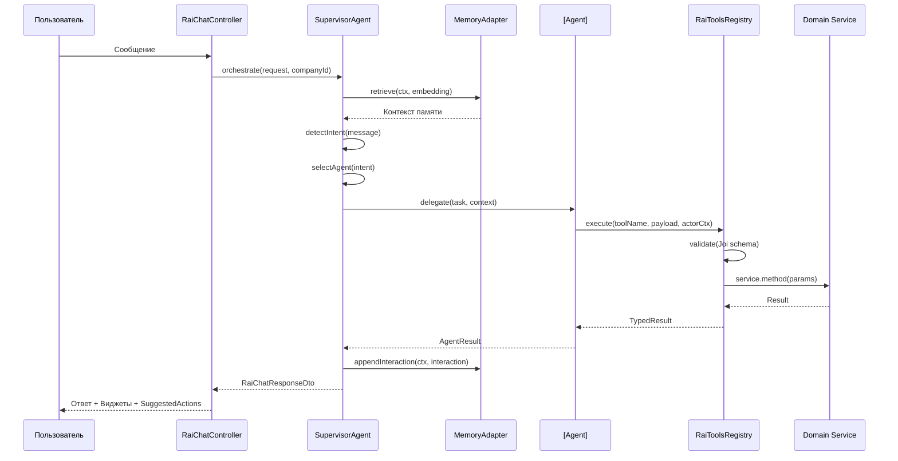
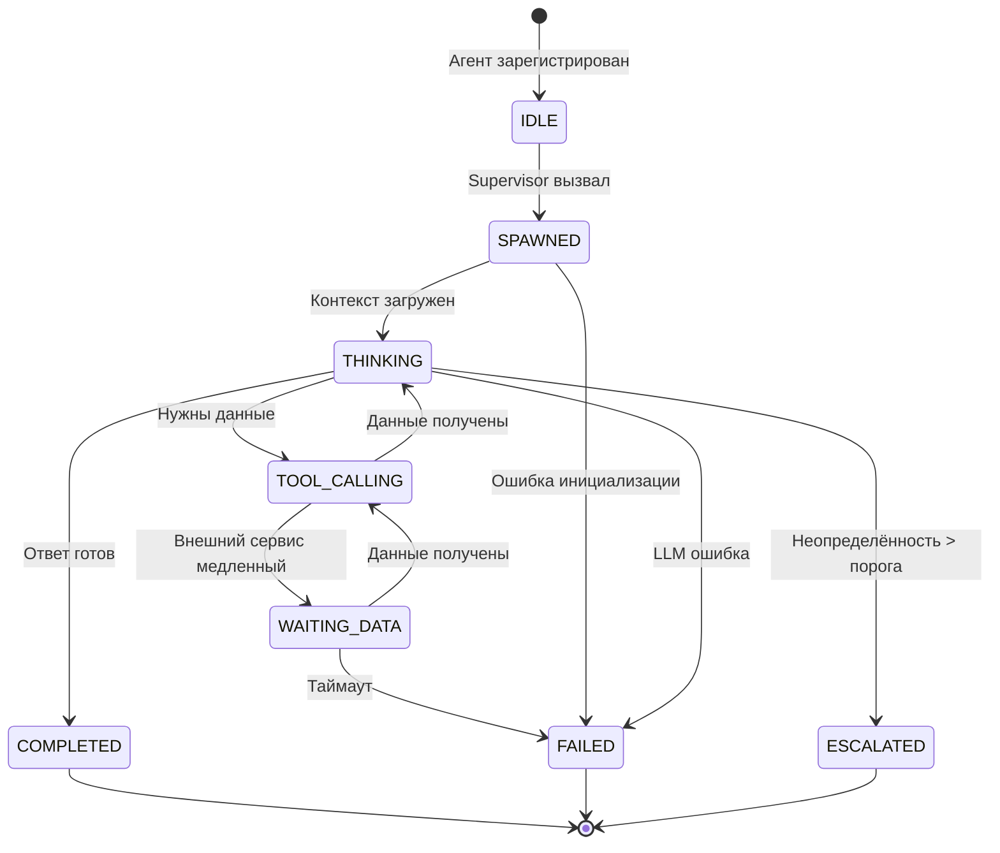
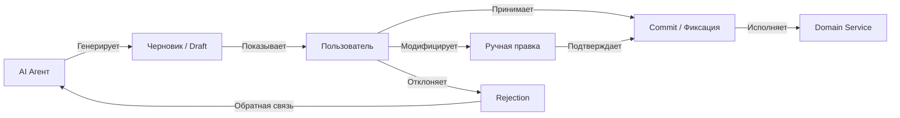

# RAI AI System — Архитектура мульти-агентной AI системы

> **Версия:** 1.0 | **Дата:** 2026-03-04  
> **Автор:** AI Systems Architect  
> **Статус:** Production Architecture Document  
> **Базис:** RAI_AI_SYSTEM_RESEARCH.md (Фаза 1)

---

## 1. Принципы AI-системы

### P-01: AI — советник, не авторитет

AI формирует рекомендации, черновики и аналитику. Детерминированные бэкенд-сервисы валидируют и исполняют. Человек принимает финальное решение. Исключений нет.

### P-02: Детерминированное ядро

Все расчёты с юридическими или финансовыми последствиями (нормы высева, дозировки СЗР, бюджеты) выполняются **детерминированным кодом**, а не LLM. AI может предлагать входные параметры, но формула исполняется бэкендом.

### P-03: Tool-gated доступ

AI-агенты **никогда** не обращаются к базе данных напрямую. Весь доступ к данным — через типизированный `RaiToolsRegistry` с Joi-валидацией, tenant-enforcement и аудит-логом.

### P-04: Human-in-the-Loop

Критические операционные действия (активация техкарты, применение СЗР, финансовые транзакции) **запрещено** выполнять без человеческого подтверждения. Паттерн: `AI Draft → Human Review → System Commit`.

### P-05: Безопасный отказ (Fail-safe)

При отказе AI-компонента система продолжает работать в штатном режиме без AI-рекомендаций. AI — надстройка, а не фундамент. Любой агент может быть отключен без потери базовой функциональности.

### P-06: Наблюдаемость по умолчанию

Каждый вызов AI-агента порождает trace с `traceId`, `companyId`, потреблёнными токенами, латентностью и результатом. Это не опционально.

### P-07: Бюджетный контроль

Каждый агент, каждая сессия и каждый тенант имеют лимит токенов. Превышение лимита приводит к graceful degradation, а не к отказу с ошибкой.

---

## 2. Структура AI Swarm

### 2.1 Топология

```
                    ┌─────────────────────┐
                    │   API Controller    │
                    │  (RaiChatController)│
                    └────────┬────────────┘
                             │
                    ┌────────▼────────────┐
                    │  SupervisorAgent    │
                    │  (Маршрутизатор)    │
                    │                     │
                    │  • Intent Router    │
                    │  • Token Budget     │
                    │  • Agent Lifecycle  │
                    │  • Memory Coord.    │
                    └────────┬────────────┘
                             │
              ┌──────────────┼──────────────────┐
              │              │                   │
     ┌────────▼──────┐ ┌────▼─────────┐ ┌──────▼──────────┐
     │  AgronomAgent │ │ EconomAgent  │ │ MonitoringAgent │
     │               │ │              │ │                 │
     │ • Техкарты    │ │ • Бюджеты    │ │ • Алерты        │
     │ • Защита      │ │ • ROI        │ │ • NDVI          │
     │ • Севооборот  │ │ • Сценарии   │ │ • Погода        │
     └───────┬───────┘ └──────┬───────┘ └────────┬────────┘
             │                │                   │
             └────────────────┼───────────────────┘
                              │
                    ┌─────────▼────────────┐
                    │   RaiToolsRegistry   │
                    │  (Tool-gated access) │
                    └─────────┬────────────┘
                              │
              ┌───────────────┼───────────────────┐
              │               │                    │
     ┌────────▼──────┐ ┌─────▼──────┐ ┌──────────▼─────┐
     │ TechMapService│ │ KpiService │ │ DeviationSvc   │
     │               │ │            │ │                │
     │ (determin.)   │ │ (determin.)│ │ (determin.)    │
     └───────────────┘ └────────────┘ └────────────────┘
```

### 2.2 Правила оркестрации

| Правило | Описание |
|---------|----------|
| **R-01** | Только `SupervisorAgent` может создавать агентов |
| **R-02** | Агенты **не** могут вызывать друг друга напрямую — только через возврат результата Supervisor'у |
| **R-03** | Максимальная глубина делегирования = 1 (Supervisor → Agent → Tools) |
| **R-04** | Максимальное количество инструментов за один запрос = 5 |
| **R-05** | Supervisor обязан завершить обработку за ≤ 30 секунд |
| **R-06** | При таймауте агент немедленно возвращает частичный результат |

### 2.3 Потоковая диаграмма запроса



---

## 3. Типы агентов

### 3.1 SupervisorAgent (Маршрутизатор)

**Роль:** Единая точка входа. Маршрутизирует запросы к специализированным агентам, управляет бюджетом токенов, координирует память.

| Параметр | Значение |
|----------|---------|
| Модель | GPT-4o-mini (роутинг) / GPT-4o (сложные запросы) |
| Макс. токенов на запрос | 4 000 (роутинг) / 8 000 (сложные) |
| Fallback | Regex-based intent routing |
| Состояния | IDLE → ROUTING → DELEGATING → AGGREGATING → RESPONDING |

**НЕ ВЫПОЛНЯЕТ:** Предметный анализ, расчёты, генерацию техкарт.

### 3.2 AgronomAgent (Агроном)

**Роль:** Агрономическое экспертное мышление — технологические карты, защита растений, севооборот, фенология.

| Параметр | Значение |
|----------|---------|
| Модель | GPT-4o (аналитика) / Claude-3.5-Sonnet (генерация) |
| Макс. токенов | 16 000 |
| Инструменты | `generate_tech_map_draft`, `compute_deviations`, аграрные калькуляторы |
| Знания | Промт с агрономическими правилами, BBCH-шкала, ЭПВ-таблицы |

**Ограничения:** Не имеет доступа к финансовым данным. Генерирует только DRAFT-объекты.

### 3.3 EconomistAgent (Экономист)

**Роль:** Финансовый анализ — ROI, бюджеты, план-факт, сценарное моделирование.

| Параметр | Значение |
|----------|---------|
| Модель | GPT-4o-mini (стандартный анализ) / GPT-4o (what-if) |
| Макс. токенов | 8 000 |
| Инструменты | `compute_plan_fact`, бюджетные калькуляторы, маржинальный анализ |
| Знания | Промт с экономическими правилами, нормативы себестоимости |

**Ограничения:** Не может изменять бюджеты — только читает и рекомендует.

### 3.4 MonitoringAgent (Дежурный)

**Роль:** Проактивный мониторинг — обработка NDVI/NDRE данных, погодные аномалии, превышение ЭПВ, алерты.

| Параметр | Значение |
|----------|---------|
| Модель | GPT-4o-mini (классификация алертов) |
| Макс. токенов | 4 000 |
| Инструменты | `emit_alerts`, спутниковые данные, метеоданные |
| Триггеры | Event-driven: данные со спутника, метеостанции |

**Особенность:** Единственный агент, который может активироваться **автономно** (по событию), а не по запросу пользователя. Но даже он НЕ МОЖЕТ выполнять действия — только формировать алерты.

### 3.5 KnowledgeAgent (Энциклопедист)

**Роль:** Ответы на вопросы из базы знаний, контекстуальные подсказки, обучение пользователей.

| Параметр | Значение |
|----------|---------|
| Модель | GPT-4o-mini + RAG (pgvector) |
| Макс. токенов | 4 000 |
| Инструменты | Knowledge Graph query, vector search |
| Источники | КнowledgeNode/KnowledgeEdge, документация, агрономические справочники |

**Ограничения:** Только чтение. Не имеет доступа к операционным данным компании — только к общей базе знаний.

### 3.6 Обоснование отказа от дополнительных агентов

| Потенциальный агент | Причина отказа |
|--------------------|---------------|
| LegalAgent | Недостаточный объём юридических задач для отдельного агента; покрывается KnowledgeAgent + детерминированный legal-engine |
| HRAgent | HR-аналитика слишком нишевая для выделения; покрывается EconomistAgent |
| LogisticsAgent | Логистика управляется детерминированным движком агро-оркестратора |

---

## 4. Runtime-архитектура агентов

### 4.1 Жизненный цикл агента



### 4.2 Состояния и переходы

| Состояние | Описание | Макс. длительность |
|-----------|----------|-------------------|
| `IDLE` | Агент зарегистрирован, ожидает вызова | ∞ |
| `SPAWNED` | Supervisor создал экземпляр, передаёт контекст | 500ms |
| `THINKING` | Агент обрабатывает запрос (LLM reasoning) | 10s |
| `TOOL_CALLING` | Агент вызывает инструменты | 5s на один вызов |
| `WAITING_DATA` | Ожидание ответа от внешнего сервиса | 10s |
| `COMPLETED` | Агент сформировал ответ | — |
| `FAILED` | Произошла ошибка | — |
| `ESCALATED` | Агент не уверен (confidence < threshold) → вопрос к человеку | — |

### 4.3 Протокол исполнения

```typescript
interface AgentExecutionProtocol {
  // 1. Supervisor создаёт задачу для агента
  task: {
    id: string;                  // UUID
    intent: RaiToolName;
    context: AgentContext;
    tokenBudget: number;
    deadline: Date;              // Абсолютный дедлайн
  };

  // 2. Агент возвращает результат
  result: {
    taskId: string;
    status: 'COMPLETED' | 'FAILED' | 'ESCALATED';
    data: unknown;               // Типизированный результат
    confidence: number;          // 0.0 - 1.0
    tokensUsed: number;
    toolCalls: ToolCallRecord[]; // Аудит-лог
    explanation?: string;        // Для explainability
  };
}
```

---

## 5. Правила оркестрации агентов

### 5.1 Защита от рекурсивных циклов

```
ПРАВИЛО ЦИКЛА:
  Агент НЕ МОЖЕТ вызвать другого агента.
  Агент может вызывать ТОЛЬКО инструменты из RaiToolsRegistry.
  Supervisor может делегировать задачу ТОЛЬКО ОДНОМУ агенту за раз.
  Если Supervisor делегирует к двум агентам — они работают ПАРАЛЛЕЛЬНО,
  не последовательно (Fan-out).
```

### 5.2 Защита от неконтролируемого спавна

```
ПРАВИЛО СПАВНА:
  Максимум агентов на один пользовательский запрос = 3.
  Максимум инструментов на одного агента = 5.
  Максимум параллельных запросов от одного тенанта = 10.
  Нарушение любого лимита → немедленный graceful return.
```

### 5.3 Защита от token explosion

```
ПРАВИЛО ТОКЕНОВ:
  Бюджет Supervisor'а      = 4 000 токенов (роутинг)
  Бюджет одного агента     = 16 000 токенов (макс.)
  Бюджет одного запроса    = 32 000 токенов (суммарно)
  Бюджет одной сессии      = 100 000 токенов
  Бюджет тенанта/день      = 1 000 000 токенов
  
  При достижении 80% бюджета — WARNING в логе.
  При достижении 100% — переключение на lightweight модель.
  При достижении 150% — остановка AI, ответ только через baseline.
```

---

## 6. Реестр инструментов (Tool Registry)

### 6.1 Архитектура

```typescript
// Расширенная архитектура RaiToolsRegistry
interface RegisteredTool<TName extends RaiToolName> {
  name: TName;                          // Уникальное имя
  schema: Joi.ObjectSchema;             // Валидация payload
  handler: ToolHandler<TName>;          // Исполнитель
  requiredRole: UserRole[];             // Минимальная роль
  riskLevel: 'READ' | 'WRITE' | 'CRITICAL';
  maxExecutionMs: number;               // Таймаут
  domainService: string;                // Owner-сервис
}
```

### 6.2 Текущие инструменты + расширение

| Инструмент | Категория | Risk Level | Доменный сервис |
|-----------|-----------|------------|----------------|
| **echo_message** | Утилита | READ | — |
| **workspace_snapshot** | Контекст | READ | — |
| **compute_deviations** | Анализ | READ | DeviationService |
| **compute_plan_fact** | Аналитика | READ | KpiService |
| **emit_alerts** | Мониторинг | WRITE | AlertService |
| **generate_tech_map_draft** | Генерация | WRITE | TechMapService |
| **query_knowledge** *(новый)* | Знания | READ | KnowledgeGraphService |
| **get_field_context** *(новый)* | Контекст | READ | FieldRegistryService |
| **get_soil_profile** *(новый)* | Данные | READ | SoilProfileService |
| **simulate_scenario** *(новый)* | Моделирование | READ | ScenarioSimulationService |
| **compute_risk_assessment** *(новый)* | Риски | READ | RiskEngine |
| **get_weather_forecast** *(новый)* | Внешние данные | READ | ExternalSignalsService |
| **get_satellite_data** *(новый)* | Спутники | READ | SatelliteService |
| **validate_tech_map** *(новый)* | Валидация | READ | TechMapValidationEngine |

### 6.3 Слой валидации

```
Запрос → Joi Schema Validation
       → Tenant Isolation Check (companyId)
       → Role-Based Access Control (requiredRole)
       → RiskGate (WRITE/CRITICAL → require confirmation)
       → Rate Limit Check
       → Handler Execution
       → Audit Log
       → Response
```

### 6.4 RiskGate

Для инструментов с `riskLevel: 'CRITICAL'` (например, активация техкарты):

```
Агент вызывает инструмент с riskLevel CRITICAL
  → RiskGate перехватывает вызов
  → Формируется PendingAction (сохраняется в БД)
  → Пользователю отправляется виджет подтверждения
  → Пользователь подтверждает / отклоняет
  → При подтверждении: инструмент исполняется
  → При отклонении: агент получает REJECTED
```

---

## 7. Event-Driven AI

### 7.1 AI-триггеры

| Событие | Источник | Агент | Действие |
|---------|---------|-------|----------|
| `satellite.ndvi.updated` | SatelliteService | MonitoringAgent | Анализ аномалий NDVI |
| `weather.alert.received` | ExternalSignals | MonitoringAgent | Оценка рисков для полевых операций |
| `techmap.execution.completed` | ConsultingOrch. | EconomistAgent | Обновление план-факта |
| `agro.event.escalated` | AgroEscalation | AgronomAgent | Формирование рекомендации |
| `budget.threshold.exceeded` | BudgetPlanSvc | EconomistAgent | Алерт о перерасходе |
| `risk.signal.critical` | RiskEngine | MonitoringAgent | Срочная рекомендация |

### 7.2 Архитектура событийной интеграции

```
EventEmitter (NestJS)
      │
      ├── consulting.operation.completed ─→ ConsultingOrchestrator (существующий)
      ├── agro.event.escalated ─→ AgroEscalationLoop (существующий)
      │
      └── ai.event.* ─→ AIEventListener (НОВЫЙ)
              │
              ├── ai.event.satellite_anomaly
              ├── ai.event.weather_alert
              ├── ai.event.budget_exceeded
              └── ai.event.risk_critical
```

### 7.3 AIEventListener

```typescript
@Injectable()
class AIEventListener {
  @OnEvent('ai.event.*')
  async handleAIEvent(event: AITriggerEvent) {
    // 1. Проверяем, включен ли AI для данного тенанта
    if (!this.isAIEnabled(event.companyId)) return;
    
    // 2. Проверяем бюджет токенов
    if (this.isTokenBudgetExhausted(event.companyId)) return;
    
    // 3. Делегируем MonitoringAgent
    const result = await this.supervisor.handleAutonomousEvent(event);
    
    // 4. Если нужно действие — формируем PendingAction
    if (result.actionRequired) {
      await this.pendingActionService.create(result.action);
    }
  }
}
```

### 7.4 Поток эскалации

```
AI детектирует аномалию
  → Формирует Alert (severity S1-S4)
  → S1-S2: Тихая запись в журнал
  → S3: Push-уведомление агроному
  → S4: Push + Telegram alert + блокировка связанной операции (через PendingAction)
  
  Человек получает рекомендацию
  → Принимает / Отклоняет / Модифицирует
  → Результат записывается в AuditLog
```

---

## 8. Архитектура AI-памяти

### 8.1 Трёхслойная модель

```
┌──────────────────────────────────────────────┐
│          Слой 1: Рабочая память              │
│          (Redis, TTL = сессия)               │
│                                              │
│  • Текущий диалог (5-10 последних сообщений) │
│  • Текущий контекст виджетов                 │
│  • Результаты последних tool-вызовов         │
│  • Идентификатор активного поля/сезона       │
└──────────────────────────────────────────────┘
                    ▼
┌──────────────────────────────────────────────┐
│       Слой 2: Эпизодическая память           │
│       (pgvector, TTL = 90 дней)              │
│                                              │
│  • Прошлые диалоги (сжатые резюме)           │
│  • Успешные рекомендации и их результаты     │
│  • Принятые/отклонённые предложения          │
│  • Паттерны поведения пользователя           │
└──────────────────────────────────────────────┘
                    ▼
┌──────────────────────────────────────────────┐
│      Слой 3: Долгосрочная/Институционная     │
│      (Knowledge Graph + PostgreSQL, TTL = ∞) │
│                                              │
│  • Агрономические правила и справочники      │
│  • Исторические урожаи по полям              │
│  • Корпоративные SOP и регламенты            │
│  • Модели культур (BBCH, GDD)               │
│  • Юридические нормативы                     │
└──────────────────────────────────────────────┘
```

### 8.2 Engram-система (правила конденсации)

Реализация сжатия памяти по правилам `engram-rules.ts`:

1. **Лимит рабочей памяти:** Максимум 10 взаимодействий → старые сжимаются в резюме и мигрируют в эпизодическую память
2. **Оценка значимости:** Каждое взаимодействие получает `significance score` (0.0-1.0); взаимодействия с score < 0.3 удаляются при ротации
3. **Семантический кластеринг:** Похожие эпизоды группируются и сжимаются в один (дедупликация)
4. **Tenant isolation:** Каждый слой строго фильтруется по `companyId` + `userId`

### 8.3 Профиль пользователя (MemoryProfile)

```typescript
interface UserProfile {
  // Автоматически формируется из паттернов взаимодействий
  preferredLanguage: 'ru' | 'en';
  expertiseLevel: 'novice' | 'professional' | 'expert';
  frequentTopics: string[];           // Частые темы запросов
  decisionPatterns: {
    acceptRate: number;               // Процент принятых рекомендаций
    commonRejectionReasons: string[];
  };
  contextPreferences: {
    defaultFieldId?: string;
    defaultSeasonId?: string;
    preferredDetailLevel: 'brief' | 'detailed';
  };
}
```

---

## 9. Контроль стоимости

### 9.1 Модель тирования моделей

| Тир | Модель | Стоимость (input/output за 1M) | Применение |
|-----|--------|-------------------------------|-----------|
| **T1 (Micro)** | GPT-4o-mini | $0.15 / $0.60 | Intent routing, классификация, простые Q&A |
| **T2 (Standard)** | GPT-4o | $2.50 / $10.00 | Агрономический анализ, what-if сценарии |
| **T3 (Premium)** | Claude-3.5-Sonnet | $3.00 / $15.00 | Генерация техкарт, сложные объяснения |
| **T4 (Heavy)** | GPT-4o (32K ctx) | $2.50 / $10.00 | Анализ больших документов (редко) |
| **T0 (Free)** | Детерминированный код | $0.00 | Калькуляция, валидация, FSM-переходы |

### 9.2 Стратегия маршрутизации моделей

```
Запрос пользователя
  → Supervisor (T1) определяет сложность
    → Простой вопрос? → T1 отвечает напрямую
    → Средняя сложность? → Agent с T2
    → Высокая сложность? → Agent с T3
    → Калькуляция? → T0 (без LLM)
```

### 9.3 Бюджетная модель

```
                  ┌───────────────────┐
                  │ CompanyTokenBudget │
                  │ daily = 1M tokens │
                  └─────────┬─────────┘
                            │
              ┌─────────────┼─────────────┐
              │             │             │
     ┌────────▼──────┐ ┌───▼────┐ ┌──────▼──────┐
     │ SessionBudget │ │ Agent  │ │ Autonomous  │
     │ = 100K tokens │ │ Budget │ │ Budget      │
     └───────────────┘ │ = 16K  │ │ = 200K/day  │
                       └────────┘ └─────────────┘
```

### 9.4 Прогноз стоимости

| Сценарий | Запросов/день | Токенов/день | Стоимость/день | Стоимость/мес. |
|----------|-------------|-------------|---------------|---------------|
| Малое хозяйство (1 аккаунт) | 50 | 200K | $0.30 | $9 |
| Среднее хозяйство (5 аккаунтов) | 250 | 1M | $1.50 | $45 |
| Крупный холдинг (20 аккаунтов) | 1 000 | 4M | $6.00 | $180 |
| Пиковая нагрузка (посевная) | 5 000 | 20M | $30.00 | $900 |

### 9.5 Оптимизация стоимости

1. **Кэширование:** Ответы на повторяющиеся вопросы кэшируются через семантический поиск (EpisodicRetrieval, similarity > 0.95)
2. **Предвычисление:** Агрономические расчёты выполняются детерминированным кодом (T0), не LLM
3. **Пакетирование:** MonitoringAgent обрабатывает массив сигналов за один вызов, а не по одному
4. **Progressive disclosure:** Сначала краткий ответ (T1), детали — по запросу (T2/T3)

---

## 10. AI-безопасность

### 10.1 Защита от prompt injection

```
┌─────────────────────────────────────┐
│        INPUT SANITIZATION           │
│                                     │
│ 1. Удаление управляющих символов   │
│ 2. Экранирование markdown-инъекций │
│ 3. Лимит длины входного сообщения  │
│    (max 4000 символов)             │
│ 4. Regex-фильтр подозрительных     │
│    паттернов ("ignore previous",   │
│    "system:", "assistant:")        │
│                                     │
│ Подозрительный ввод → sanitize     │
│ + warning в аудит-лог              │
└─────────────────────────────────────┘
```

### 10.2 Защита от утечки данных (data exfiltration)

| Механизм | Реализация |
|----------|-----------|
| **Tenant Barrier** | Каждый Tool-вызов содержит `companyId`; выход за пределы тенанта невозможен на уровне Prisma-фильтров |
| **Output Filtering** | Ответы агентов проходят через output-фильтр, удаляющий PII, номера банковских счетов, ИНН |
| **Secrets Masking** | Переменные окружения и API-ключи НИКОГДА не попадают в контекст агента |
| **Memory Isolation** | Эпизодическая память строго фильтруется по `companyId` + `userId` |

### 10.3 Защита от небезопасных рекомендаций

```
Рекомендация агронома (пестициды, нормы)
  → DomainValidation Gate
    → Дозировка в пределах регистрации? (справочник)
    → Смесь совместима? (TankMixValidator)
    → Срок ожидания соблюдён? (BBCH-модель)
    → Метео-окно допустимо? (скорость ветра < 5 м/с)
  
  ✓ Все проверки пройдены → Рекомендация передаётся пользователю
  ✗ Хоть одна не пройдена → Рекомендация блокируется, 
    пользователь видит предупреждение с объяснением
```

### 10.4 Аудит-лог AI-действий

Каждое действие AI записывается в `AuditLog`:

```typescript
interface AIAuditEntry {
  id: string;
  timestamp: Date;
  traceId: string;
  companyId: string;
  userId: string;
  agentName: string;
  action: string;
  input: {
    message: string;      // Sanitized пользовательский ввод
    toolsCalled: string[]; // Перечень инструментов
  };
  output: {
    response: string;     // Ответ агента (truncated)
    confidence: number;
    tokensUsed: number;
  };
  validation: {
    domainChecks: ValidationResult[];
    riskGateDecision: 'PASS' | 'BLOCK' | 'ESCALATE';
  };
}
```

---

## 11. Наблюдаемость (Observability)

### 11.1 Трассировка агентов

```
┌──────────────────────────────────────────────┐
│              AI Trace (OpenTelemetry)         │
│                                              │
│  TraceId: abc-123                            │
│  ├── Span: supervisor.route (150ms)          │
│  │   ├── Tokens: 420 (T1)                   │
│  │   └── Intent: generate_tech_map           │  
│  ├── Span: agro_agent.think (3200ms)         │
│  │   ├── Tokens: 8 430 (T3)                 │
│  │   ├── Tool: get_field_context (120ms)     │
│  │   ├── Tool: get_soil_profile (95ms)       │
│  │   └── Tool: generate_tech_map_draft (45ms)│
│  └── Span: supervisor.aggregate (80ms)       │
│      └── Tokens: 250 (T1)                   │
│                                              │
│  Total: 3 430ms | 9 100 tokens | $0.028     │
└──────────────────────────────────────────────┘
```

### 11.2 Метрики (Prometheus)

| Метрика | Тип | Описание |
|---------|-----|----------|
| `rai_ai_agent_calls_total` | Counter | Общее число вызовов по агенту |
| `rai_ai_agent_latency_seconds` | Histogram | Латентность по агенту |
| `rai_ai_tokens_used_total` | Counter | Потреблённые токены (по модели, тенанту) |
| `rai_ai_tool_calls_total` | Counter | Вызовы инструментов |
| `rai_ai_tool_errors_total` | Counter | Ошибки инструментов |
| `rai_ai_confidence_score` | Histogram | Распределение уверенности агентов |
| `rai_ai_budget_usage_ratio` | Gauge | Процент использования бюджета тенанта |
| `rai_ai_escalation_total` | Counter | Количество эскалаций к человеку |
| `rai_ai_recommendation_accept_rate` | Gauge | Процент принятых рекомендаций |

### 11.3 Дашборд

Ключевые панели:
1. **Нагрузка:** Запросов/мин по тенантам, агентам, моделям
2. **Стоимость:** Расход токенов в реальном времени, прогноз на месяц
3. **Качество:** Acceptance rate рекомендаций, confidence distribution
4. **Здоровье:** Error rate, latency p50/p95/p99, agent failures
5. **Безопасность:** Blocked recommendations, injection attempts, tenant violations

---

## 12. Graceful Degradation (Отказоустойчивость)

### 12.1 Отказ модели (LLM API)

```
LLM Provider недоступен (таймаут / 5xx)
  → Retry (3 попытки с экспоненциальной паузой)
  → Fallback на альтернативную модель
    ├── GPT-4o недоступен → Claude-3.5-Sonnet
    ├── Claude недоступен → GPT-4o-mini
    └── Все LLM недоступны → Deterministic baseline
  → Уведомление пользователю: "AI-рекомендации временно недоступны"
  → Все доменные сервисы продолжают работать штатно
```

### 12.2 Отказ агента

```
Агент упал (exception / timeout / budget exhausted)
  → Supervisor ловит ошибку
  → Логирует в AuditLog с severity = ERROR
  → Возвращает пользователю:
    "Не удалось обработать запрос AI. Вы можете выполнить это действие вручную."
  → Предлагает SuggestedActions для ручного выполнения
  → Доменные сервисы не затронуты
```

### 12.3 Отказ AI-провайдера

```
Весь AI-провайдер недоступен (глобальный outage)
  → Circuit Breaker переключается в OPEN (порог: 5 ошибок за 30с)
  → Все AI-запросы возвращают baseline-ответы
  → Baseline-ответы:
    ├── Для Q&A: "AI-ассистент временно недоступен"
    ├── Для расчётов: Детерминированный движок (всегда работает)
    ├── Для мониторинга: Стандартные правила алертов (без AI-обогащения)
    └── Для техкарт: Шаблоны (template-based generation)
  → Автоматическая проверка провайдера каждые 60с
  → При восстановлении: Circuit Breaker → HALF_OPEN → CLOSED
```

### 12.4 Каскадная деградация

| Уровень | Что доступно | Что отключено |
|---------|-------------|--------------|
| **Level 0 (Norma)** | Все AI-функции | — |
| **Level 1 (Degraded AI)** | T1-модели, базовый Q&A | T2/T3-модели, генерация техкарт |
| **Level 2 (Baseline)** | Детерминированные расчёты, шаблоны | Все LLM-вызовы |
| **Level 3 (Manual)** | Только UI, ручной ввод | Все AI и часть автоматики |

---

## 13. Human-in-the-Loop

### 13.1 Workflow: Draft → Review → Commit



### 13.2 Матрица уровней автономности

| Действие | Уровень | Описание |
|---------|---------|---------|
| Ответ на вопрос | **Автономный** | AI отвечает без подтверждения |
| Отображение аналитики | **Автономный** | AI показывает графики и данные |
| Формирование алерта S1-S2 | **Автономный** | Тихая запись в журнал |
| Формирование алерта S3-S4 | **Полуавтономный** | Push + запрос подтверждения |
| Генерация черновика техкарты | **Контролируемый** | AI генерирует → человек проверяет → commit |
| Изменение бюджета | **Контролируемый** | AI рекомендует → человек утверждает |
| Активация техкарты | **Строго контролируемый** | Только человек; AI может только предложить |
| Финансовая транзакция | **Запрещённый для AI** | AI не участвует в исполнении |

### 13.3 Механизм обратной связи

```
Пользователь принял рекомендацию
  → Engram: запись успешного паттерна (significance = 0.8)
  → Метрика: acceptance_rate += 1
  
Пользователь отклонил рекомендацию
  → Engram: запись отклонения с причиной (significance = 0.9)
  → Метрика: rejection_rate += 1
  → Анализ: если rejection_rate > 30% для агента — автоматический review промтов
  
Пользователь модифицировал рекомендацию
  → Engram: запись дельты (что изменил пользователь)
  → Паттернирование: анализ повторяющихся модификаций → корректировка промтов
```

---

## 14. Дорожная карта реализации

### Stage 1 — Минимальная AI-интеграция (4-6 недель)

**Цель:** Расширить текущий SupervisorAgent полноценной LLM-интеграцией и новыми инструментами.

| Задача | Описание | Срок |
|--------|----------|------|
| S1.1 | Интеграция LLM API (OpenAI/Anthropic) в SupervisorAgent вместо regex-роутинга | 1 нед. |
| S1.2 | Добавление 6 новых инструментов в RaiToolsRegistry (query_knowledge, get_field_context, get_soil_profile, simulate_scenario, compute_risk_assessment, get_weather_forecast) | 2 нед. |
| S1.3 | Реализация token-бюджетов и rate-limiting | 1 нед. |
| S1.4 | Observability: Prometheus метрики для AI-вызовов | 0.5 нед. |
| S1.5 | Реализация RiskGate для WRITE-инструментов | 0.5 нед. |
| S1.6 | E2E тесты AI-потока | 1 нед. |

**Критерий завершения:** SupervisorAgent корректно маршрутизирует 90%+ запросов к правильным инструментам, соблюдая бюджет токенов.

### Stage 2 — Операционные AI-агенты (6-10 недель)

**Цель:** Выделить специализированных агентов под управлением Supervisor'а.

| Задача | Описание | Срок |
|--------|----------|------|
| S2.1 | Архитектура AgentRuntime (lifecycle, state machine, protocol) | 2 нед. |
| S2.2 | Реализация AgronomAgent с полноценной генерацией техкарт | 3 нед. |
| S2.3 | Реализация EconomistAgent с what-if сценариями | 2 нед. |
| S2.4 | Реализация KnowledgeAgent с RAG-поиском | 1 нед. |
| S2.5 | Улучшение Memory-системы (engram-condensation, profile learning) | 1 нед. |
| S2.6 | Интеграционные тесты мульти-агентных сценариев | 1 нед. |

**Критерий завершения:** AI может сгенерировать полноценный черновик техкарты рапса с агрономическим обоснованием и экономической оценкой.

### Stage 3 — Проактивный AI Swarm (10-16 недель)

**Цель:** Добавить event-driven активацию агентов и замкнуть цикл обратной связи.

| Задача | Описание | Срок |
|--------|----------|------|
| S3.1 | Реализация MonitoringAgent + event-driven триггеры | 3 нед. |
| S3.2 | Интеграция со спутниковыми данными (NDVI/NDRE → AI-анализ) | 2 нед. |
| S3.3 | Интеграция с метеоданными (погодные алерты → AI-рекомендация) | 1 нед. |
| S3.4 | Circuit Breaker и Graceful Degradation (Level 0-3) | 2 нед. |
| S3.5 | Feedback Loop (acceptance/rejection → prompt tuning) | 2 нед. |
| S3.6 | AI Safety: input sanitization, output filtering, PII masking | 2 нед. |
| S3.7 | Нагрузочное тестирование и оптимизация стоимости | 2 нед. |
| S3.8 | Документация и обучение команды | 2 нед. |

**Критерий завершения:** Система проактивно обнаруживает аномалии, формирует рекомендации, и замыкает цикл обучения на обратной связи от агрономов.

---

## Самоаудит архитектуры

### Архитектурные слабости

| Слабость | Описание | Митигация |
|---------|----------|-----------|
| **Монолитный Supervisor** | SupervisorAgent — единая точка отказа | Circuit Breaker + fallback на regex-routing |
| **Зависимость от LLM-провайдеров** | Внешняя зависимость с непредсказуемой доступностью | Мульти-провайдер (OpenAI + Anthropic) + Circuit Breaker |
| **Сложность промтов** | По мере роста контекста промты станут трудно поддерживаемыми | Версионирование промтов в БД, A/B тестирование |
| **Latency** | Цепочка Supervisor → Agent → Tools может превышать 10с | Агрессивное кэширование, progressive disclosure, параллельные tool-вызовы |

### Риски безопасности

| Риск | Вероятность | Влияние | Митигация |
|------|-----------|---------|-----------|
| Prompt injection | Средняя | Высокое | Input sanitization + output filtering |
| Tenant data leak | Низкая | Критическое | companyId enforcement на каждом уровне |
| Вредоносная рекомендация (агрономия) | Средняя | Высокое | DomainValidation Gate + Human-in-the-Loop |
| Token budget overdraft | Средняя | Среднее | Hard limits + auto-downgrade моделей |

### Риски стоимости

| Сценарий | Ожидаемо | Риск |
|----------|---------|------|
| Нормальная нагрузка | $45-180/мес. на тенант | Приемлемо |
| Посевная/уборочная | До $900/мес. на крупный холдинг | Требуется бюджетирование |
| Мискофигурация (бесконечный цикл) | Теоретически неограничено | Митигация: hard token cap |

### Риски сложности

| Аспект | Оценка | Комментарий |
|--------|--------|------------|
| Когнитивная нагрузка на команду | 7/10 | Мульти-агентная система требует глубокого понимания |
| Отладка | 8/10 | Стохастические LLM-ответы трудно воспроизвести |
| Тестирование | 7/10 | Нужны snapshot-тесты для промтов + детерминированные E2E |
| Развёртывание | 5/10 | Не требует инфраструктурных изменений — добавляется как NestJS-модуль |

### Результат аудита

Архитектура **утверждена** для реализации с учётом следующих обязательных условий:

1. **Stage 1 должен быть завершён перед Stage 2** — нельзя создавать агентов без token-бюджетов и observability.
2. **RiskGate обязателен** для любого WRITE-инструмента — никаких исключений.
3. **Каждый агент должен пройти Red Team тестирование** перед production-использованием.
4. **Регулярный review расходов** — еженедельный отчёт по token-бюджетам.
5. **Ежемесячный аудит промтов** — проверка на drift и alignment с агрономическими стандартами.
