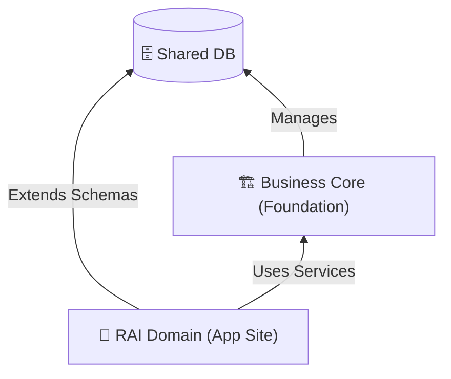

# Business Core Concept: Философия и Назначение 🏗️

> **Статус:** Канон | **Версия:** 1.0 | **Область:** Фундамент

---

## 1. Что такое Business Core?

**Business Core (Ядро)** — это набор универсальных, доменно-независимых сервисов и политик, которые составляют "генетический код" любой корпоративной системы в нашей экосистеме. 

Ядро — это не просто библиотека, это **runtime-фундамент**, который обеспечивает:
- Идентификацию и безопасность (IAM)
- Управление оргструктурой (Registry)
- Движок бизнес-процессов (Task Engine)
- Аудит и событийную шину (Audit & Events)

---

## 2. Зачем нам нужно Ядро?

### 2.1 Разделение ответственности (Separation of Concerns)
Доменные разработчики (например, RAI) не должны тратить время на написание авторизации, регистрацию пользователей или логику смены статусов задач. Они фокусируются на **агро-бизнесе**. Ядро берет на себя всю "инфраструктурную" бизнес-логику.

### 2.2 Гарантированная безопасность (Security by Design)
Все механизмы безопасности (Multi-tenancy, RBAC, Audit) реализованы в Ядре один раз и протестированы на высшем уровне. Домен просто "наследует" эту безопасность.

### 2.3 Масштабируемость и Унификация
Если мы решим запустить новый продукт (например, CRM для агротехники), нам не нужно начинать с нуля. Мы подключаем Business Core, и у нас сразу есть готовая система управления пользователями и задачами.

---

## 3. Архитектурная связь

1. **Домен всегда ВЫШЕ Ядра.**
2. **Ядро ничего не знает о Домене.** (Ядро не знает, что такое "поле" или "рапс").
3. **Домен использует контракты Ядра.** (RAI говорит: "Создай задачу типа X для пользователя Y").

---

## 4. Ключевые аксиомы Ядра

1. **Immutability (Неизменяемость)**: Ядро стремится сохранять историю изменений (Audit Trail), а не просто текущее состояние.
2. **Multi-tenancy**: Данные разных компаний изолированы на уровне Ядра. Утечка данных между клиентами невозможна на уровне дизайна.
3. **Event-Driven**: Любое значимое действие в Ядре порождает событие, на которое может подписаться Домен.

---

## 5. Связанные компоненты

- [Identity & Access Management](./CORE_SUBSYSTEMS/IDENTITY_ACCESS.md)
- [Task & Workflow Engine](./CORE_SUBSYSTEMS/TASK_WORKFLOW.md)
- [Registry & Structure](./CORE_SUBSYSTEMS/STRUCTURE_REGISTRY.md)
