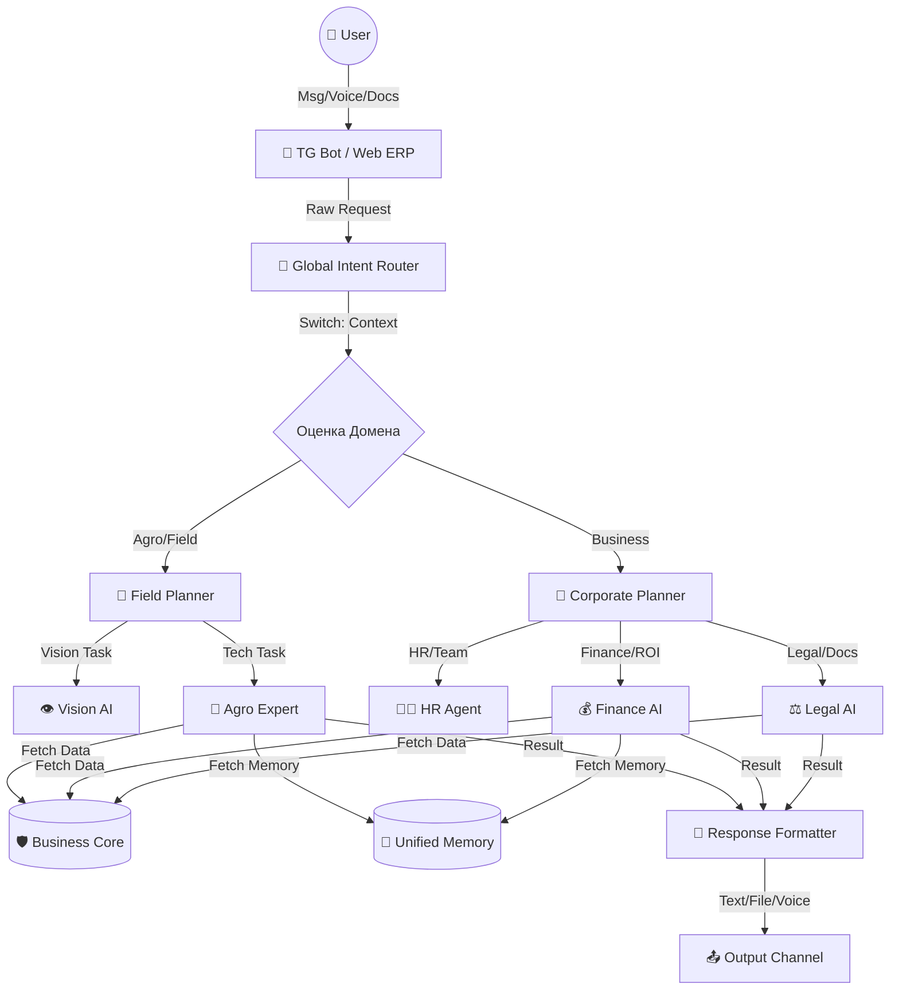

# HLD: AI Orchestration Hub (ИИ-Оркестратор) 🤖

> **Статус:** Проектирование | **Фаза реализации:** Beta/Gamma | **Слой:** Архитектура / HLD

---

## 1. Философия: "Stateless Intelligence for Enterprise"
В RAI Enterprise Platform ИИ — это "мозг", работающий в **Двух Контурах** (Офис и Поле).
Мы придерживаемся канона **Stateless AI**:
- Сам LLM-адаптер **не хранит** историю чата.
- Контекст собирается динамически из **Unified Memory** (CRM, HR, Agro).
- **AI explains. Human decides.**

---

## 2. Архитектура: "Router-Solver" (Enterprise Edition)

Мы реализуем паттерн **Multi-Agent Orchestrator**, где Router распределяет задачи между "Полевыми" и "Офисными" агентами.

---

## 3. Специализация Агентов (Solvers)

### 3.1 Полевой Контур (Field Solvers)
1.  **Agro Expert:** Знает 16 этапов рапса. Умеет диагностировать дефицит питания.
2.  **Vision Agent:** Распознает вредителей по фото (Computer Vision).
3.  **Machinery Agent:** Знает остатки ГСМ и статус техники.

### 3.2 Офисный Контур (Enterprise Solvers)
1.  **HR Agent:**
    *   *Skill:* Анализ пульс-опросов (выгорание).
    *   *Task:* "Найди агронома в Краснодаре".
2.  **Legal Agent:**
    *   *Skill:* Проверка договоров (GigaLegal Integration).
    *   *Task:* "Риски в договоре поставки №5".
3.  **Finance Agent:**
    *   *Skill:* Расчет ROI и What-if симуляции.
    *   *Task:* "Что если цена на селитру вырастет на 20%?".
4.  **Sales Agent:**
    *   *Skill:* Скоринг клиентов (LTV).

---

## 4. Этапы обработки (Router Flow)

### 4.1. Router (Классификатор)
*   **Модель:** `gpt-4o-mini` / `local-llama-3`.
*   **Classes:** `AGRO_QUERY`, `HR_REQUEST`, `LEGAL_CHECK`, `FINANCE_REPORT`.
*   **Пример:**
    *   "Почему желтеет лист?" -> `AGRO_QUERY`
    *   "Какой бонус я получу?" -> `HR_REQUEST`

### 4.2. Solvers (Исполнители)
Используют **Tool Calling** для доступа к API (Back-Office или Field Services).
*   *HR Agent* вызывает `GET /hr/salary/my`.
*   *Agro Agent* вызывает `GET /fields/5/soil`.

---

## 5. Риски и Решения

### ⚠️ Риск: "Сломанный телефон"
Если Router отправит юридический вопрос агроному, будет бред.
*   **Решение:** Solvers имеют право вернуть флаг `WRONG_CONTEXT` обратно в Router.

### ⚠️ Риск: Конфиденциальность
HR-данные (зарплаты) не должны попасть в ответ, если спрашивает механизатор.
*   **Решение:** Router передает **User Role** в Solver. Solver фильтрует ответ.

---

## 6. Технический стек
*   **Orchestration:** LangChain / AutoGen.
*   **Core Models:** GPT-4o (Reasoning), Claude 3 (Code/Legal).
*   **Local Models:** Fine-tuned Lliama 3 (для конфиденциальных данных).
