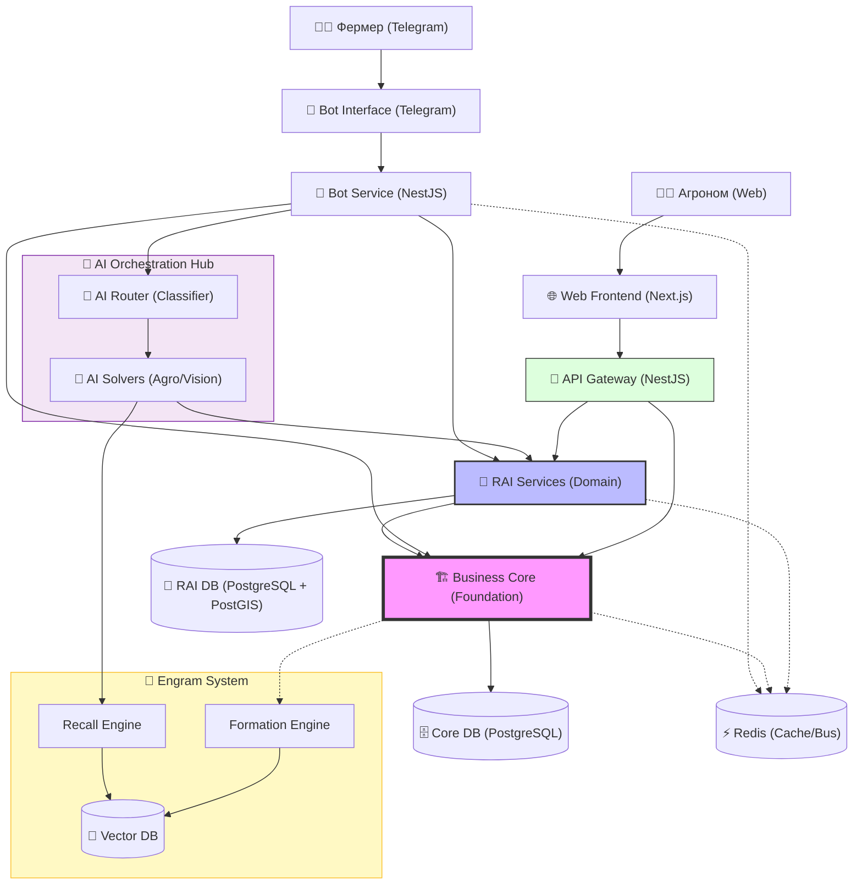

markdown
# Архитектура: Контейнеры (C4 Model Level 2)

> **Статус:** Черновик | **Версия:** 0.1 | **Обновлено:** 2026.02.02  
> **Диаграмма:** [ссылка на Miro/draw.io] | **Covers:** Phase Alpha

---

## 1. ОБЗОР АРХИТЕКТУРЫ

RAI Platform построена по принципу **двухуровневой архитектуры** с интеграцией **AI Orchestration**:
┌─────────────────────────────────────────────────┐
│ RAI DOMAIN (Прикладная логика)                  │
│ • Agro Intelligence   • Client Engagement       │
│ • Field Management    • Task Coordination       │
└─────────────────────────────────────────────────┘
┌─────────────────────────────────────────────────┐
│ AI ORCHESTRATION & ENGRAMS (Интеллект)          │
│ • Router-Solver Flow  • Contextual Memory       │
│ • Vision Analysis     • Proactive Alerts        │
└─────────────────────────────────────────────────┘
┌─────────────────────────────────────────────────┐
│ BUSINESS CORE (Фундамент)                       │
│ • Identity & Access   • Structure & Registry    │
│ • Task & Workflow     • Audit & Events          │
└─────────────────────────────────────────────────┘

text

**Ключевые принципы:**
1. **Каноничность** — каждая сущность имеет чёткий жизненный цикл
2. **Событийность** — вся система реагирует на события
3. **Advisory AI** — ИИ только рекомендует, решения за человеком
4. **Контурная безопасность** — строгое разделение уровней

---

## 2. КАРТА КОНТЕЙНЕРОВ (PHASE ALPHA + BETA/GAMMA VISION)

### 2.1 Веб-клиенты
┌─────────────────┐ REST/WebSocket      ┌─────────────────┐
│  Web Frontend   │───────────────────────▶│   API Gateway   │
│                 │                       │                 │
│ • Next.js 14    │◀───────────────────────│ • NestJS        │
│ • React         │         JSON          │ • Rate Limiting │
│ • TypeScript    │                       │ • Auth          │
│ • Tailwind CSS  │                       │                 │
└─────────────────┘                       └─────────────────┘

text

### 2.2 Телеграм-бот и AI
┌─────────────────┐ Webhooks ┌─────────────────┐       ┌─────────────────┐
│  Telegram Bot   │────────────▶│   Bot Service   │──────▶│ AI Orchestrator │
│                 │            │                 │       │                 │
│ • Node.js       │◀────────────│ • NestJS        │◀──────│ • Router (4o-mini)│
│                 │            │                 │       │ • Solvers (4o)  │
└─────────────────┘            └─────────────────┘       └─────────────────┘

text

### 2.3 Бэкенд-сервисы
┌─────────────────┐ gRPC/REST ┌─────────────────┐
│   API Gateway   │───────────────────────▶│  RAI Services   │
│                 │                       │                 │
│ • NestJS        │◀───────────────────────│ • Field Service │
│ • Auth Proxy    │        Events         │ • Crop Service  │
│ • Load Balancer │                       │ • Task Service  │
│                 │     Async (Events)    │                 │
│                 ├───────────────────────▶│    Event Bus    │
│                 │                       │  (Redis/NATS)   │
└─────────────────┘                       └─────────────────┘
         ↓                                         ⬇ Log Stream
┌─────────────────┐                       ┌─────────────────┐
│  Business Core  │                       │  Engram System  │
│                 │                       │  (Gamma Phase)  │
│ • Identity Svc  │                       │ • Formation Eng.│
│ • Registry Svc  │                       │ • Recall Eng.   │
│ • Task Engine   │                       │ • Vector DB     │
└─────────────────┘                       └─────────────────┘

text

### 2.4 Базы данных и хранилища
┌─────────────────┐ SQL ┌─────────────────┐
│  Business Core  │───────────────────────▶│   PostgreSQL    │
│    Services     │                       │                 │
│                 │◀───────────────────────│ • Core DB       │
│                 │          SQL          │ • Structured    │
│                 │                       │   Data          │
└─────────────────┘                       └─────────────────┘

┌─────────────────┐ SQL ┌─────────────────┐
│  RAI Services   │───────────────────────▶│   PostgreSQL    │
│                 │                       │                 │
│                 │◀───────────────────────│ • RAI Domain DB │
│                 │          SQL          │ • Agronomy Data │
└─────────────────┘                       └─────────────────┘

┌─────────────────┐ Vector ┌─────────────────┐
│  Engram System  │───────────────────────▶│   Vector DB     │
│                 │                       │                 │
│                 │◀───────────────────────│ • pgvector      │
│                 │       Similarity      │ • Embeddings    │
└─────────────────┘                       └─────────────────┘

text

---

## 3. ДЕТАЛЬНОЕ ОПИСАНИЕ КОНТЕЙНЕРОВ

### 3.1 `web-frontend` (Next.js 14)
**Назначение:** Основной веб-интерфейс для агрономов и менеджеров
**Технологии:** Next.js 14, React, TypeScript, Tailwind CSS, Mapbox/Leaflet
**Взаимодействие:**
- → `api-gateway`: REST API для данных
- → `bot-service`: статус задач через WebSocket

**Обязанности:**
- Отображение карты полей
- Управление задачами
- Аналитические дашборды
- Настройка системы

### 3.2 `api-gateway` (NestJS)
**Назначение:** Единая точка входа для всех API-запросов
**Технологии:** NestJS, TypeScript, JWT, Rate Limiting
**Взаимодействие:**
- ← `web-frontend`, `mobile-app`: принимает запросы
- → `rai-services`: проксирует запросы в доменные сервисы
- → `business-core-services`: проксирует запросы в ядро
- → `event-bus`: публикует события

**Обязанности:**
- Аутентификация и авторизация
- Лимитирование запросов
- Логирование входящих запросов
- Маршрутизация к сервисам

### 3.3 `bot-service` (NestJS)
**Назначение:** Обработка команд Telegram-бота и шлюз к AI
**Технологии:** NestJS, node-telegram-bot-api
**Взаимодействие:**
- ← `Telegram`: получает сообщения через Webhook
- → `ai-orchestration`: отправляет текст/фото для понимания интента
- → `rai-services`: выполнение команд
- → `event-bus`: публикация событий

### 3.4 `ai-orchestration-hub` (Logical Container)
**Назначение:** Маршрутизация и исполнение интеллектуальных задач
**Phase:** Beta/Gamma
**Компоненты:**
- **Router:** Классификатор интентов (gpt-4o-mini).
- **Solvers:** Агенты (Agro, Finance, Vision).
**Взаимодействие:**
- ← `bot-service`: получает контекст
- → `engram-system`: запрашивает память
- → `rai-services`: запрашивает данные о полях

### 3.5 `engram-memory-system` (Logical Container)
**Назначение:** Долгосрочная память и опыт системы
**Phase:** Gamma
**Компоненты:**
- **Formation Engine:** Создает энграммы из Audit Log.
- **Recall Engine:** Ищет аналогии в Vector DB.
- **Vector DB:** Хранилище эмбеддингов (pgvector).

### 3.6 `rai-services` (Микросервисы NestJS)
**Назначение:** Обработка агрономической логики
**Состав:**
- `field-service`: управление полями, геоданными
- `crop-service`: справочник культур, характеристик
- `task-service`: задачи полевых работ (доменная часть)
- `season-service`: планирование сезонов

**Взаимодействие:**
- ← `api-gateway`, `bot-service`: принимает запросы
- → `business-core-services`: делегирует общую логику
- → `event-bus`: публикует доменные события
- → `rai-database`: сохраняет данные

### 3.7 `business-core-services` (Микросервисы Node.js)
**Назначение:** Общая бизнес-логика, применимая в любом домене
**Состав:**
- `identity-service`: пользователи, роли, аутентификация
- `registry-service`: иерархические структуры (компания→хоз-во→поле)
- `task-engine-service`: движок задач (статусы, workflow)
- `audit-service`: логирование действий (источник данных для Энграмм)
- `event-service`: управление событиями

**Взаимодействие:**
- ← `rai-services`, `api-gateway`: принимает запросы
- → `core-database`: сохраняет данные ядра
- → `event-bus`: публикует системные события
- → `redis`: кэш, сессии

### 3.8 `event-bus` (Redis/NATS)
**Назначение:** Асинхронная коммуникация между сервисами
**Технологии:** Redis Streams или NATS
**Топики (для Alpha):**
- `user.created`
- `task.created`
- `task.status.changed`
- `field.updated`

**Подписчики:** Все сервисы, которым нужно реагировать на события

### 3.9 Базы данных
**`core-database` (PostgreSQL)**
- Схема: `auth`, `registry`, `tasks`, `audit`
- Миграции: через Prisma

**`rai-database` (PostgreSQL + PostGIS)**
- Схема: `fields`, `crops`, `seasons`, `operations`
- Расширение: PostGIS для геоданных

**`engram-database` (PostgreSQL + pgvector)**
- Назначение: Векторный поиск по инцидентам и опыту (Phase Gamma)

**`redis`**
- Использование: кэш, сессии, event bus, распределённые блокировки

---

## 4. КЛЮЧЕВЫЕ ПОТОКИ ДАННЫХ

### 4.1 Создание нового поля
1. Web Frontend → API Gateway (POST /api/v1/fields)
2. API Gateway → Field Service (с токеном)
3. Field Service → Registry Service (создать в иерархии)
4. Registry Service → Core DB (сохранить)
5. Field Service → RAI DB (сохранить детали)
6. Field Service → Event Bus (field.created)
7. Event Bus → Audit Service (записать действие) 
8. Audit Service → Engram Formation (если настроено, асинхронно)

### 4.2 Обработка вопроса агроному (AI Flow)
1. Telegram → Bot Service (Webhook)
2. Bot Service → AI Router (Классификация)
3. AI Router → AI Solver (Agro) 
4. AI Solver → Engram Recall (Поиск похожих ситуаций)
5. AI Solver → Field Service (Получение данных о поле)
6. AI Solver → Formatter → Bot Service (Ответ)