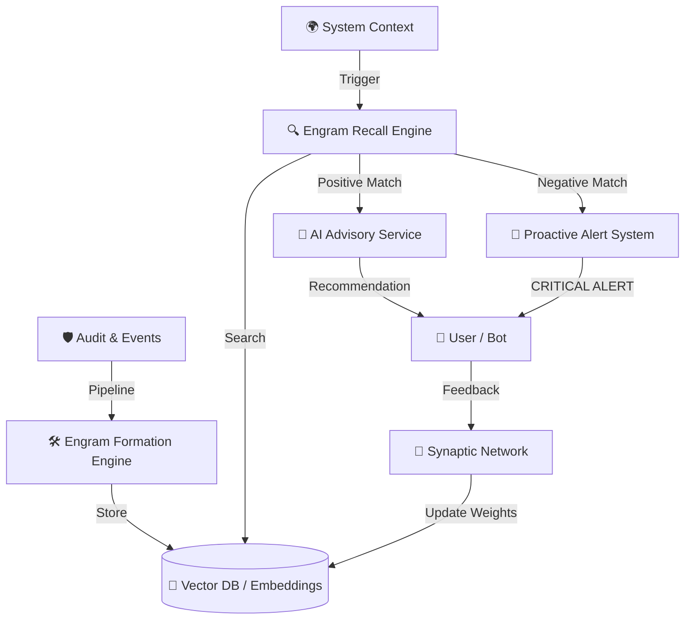

# HLD: Engram Memory System (Когнитивная память) 🧠

> **Статус:** Проектирование | **Фаза реализации:** Gamma (2026) | **Слой:** Архитектура / HLD

---

## 1. Концепция
**Энграмма (Engram)** — это минимальная единица опыта системы. Система формирует два типа "воспоминаний":
- **Positive Engrams (+)**: Паттерны, приведшие к успеху (используются для рекомендаций).
- **Negative Engrams (-)**: Паттерны, приведшие к провалу, ошибкам или потерям (используются для **алертов и блокировок**).

---

## 2. Архитектура компонентов

---

## 3. Ключевые модули

### 3.1 Engram Formation Engine
Слушает поток событий из `AuditLog`. При завершении бизнес-цикла:
1. Собирает "Слепок контекста".
2. Оценивает результат.
3. Если результат **отрицательный** (например, гибель посевов, резкий рост сорняков после обработки) — формирует **Negative Engram**.

### 3.2 Engram Recall Engine & Alerting
При возникновении новой ситуации:
1. Оцифровывает текущий контекст.
2. Ищет аналоги в Vector DB.
3. **Trigger Logic**:
   - Если найдена Negative Engram с высоким весом → **Мгновенный Алерт**: "Внимание! В 2023 году при таких же условиях (t, влажность, фаза) обработка препаратом X привела к ожогу листа. Не повторяйте ошибку!"
   - Если найдена Positive Engram → Стандартная рекомендация.

### 3.3 Synaptic Network
Управляет "весом" (значимостью) энграмм. Если рекомендация, основанная на энграмме, привела к успеху — вес растет. Если к провалу — падает (правило Хебба).

---

## 4. Технологический стек (предварительно)
- **Vector Storage**: `pgvector` расширение для PostgreSQL.
- **Embeddings**: Перевод контекста в векторы через LLM (OpenAI/Local).
- **Processing**: Redis Streams для реактивного формирования памяти.

---

## 5. Дорожная карта реализации

| Этап | Задача | Статус |
|------|--------|--------|
| **Alpha** | Сбор качественных данных в `AuditLog` | ✅ В процессе |
| **Beta** | Проектирование схем эмбеддингов для агро-событий | 💤 План |
| **Gamma** | Запуск MVP Engram System (поиск по аналогам) | 💤 План |
| **Delta** | Автономное самообучение и кросс-клиентский опыт | 💤 План |
