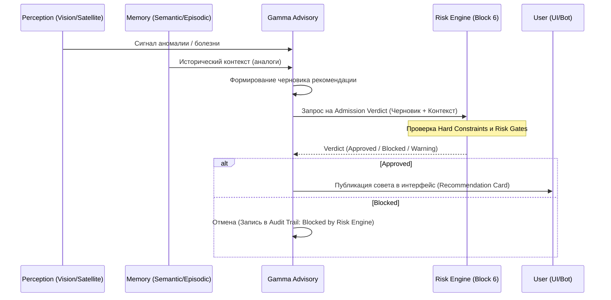

# HLD: Интеграция Gamma & Risk Engine 🛡️

## 1. Концепция
Для предотвращения дублирования логики и обеспечения безопасности, все проактивные рекомендации фазы Gamma обязаны проходить через существующий **Risk Engine** (Block 6).

## 2. Петля принятия решения (Decision Loop)

## 3. Разделение ответственности
- **Gamma Advisory:** Генерирует "ЧТО" делать на основе данных и опыта.
- **Risk Engine:** Решает "МОЖНО ЛИ" это сейчас делать, исходя из бизнес-правил, SLA и матриц рисков.

## 4. Канонический инвариант
> [!IMPORTANT]
> Система не имеет права показывать пользователю совет, который не прошел верификацию в Risk Engine. Любая попытка обхода считается критическим инцидентом безопасности.
