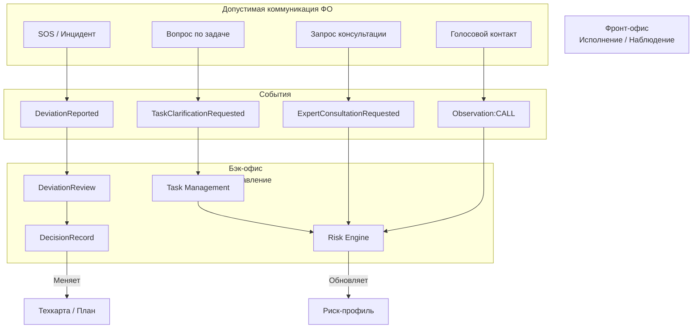

# Front-Office Function Admission Rules

RAI_EP · Phase Beta · Canonical

## 0. Статус документа

**Обязательный. Нормативный. Блокирующий.**  
Любая функция Фронт-офиса, не прошедшая эти правила, запрещена к реализации.

---

## 1. Базовый принцип (Единое тело системы)

Фронт-офис не является модулем.  
Фронт-офис — это исполнительный и сенсорный контур Бэк-офиса.

**Следствие:**  
Фронт-офис не может:
- существовать автономно,
- иметь собственную логику принятия решений,
- хранить «локальную правду».

---

## 2. Обязательное правило причинно-следственной замкнутости

### 2.1. Золотое правило
Каждое действие во Фронт-офисе ОБЯЗАНО:
1. Сгенерировать явное событие (Event)
2. Иметь детерминированную реакцию Бэк-офиса
3. Привести к изменению состояния системы

Если хотя бы один пункт отсутствует — функция запрещена.

---

## 3. Admission Gate: формальный шаблон функции

Любая функция Фронт-офиса обязана быть описана так:

- **F:** <Название функции ФО>
- **Trigger:** Кто и в каком контексте инициирует действие.
- **Event:** Какое структурированное событие порождается.
- **Backend Reaction:** Какой модуль Бэк-офиса реагирует.
- **State Impact:** Что именно меняется:
    - план
    - риск
    - ответственность
    - экономический факт
    - память системы
- **Failure Mode:** Что происходит, если пруфы отсутствуют.

> [!CAUTION]
> Функция без такого описания не обсуждается.

---

## 4. Обязательное наличие цифровых пруфов

### 4.1. Пруф-минимум
Каждое событие Фронт-офиса должно иметь хотя бы один:
- Гео-метка
- Фото / видео
- Голосовая фиксация
- Лог телефонного контакта

### 4.2. Отсутствие пруфов
Отсутствие пруфов:
- не блокирует событие,
- генерирует риск,
- маркирует событие как слабое доказательство.

**Нет пруфа → есть риск → есть след ответственности.**

---

## 5. Запрещённые классы функций (Hard Ban)

### 5.1. Что именно запрещено (точная формулировка)
Во Фронт-офисе КАТЕГОРИЧЕСКИ ЗАПРЕЩЕНА любая коммуникация, которая:
- не порождает структурированного Event,
- не привязана к объекту управления,
- не влияет на состояние системы,
- не может быть использована как evidence,
- не замыкается на решение / риск / план.

**❌ Запрещённые формы (без исключений):**
- ❌ Свободный чат (общий, личный, неякорный)
- ❌ Сообщение “просто написать”
- ❌ Комментарий ради комментария
- ❌ Обсуждение без события
- ❌ Коммуникация вне модели

> [!CAUTION]
> Если сообщение нельзя однозначно связать с Task / Observation / Deviation / Decision — его не должно существовать в системе.

### 5.2. Принципиальное уточнение (критично)
Запрещена не коммуникация как таковая. Запрещена коммуникация без управленческого якоря.  
Фронт-офис разрешает общение только как производную от события, а не как самостоятельную функцию.

### 5.3. Разрешённые формы коммуникации (исчерпывающий список)
Любая коммуникация во Фронт-офисе ОБЯЗАНО:
1. Быть инициирована через кнопку / действие (а не текстовое поле).
2. Создать явный Event.
3. Быть привязана к конкретной модели.
4. Иметь конечный управленческий исход.

**✅ Допустимые типы (и только они):**

| Тип коммуникации | Якорь | Event | Управленческий исход |
| :--- | :--- | :--- | :--- |
| Инцидентный Thread | Deviation | `DeviationReported` | `DecisionRecord` |
| Вопрос по задаче | Task | `TaskClarificationRequested` | Продолжение / риск |
| Консультация | Field Context | `ExpertConsultationRequested` | Risk / Observation / Close |
| Голосовой контакт | Call Log | `Observation(Type:CALL)` | Evidence / Risk |

### 5.4. Формула допуска (можно считать юридической)
**Нет Event → нет коммуникации. Нет модели → нет сообщения. Нет влияния → нет функции.**

### 5.5. Архитектурное следствие (не обсуждается)
Фронт-офис не предоставляет “пустое текстовое поле”.  
Он предоставляет управляемые действия, которые могут сопровождаться коммуникацией.

---

## 6. Диаграмма типов коммуникации ФО ↔ БО
(Каноническая, для Phase Beta)

---

## 7. Решения: строгая централизация
...

### 6.1. Запрет на принятие решений в поле
Фронт-офис не может:
- утверждать изменения технологии,
- закрывать инциденты,
- признавать отклонения допустимыми.

### 6.2. Единственный легитимный путь
Любое отклонение → `DeviationReview` → `DecisionRecord`

Все решения:
- фиксируются,
- трассируются,
- аудируются.

---

## 7. Принцип асимметрии ответственности

- **Фронт-офис:** фиксирует факт.
- **Бэк-офис:** несёт ответственность за решение.

Это ключевой принцип юридической и консультационной защиты.

---

## 8. Traceability как обязательное свойство

Каждая функция Фронт-офиса должна быть трассируема до:
- Техкарты
- Риска
- Экономического события
- Решения

Если нельзя построить цепочку:  
**План → Исполнение → Факт → Реакция → Решение**  
— Функция запрещена.

---

## 9. Admission Checklist (для ревью)

Функция допускается, если на все вопросы ответ **ДА**:
1. Есть явный Event?
2. Есть Backend-реакция?
3. Меняется состояние системы?
4. Есть цифровой пруф или риск?
5. Нет принятия решений в поле?
6. Нет автономной логики ФО?

> [!IMPORTANT]
> Один «НЕТ» = блок.

---

## 10. Стратегическое резюме (не для обсуждения)

В RAI_EP нет общения “вообще”.  
Есть только коммуникация как часть управленческого контура.

**Это:**
- сохраняет трассируемость,
- защищает ответственность,
- не убивает живое общение,
- **но убивает управленческий шум.**

Фронт-офис в RAI_EP — это **не интерфейс. Не бот. Не удобство.**  
**А исполнительный орган системы управления реальностью.**
