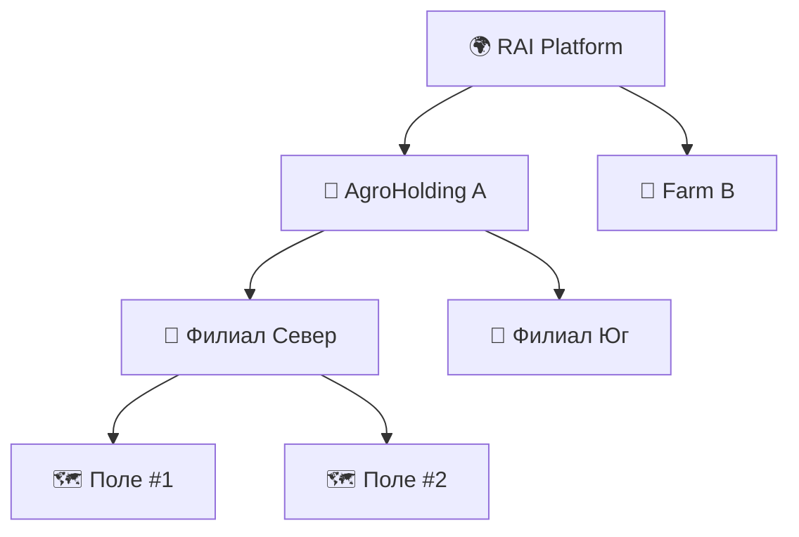

---
id: service-structure-registry
type: service
status: review
owners: [architects]
aligned_with: [principle-axioms]
---

# Subsystem: Structure & Registry 🏢

> **Статус:** Канон | **Версия:** 1.0 | **Расположение:** Business Core

---

## 1. Назначение
Registry — это "адресная книга" и скелет всей системы. Он определяет иерархию владения и прав доступа. Без записи в Registry ни один объект в системе (поле, трактор, агроном) не существует.

---

## 2. Иерархия (Registry Tree)

Мы используем жесткую иерархию для обеспечения изоляции данных:

- **Company**: Юридическое лицо, владелец подписки.
- **Client (Farm)**: Конкретное хозяйство или производственный участок.
- **Node**: Любая конечная сущность (Поле, Техника, Склад), привязанная к Client.

---

## 3. Registry Model (Data Structure)

Все элементы реестра имеют общий набор свойств:
- `companyId`: Глобальный идентификатор владельца.
- `parentId`: Ссылка на родительский узел.
- `metadata`: Специфические данные (для поля — геометрия, для компании — ИНН).

---

## 4. Правила валидации
1. **Orphan Protection**: Узел не может существовать без привязки к Компании.
2. **Move Limitation**: Нельзя переместить Поле из одной Компании в другую без специальной процедуры миграции (так как теряется история аудита).
3. **Unique Naming**: Имена полей должны быть уникальны в рамках одного Хозяйства.

---

## 5. Связь с правами доступа
Registry напрямую прокидывает права: если пользователь имеет доступ к "Филиалу Север", он автоматически видит все Поля внутри этого узла.
