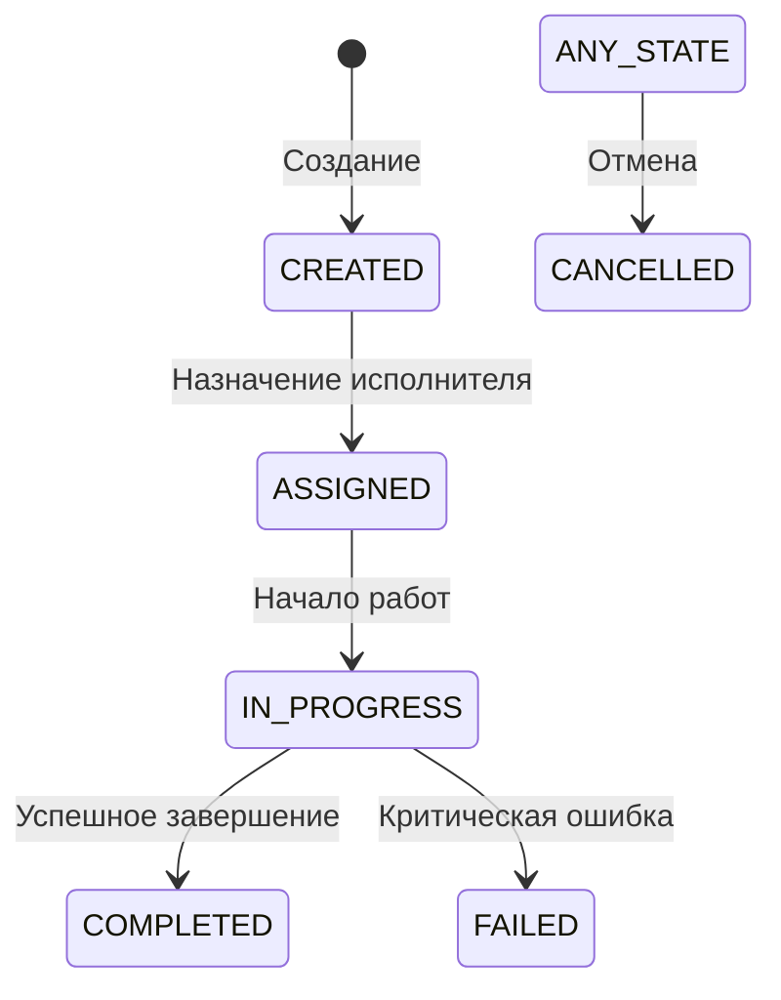

---
id: service-task-workflow
type: service
status: review
owners: [architects, techleads]
aligned_with: [principle-axioms]
---

# Subsystem: Task & Workflow Engine ⚙️

> **Статус:** Канон | **Версия:** 1.0 | **Расположение:** Business Core

---

## 1. Назначение
Task Engine — это универсальный движок для управления любыми работами внутри платформы. Он обеспечивает жизненный цикл задачи, контроль исполнителей и уведомления о прогрессе.

---

## 2. Модель состояния (FSM)

Каждая задача следует строгому конечному автомату (Finite State Machine):

---

## 3. Компоненты задачи

- **Task Type**: Шаблон задачи (например, "Посев", "Внесение удобрений"). Определяет набор необходимых параметров.
- **Payload**: Данные задачи (какое поле, какой ресурс, какой объем).
- **Assignee**: Лицо, ответственное за выполнение.
- **Workflow**: Набор правил, по которым задача переходит между состояниями.

---

## 4. Интеграция с доменами (на примере RAI)

1. **RAI Domain**: Генерирует "Намерение" (Intent) — например, "Нужно посеять рапс".
2. **Core Task Engine**: Создает объект `Task` со статусом `CREATED`.
3. **Telegram Bot**: Уведомляет агронома и предлагает взять задачу в работу.
4. **Core Task Engine**: При нажатии кнопки меняет статус на `ASSIGNED` и логирует время начала.

---

## 5. Автоматизация и Триггеры

Движок поддерживает несколько типов запуска:
- **Manual**: Прямое создание менеджером.
- **Scheduled**: По календарному плану (техкарте).
- **Event-driven**: Реакция на внешнее событие (например, "Влажность почвы достигла X%").

---

## 6. Отчётность и SLA
Система автоматически считает:
- **Lead Time**: Время от создания до завершения.
- **Reaction Time**: Время от назначения до начала работ.
- **Success Rate**: Процент успешно выполненных задач без возврата на доработку.
