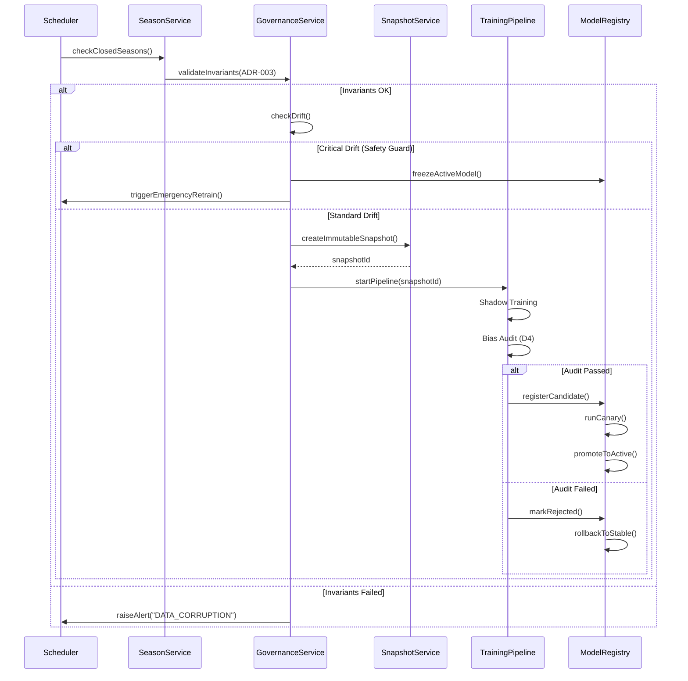
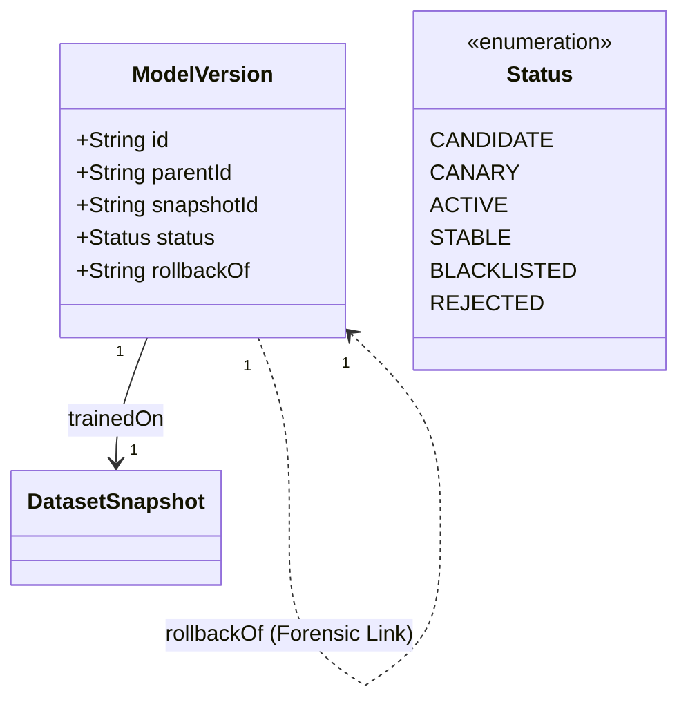

# LEVEL D — SYSTEM FLOW HLD (D6 Tuning)
## Схемы потоков данных и управления

---

## 1. Data Flow — Полный цикл обучения (D6)

**Tenant Isolation Scope:** Весь цикл выполняется строго внутри `TenantID`. Cross-tenant data access **prohibited**.

```mermaid
flowchart TD
    %% Phase 1: Validation & Invariants
    A[Закрытие сезона] --> V{SeasonCloseValidator}
    V -->|Invariant Fail (ADR-003)| ERR[System Alert: Data Integrity]
    V -->|OK| B[FeedbackLoopEngine]
    
    %% Phase 2: Drift & Monitoring (ADR-004)
    B -->|LearningEvent (Immutable)| C[DriftMonitorWorker]
    C -->|DriftReport| G{Governance Gate}
    
    %% Monitoring Lane (Failure Isolation)
    subgraph Monitoring Lane
        H[HeartbeatMonitor] -->|Full SLA Check| C
        H -->|SLA Violation| ALERT[SEV-1 Alert]
        CB[CircuitBreaker] -.->|Isolate Failures| C
    end

    %% Phase 3: Governance (Ordered)
    G -->|Condition 1: Critical Drift| CRIT{Drift > Critical?}
    CRIT -->|Yes| FREEZE[EMERGENCY FREEZE (Auto-Block)]
    CRIT -->|No| G1{MinSeasons >= 3?}
    G1 -->|No| REJ1[REJECTED: Insufficient Data]
    G1 -->|Yes| G2{MaxFrequency OK?}
    G2 -->|No| REJ2[REJECTED: Too Frequent]
    G2 -->|Yes| G3{Drift > Warning?}
    G3 -->|No| REJ3[REJECTED: No Drift]
    G3 -->|Yes| G4{Accuracy Gain > Threshold?}
    G4 -->|No| REJ4[REJECTED: No Gain]
    
    %% Phase 4: Snapshot & Training (ADR-003)
    G4 -->|APPROVED| S[DatasetSnapshotService]
    S -->|Create Snapshot| SNAP[DatasetSnapshot (Immutable)]
    SNAP --> TRAIN[ShadowTrainer]
    
    %% Phase 5: Verification & Promotion
    TRAIN -->|ModelCandidate| BIAS[BiasAuditModule]
    BIAS -->|Bias Detected| ROLL[MANDATORY ROLLBACK to STABLE]
    BIAS -->|OK| VAL[ModelValidator]
    VAL -->|OK| CANARY[CanaryDeployment]
    CANARY -->|Success| PROMO[Promote to ACTIVE]
    CANARY -->|Fail| ROLL
```

---

## 2. Learning Lifecycle — Жизненный цикл знаний

```mermaid
flowchart LR
    subgraph SOURCES [Sources (Read-Only)]
        S1[HarvestResult (Closed)]
        S2[OverrideTrace]
        S3[WeatherData]
    end

    subgraph ENGINE [Engine]
        VAL[Validator]
        FB[FeedbackLoop]
        DM[DriftMonitor]
    end

    subgraph ARTIFACTS [Immutable Artifacts]
        LE[LearningEvent]
        DR[DriftReport]
        DS[DatasetSnapshot]
        MV[ModelVersion]
    end

    S1 --> VAL
    VAL --> FB
    FB --> LE
    LE --> DM
    DM --> DR
    DR --> DS
    DS --> MV
```

**Key Constraints (ADR-003):**
*   `DatasetSnapshot` создается **только** после Governance Approval.
*   `LearningEvent` является **Immutable**.

---

## 3. Update Control Flow — Sequence Diagram



---

## 4. Version Graph Model (Lineage)

Архитектура графа версий (DAG Integrity):



**Status Transitions:**
*   `ACTIVE` $\to$ `STABLE`: Версия проработала $\ge 1$ сезон без критических алертов.
*   `ACTIVE` $\to$ `BLACKLISTED`: Обнаружен Critical Issue или откат.

**Rollback Target Policy:**
*   При сбое (`CRITICAL_DRIFT`, `BIAS_DETECTED`) система выполняет откат к **Last STABLE Version**.

---

## 5. Failure Mode Isolation (D6)

*   **Circuit Breakers:** Monitoring Lane изолирует сбои (Fail-Closed для Safety, Fail-Open для Monitoring).
*   **Resource Isolation:** Training выполняется в отдельных Docker-контейнерах с жесткими лимитами (CPU/RAM).
*   **Queue Policy:** Отдельная очередь для каждого тенанта (Fairness).

---

## 6. Связанные документы
- [ADR-001: Controlled Autonomy](file:///f:/RAI_EP/docs/01_ARCHITECTURE/DECISIONS/ADR_LD_001_CONTROLLED_AUTONOMY.md)
- [ADR-002: Immutable Lineage](file:///f:/RAI_EP/docs/01_ARCHITECTURE/DECISIONS/ADR_LD_002_IMMUTABLE_MODEL_LINEAGE.md)
- [ADR-003: No Retroactive Mutation](file:///f:/RAI_EP/docs/01_ARCHITECTURE/DECISIONS/ADR_LD_003_NO_RETROACTIVE_MUTATION.md)
- [ADR-004: Mandatory Drift](file:///f:/RAI_EP/docs/01_ARCHITECTURE/DECISIONS/ADR_LD_004_DRIFT_MANDATORY_ENFORCEMENT.md)
