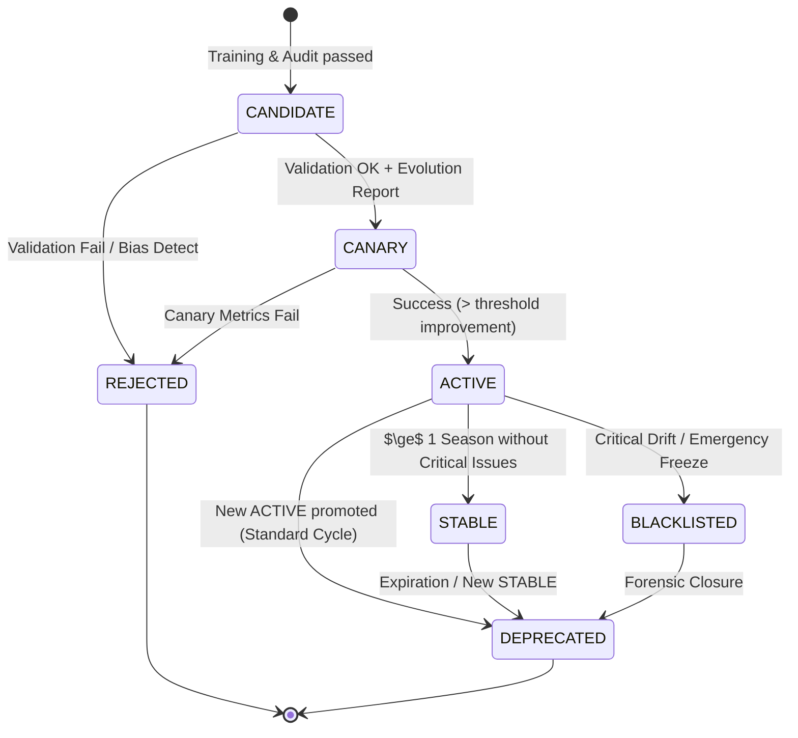

# MODEL UPDATE STATE MACHINE (D6++ Precision)
## FSM жизненного цикла модели (Registry Lifecycle)

---

## 1. Состояния (Registry States)

Унифицированная статусная модель (D6++):

| Состояние | Описание | Инвариант |
|-----------|----------|-----------|
| **CANDIDATE** | Модель обучена, зарегистрирована, ожидает валидации. | Immutable Snapshot Link |
| **CANARY** | Прошла валидацию, развернута на $\%$ трафика. | Evolution Report Exists |
| **ACTIVE** | Основная production-модель (принимает 100% трафика). | Singleton per Tenant (Transactional) |
| **STABLE** | Проверенная временем версия (Last Known Good). | Singleton per Tenant (Max 1) |
| **BLACKLISTED** | Заблокирована из-за критического сбоя/дрифта/bias. | Never Promotable, Never Parent |
| **REJECTED** | Не прошла валидацию или bias-аудит. | Dead End |
| **DEPRECATED** | Замещена новой ACTIVE версией. | Read-Only |

---

## 2. FSM-диаграмма



---

## 3. Правила переходов (Transitions)

Safety Guards:
*   **AND** условия (никаких опасных OR).
*   **Tenant Scope** (проверка в контексте тенанта).
*   **Atomic Transactions** (Swap в одной транзакции).

| Из | В | Trigger | Guard (Condition) | Action |
|---|---|---|---|---|
| CTX | CANDIDATE | FeedbackLoop | `Snapshot.exists` AND `Training.success` | `Registry.createVersion()` (Concurrency Guard) |
| CANDIDATE | CANARY | Manual/Auto | `Validation.passed` **AND** `BiasAudit.passed` **AND** `EvolutionReport.exists` | `Canary.deploy()` (Max 1 Canary) |
| CANDIDATE | REJECTED | Validation | `Validation.failed` OR `BiasAudit.failed` | `Registry.markRejected()` |
| CANARY | ACTIVE | CanaryEnd | `Canary.improvement > 0` **AND** `Drift < Threshold` | `AtomicPromotion(Canary -> ACTIVE, OldActive -> DEPRECATED)` |
| CANARY | REJECTED | CanaryFail | `Canary.degradation > Threshold` | `RollbackCanary()` |
| ACTIVE | STABLE | SeasonClose | `Age >= 1 Season` **AND** `Alerts.Critical == 0` | `AtomicPromotion(ACTIVE -> STABLE, OldStable -> DEPRECATED)` |
| ACTIVE | BLACKLISTED | Monitoring | `Drift > Critical` OR `Bias > Critical` | **EMERGENCY FREEZE** |
| ACTIVE | DEPRECATED | Promotion | `NewVersion.status == ACTIVE` | `Deprecate(Old)` (Stops Stable Timer) |
| STABLE | DEPRECATED | Promotion | `NewStable.status == STABLE` | `Deprecate(Old)` |

---

## 4. Edge Cases & Safety Policies (D6++)

### A. SAFE_MODE Logic (No Stable Fallback)
Если `ACTIVE` переходит в `BLACKLISTED`, но в системе **нет** `STABLE` версии (например, первый запуск):
1.  **System Action:** Enter **SAFE_MODE**.
2.  **Constraint:** Inference API возвращает `503 Service Unavailable` или дефолтную эвристику (Hardcoded Rule).
3.  **Resolution:** Только ручное вмешательство или экстренный Retrain от "чистого листа".

### B. Stable Singleton Policy
*   В системе может быть **ТОЛЬКО ОДНА** версия `STABLE` на тенант.
*   При переходе `ACTIVE` $\to$ `STABLE`, предыдущая `STABLE` атомарно переходит в `DEPRECATED`.

### C. Warning Drift Policy (Gradual Degradation)
*   **Drift < Warning:** Normal Operation.
*   **Warning < Drift < Critical:**
    *   Status: остается `ACTIVE`.
    *   Action: Alert `SEV-2`, ускорение мониторинга (x2 frequency).
    *   Trigger: Proactive Retraining (вне очереди).
*   **Drift > Critical:**
    *   Status: `BLACKLISTED` (Emergency Freeze).
    *   Action: Alert `SEV-1`, Rollback to STABLE.

### D. Promotion Atomicity
Смена статусов должна быть **строго транзакционной**:
```sql
BEGIN;
  -- Demote old ACTIVE
  UPDATE model_versions SET status = 'DEPRECATED' 
  WHERE tenant_id = :tid AND status = 'ACTIVE';
  
  -- Promote new ACTIVE
  UPDATE model_versions SET status = 'ACTIVE' 
  WHERE id = :candidateId;
COMMIT;
```

---

## 5. Invariant Guards & DB Enforcement

### A. DB Constraints (Hard Enforcement)
Используются **Partial Unique Indexes** (PostgreSQL) для гарантии Singleton состояний:

```sql
-- 1. Single Active per Tenant
CREATE UNIQUE INDEX idx_single_active ON model_versions (tenant_id) 
WHERE status = 'ACTIVE';

-- 2. Single Canary per Tenant
CREATE UNIQUE INDEX idx_single_canary ON model_versions (tenant_id) 
WHERE status = 'CANARY';

-- 3. Single Stable per Tenant
CREATE UNIQUE INDEX idx_single_stable ON model_versions (tenant_id) 
WHERE status = 'STABLE';
```

### B. Concurrency Guards
*   **Max 1 Training:** Distributed Mutex `lock:training:{tenantId}`.

### C. Code Contract Guards

```typescript
class ModelLifecycleFSM {
  constructor(private readonly tenantId: string) {}

  private invariants = {
    // 1. Parent Blacklist Check
    VALID_PARENT: (ctx) => {
       const parent = await repo.get(ctx.candidate.parentId);
       if (parent.status === 'BLACKLISTED') throw new IntegrityError("Toxic Lineage");
       return true;
    },
    
    // 2. Immutable Snapshot
    SNAPSHOT_LINK: (ctx) => {
       return !!ctx.candidate.snapshotId; 
    }
  };
}
```

---

## 6. Связанные документы
- [LEVEL_D_SYSTEM_FLOW_HLD.md](file:///f:/RAI_EP/docs/01_ARCHITECTURE/HLD/LEVEL_D_SYSTEM_FLOW_HLD.md)
- [ADR-002: Immutable Lineage](file:///f:/RAI_EP/docs/01_ARCHITECTURE/DECISIONS/ADR_LD_002_IMMUTABLE_MODEL_LINEAGE.md)
- [MODEL_VERSIONING_ARCHITECTURE.md](file:///f:/RAI_EP/docs/01_ARCHITECTURE/CORE/LEVEL_D/MODEL_VERSIONING_ARCHITECTURE.md)
