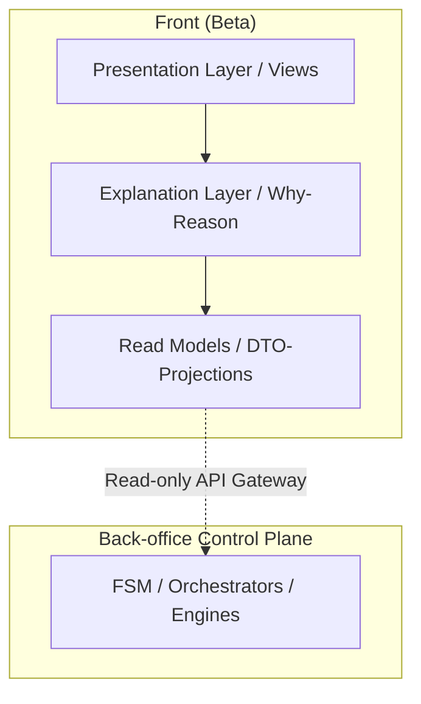

# Front Architecture (Beta) 🔒 Normative / Binding

**Контекст:** Phase Beta (Front Enablement)  
**Основание:** Back-office Beta закрыта (B1–B5)

---

## 1. Базовая архитектурная формула
> **Front = Read-only Strategic Projection over Control Plane**

Фронт не слой управления, а слой наблюдения и осмысления состояний.

---

## 2. Почему НЕТ бокового меню — и это правильно
### ❌ Sidebar — признак операционки
Боковое меню:
- провоцирует CRUD-мышление
- подразумевает “разделы для работы”
- толкает к навигации, а не к пониманию
- масштабируется под массовых пользователей

👉 Это противоречит Front Canon (Beta).

### ✅ Чем заменяется sidebar
**Navigation = Contextual + State-driven**
- нет постоянной навигации
- нет “разделов”
- есть контекст текущего состояния системы

Фронт — это не приложение, это панель состояния.

---

## 3. High-Level Front Architecture

---

## 4. Слои фронта (строго)

### 4.1 Presentation Layer (Views)
- **Что это:** экраны состояния, не формы, не workflow, не “страницы продукта”.
- **Типы View:** Global State View, Context View (R&D / Legal / Risk), Detail Overlay (read-only).
❗ **Нет:** мастеров, пошаговых сценариев, action-heavy UI.

### 4.2 Explanation Layer (ключевой слой)
Это сердце фронта Beta. Каждый статус обязан иметь: источник, причину, ссылку на домен.
**Пример:**
> Experiment: **BLOCKED**  
> Reason:
> - LegalRequirement LR-124
> - Status: AT_RISK
> - CheckedAgainstVersion: 2025.3

👉 **Фронт объясняет, но не решает.**

### 4.3 Read Models Layer
Фронт НЕ работает с domain-моделями напрямую. Только DTO, Aggregated Projections, Read Views.
❗ **Никаких write-DTO. Вообще.**

---

## 5. Навигационная модель (без sidebar)

### 5.1 Entry Point — Global State
Единственная “главная”: System Health, Active Constraints, Blockers, Escalations.
Из неё проваливаются в контексты без перехода “в раздел”.

### 5.2 Contextual Drill-down
Navigation: **Global State** -> **Click on Constraint** -> **Context View (R&D / Legal)** -> **Detail Overlay (read-only)**.
Назад = всегда Global. Нет “потерянных” страниц и древовидной навигации.

### 5.3 Detail Overlay (вместо страниц)
Модальные / side-panels, read-only. Закрываются без изменения контекста. 👉 Это просмотр, не “переход”.

---

## 6. API Interaction Model
- **Разрешено:** `GET /state`, `GET /experiments/read`, `GET /compliance/summary`, `GET /risk/indicators`.
- **Запрещено:** `POST / PUT / PATCH / DELETE`, batch operations, FSM triggers.
⚠️ Даже если API существует — фронт его не использует.

---

## 7. Security & Access
- **Role Gate (жёсткий):** роли проверяются до рендера (не через скрытие кнопок, а через недоступность view).
- **Audit:** логируется кто, что и когда смотрел.

---

## 8. UX-паттерны (Beta)
- **Разрешены:** badges состояний, warning blocks, explanation panels, timestamps (“as of”).
- **Запрещены:** inline editing, “quick actions”, drag & drop, bulk select.

---

## 9. Технический стек (рекомендованный)
- SPA / SSR — не принципиально.
- Строгая типизация Read Models.
- Feature flags на уровне view.
- Zero local state for domain data.

---

## 10. Граница ответственности
| Слой | Отвечает |
| :--- | :--- |
| Front | Понимание |
| Back | Истина |
| Orchestrators | Решения |
| Legal / R&D | Ограничения |

Фронт не может сломать систему, даже если разработчик захочет.

---

## 11. Canon Statement (фиксируем)

> **Front Architecture (Beta):**  
> Это контекстно-навигационная, read-only проекция состояния контрольных контуров системы без бокового меню, без управления, с обязательным слоем объяснений.
