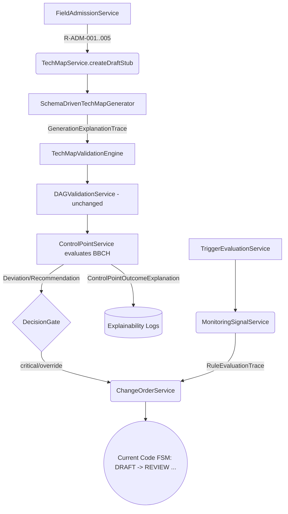

# RAPESEED ENGINE INTEGRATION MAP
## TechMap Engine ↔ Canonical Rapeseed Agronomy Core

## CLAIM
id: CLAIM-ARCH-RAPESEED-INT-001
status: asserted
verified_by: manual
last_verified: 2026-04-01

---

## 1. Назначение документа

Этот документ является **каноническим архитектурным планом интеграции** между:

- **TechMap Engine** — существующей governance / runtime-платформой (FSM, DAG, ChangeOrder, Evidence, ValidationEngine, WorkflowOrchestrator)
- **Canonical Rapeseed Core** — новым каноническим агрономическим ядром по рапсу (Rule Registry, Domain Ontology, Techcard Schema)

Документ отвечает на три вопроса:
1. **ЧТО** в Engine уже существует и корректно работает — не трогать.
2. **ЧТО** в Canonical Core является новым семантическим слоем, которого в Engine нет.
3. **КАК** встраивать новый core, не заменяя engine, не ломая существующие архитектурные инварианты.

---

## 2. Post-Migration Source of Truth (Что становится истиной)

После завершения интеграции устанавливается следующий канонический порядок:
- **Canonical Schema** — источник генерации структуры этапов и веток
- **Rule Registry** — источник правил валидации и порогов
- **Ontology** — источник семантического контракта
- **TechMap Engine** — источник жизненного цикла (FSM), runtime-оркестрации, change order и governance

---

## 3. Контекст: текущее состояние Engine (Sprint TM-1 → TM-5 + POST)

По результатам спринтов TM-1…TM-5 + POST-A/B/C Engine реализует следующее:

### 3.1 Реализованный Runtime Layer (locked — не трогать)

| Компонент | Местоположение | Статус |
|-----------|---------------|--------|
| `TechMapStateMachine` (FSM) | `tech-map/fsm/` | ✅ DONE (см. раздел 9.1) |
| `DAGValidationService` (CPM, acyclicity, resource conflicts) | `tech-map/validation/` | ✅ DONE |
| `TechMapValidationEngine` (7 классов ошибок HARD_STOP/WARNING) | `tech-map/validation/` | ✅ DONE |
| `TankMixCompatibilityService` | `tech-map/validation/` | ✅ DONE |
| `ChangeOrderService` + `Approval` | `tech-map/change-order/` | ✅ DONE |
| `EvidenceService` | `tech-map/evidence/` | ✅ DONE |
| `TechMapBudgetService` + `TechMapKPIService` | `tech-map/economics/` | ✅ DONE |
| `ContractCoreService` (SHA-256 hash) | `tech-map/economics/` | ✅ DONE |
| `RecalculationEngine` | `tech-map/economics/` | ✅ DONE |
| `TriggerEvaluationService` | `tech-map/adaptive-rules/` | ✅ DONE |
| `RegionProfileService` | `tech-map/adaptive-rules/` | ✅ DONE |
| `HybridPhenologyService` | `tech-map/adaptive-rules/` | ✅ DONE |
| `TechMapWorkflowOrchestratorService` | `tech-map/` | ✅ DONE |
| `buildTechMapBlueprint()` | `tech-map/tech-map-blueprint.ts` | ✅ DONE (см. Blueprint Status §5) |

### 3.2 Данные в Prisma-схеме (locked — не трогать, только расширять)

| Модель | Статус |
|--------|--------|
| `TechMap`, `MapStage`, `MapOperation`, `MapResource` | ✅ DONE |
| `CropZone`, `CropPlan`, `SoilProfile`, `RegionProfile` | ✅ DONE |
| `Evidence`, `ChangeOrder`, `Approval` | ✅ DONE |
| `AdaptiveRule`, `HybridPhenologyModel` | ✅ DONE |
| `InputCatalog`, `BudgetLine`, `KPI` | ✅ DONE |

---

## 4. Canonical Rapeseed Core: новые семантические слои

Canonical Core (документы v1.0.0 от 2026-04-01) вводит следующие семантические сущности и концепции, которых в Engine **нет или нет в явном виде**:

### 4.1 Таблица новых сущностей Canonical Core

| Сущность Canonical Core | Canonical ID | Есть в Engine? | Разрыв |
|--------------------------|--------------|----------------|--------|
| `RapeseedTechCard` (обёртка поверх `TechMap`) | Ontology §2.3 | ❌ Нет (TechMap — generic) | Нет явной специализации под рапс |
| `TechCardStage` (логический блок со Stage Goal) | Ontology §2.4 | ⚠️ `MapStage` есть, но без `goal`, `bbch_scope` | Отсутствуют: `stage_goal`, `bbch_scope` |
| `ControlPoint` (шлюз решений при BBCH-фазе) | Ontology §2.5 | ❌ Нет | Полностью отсутствует |
| `RuleRegistry` (Rule со структурой rule_id, layer, confidence) | Rule Registry §3 | ⚠️ 7 классов ошибок в `ValidationEngine` | Нет rule_id, layer, confidence. Правила хардкод |
| `RuleType` enum | Rule Registry §2.1 | ⚠️ Частично (HARD_STOP, WARNING) | Отсутствуют: `STRONG_RECOMMENDATION`, `CONDITIONAL_ADAPTATION`, `SEASONAL_OVERRIDE_TRIGGER`, `MONITORING_SIGNAL`, `HUMAN_REVIEW_REQUIRED` |
| `CropForm` enum (winter/spring) | Schema §enums | ⚠️ `CropType.RAPESEED` есть | Нет разделения RAPESEED_WINTER / RAPESEED_SPRING |
| `MonitoringSignal` (асинхронный сигнал из внешних систем) | Schema §monitoring_signals | ❌ Нет | Полностью отсутствует |
| `CanonicalBranch` (winter_rapeseed / spring_rapeseed) | Schema §canonical_branches | ❌ Нет | Blueprint знает про рапс, но не разделяет ветки |
| `FieldAdmissionCheck` (pre-generation blocker) | Rule Registry §3.1 (R-ADM-*) | ❌ Нет | Нет pre-generation validation gate |
| `AgroclimaticProfile` (регионально) | Schema required_inputs | ⚠️ `RegionProfile` есть | Нет `SAT_avg`, `agroclimatic_zone` как обязательных полей |
| `FieldConditionProfile` (локально) | Ontology | ⚠️ `SoilProfile` есть | Нет `S_available`, `B_available` как обязательных полей для рапса |
| `DeviationSeverity` enum | Ontology §4, Schema §enums | ❌ Нет | Нет `informational / warning / critical / blocker` hierarchy |

### 4.2 Agroclimatic vs FieldCondition Separation

Текущая реализация (и прошлая версия этого документа v1.0) ошибочно смешивала `RegionProfile` с полевыми агрохимическими данными (`S_available`, `B_available`). Использование их внутри регионального профиля семантически неверно.

**Региональный vs. Локальный профиль**:
- **`RegionProfile` / `AgroclimaticProfile`** содержит общие климатические и региональные значения: `SAT_avg`, `agroclimatic_zone`, `winter_type`, риски заморозков (frost risk), засухи (drought risk), паттерны сезонных осадков, региональные риски вредителей.
- **`SoilProfile` / `FieldConditionProfile`** содержит конкретные, уникальные для отдельного поля данные: `pH`, `humus`, `P_available`, `K_available`, `S_available`, `B_available`, compaction level, data freshness.

Эта семантическая граница **обязательна**. Параметры серы (`S_available`) и бора (`B_available`) относятся исключительно к FieldCondition и `SoilProfile`. Место их валидации — FieldAdmissionService и ValidationEngine.

---

## 5. Blueprint Status — Transitional Generator, Not Canonical Truth

Текущий механизм `buildTechMapBlueprint()` в `tech-map-blueprint.ts` реализует MVP-уровень детерминированной генерации (с хардкодом на 5 стадий и 10 операций). Он валиден для текущей фазы, но является **недостаточным** для полноценного исполнения канонического рапсового ядра.

**КЛЮЧЕВОЙ АРХИТЕКТУРНЫЙ ВЕРДИКТ**:
- `tech-map-blueprint.ts` является **переходным генератором (transitional expansion layer)**.
- Долгосрочным (каноническим) источником генерации (Canonical Source of Truth) **обязаны** стать `rapeseed_techcard.schema.yaml`, `RAPESEED_CANONICAL_RULE_REGISTRY.md` и `RAPESEED_DOMAIN_ONTOLOGY.md`.
- Блюпринт **не должен оставаться скрытым первоисточником истины (hidden primary truth)** после завершения Phase II/III.
- Его конечная роль — адаптер обратной совместимости (compatibility adapter) или запасной fallback-движок.
- Дальнейшая разработка генерации должна двигаться к сервису `SchemaDrivenTechMapGenerator` (`CanonicalRapeseedGeneratorService`).

---

## 6. Карта интеграции: Entity Mapping

### 6.1 Прямое совмещение (entity aliasing — без переписывания)

```
TechMap             ↔  RapeseedTechCard        (специализация, не новая модель)
MapStage            ↔  TechCardStage            (расширить: добавить stage_goal, bbch_scope)
MapOperation        ↔  Operation                (расширить: operation_type уже есть)
MapResource         ↔  InputMaterial            (уже есть через InputCatalog+Application)
RegionProfile       ↔  AgroclimaticProfile      (расширить: добавить SAT_avg, agroclimatic_zone)
AdaptiveRule        ↔  SeasonalOverrideTrigger  (расширить rule_type)
SoilProfile         ↔  FieldConditionProfile    (добавить B_available, S_available как mandatory for rapeseed)
CropZone.cropType   ↔  CropForm                 (расширить enum: RAPESEED_WINTER / RAPESEED_SPRING)
```

### 6.2 Новые сущности — требуют добавления

```
ControlPoint                 → новая Prisma-модель (привязана к MapStage)
RuleRegistryEntry            → новая Prisma-модель (rule_id, layer, type, confidence, condition, action, override_allowed)
MonitoringSignal             → новая Prisma-модель / event (signal_type, threshold_logic, severity, action)
DeviationSeverity            → новый Enum (informational | warning | critical | blocker)
ThresholdRegistry            → новый stateless сервис / seed-данные
FieldAdmissionGate           → новый validation service (pre-generation)
SchemaDrivenTechMapGenerator → новый canonical сервис-генератор (Phase II/III)
```

---

## 7. Missing Runtime Semantic Components

Архитектура Phase B+ требует явной trace-прослеживаемости AI/системных решений (explainability). Текущие абстракции Validation и ControlPoint недостаточны без следующих первоклассных компонентов, которые **должны быть внедрены** при интеграции:

1. **`Recommendation`** — рекомендательный вывод (advisory output) по результатам правила, отклонения или проверки `ControlPoint`. Не блокирует FSM, но сопровождает `Deviation` и обогащает контекст TechMap.
2. **`DecisionGate`** — явная точка (шлюз) в системе, где перед продолжением workflow *обязательно* требуется прямое решение человека (human resolution / override).
3. **`GenerationExplanationTrace`** — trace-объект, объясняющий, *почему* генератор (Schema/Blueprint) выбрал конкретную ветку, стадии, обязательные блоки и пороги.
4. **`ControlPointOutcomeExplanation`** — trace-объект, описывающий причину прохождения, ошибки или сформированного action в рамках `ControlPoint`.
5. **`RuleEvaluationTrace`** — машиночитаемый и аудируемый след (audit trail) исполнения конкретного правила (например, какое правило сработало, какие пороги из `ThresholdRegistry` были превышены).

---

## 8. Gap Analysis: Что отсутствует в Engine

> Легенда: 🔴 Critical (блокирует корректное логическое поведение) | 🟡 Important (влияет на качество) | 🟢 Enhancement (улучшение)

| Gap ID | Описание | Severity | Canonical Source | Target Component |
|--------|----------|----------|-----------------|-----------------|
| GAP-01 | Current blueprint не поддерживает Schema-driven генерацию и разделение WINTER/SPRING | 🔴 | Schema §canonical_branches | Новый `SchemaDrivenTechMapGenerator` |
| GAP-02 | Нет `FieldAdmissionGate` до генерации (pH, севооборот, кила) | 🔴 | Rule Registry §3.1 | Новый `field-admission.service.ts` |
| GAP-03 | `S_available`, `B_available` не являются обязательными полями для рапса в `SoilProfile` | 🔴 | Schema required_inputs | `SoilProfile` Prisma + Zod |
| GAP-04 | Нет `ControlPoint` сущности (шлюз решений по BBCH) | 🔴 | Ontology §2.5 | Новая Prisma-модель + сервис |
| GAP-05 | `RuleType` в `ValidationEngine` ограничено (HARD_STOP / WARNING) | 🟡 | Rule Registry §2.1 | `techmap-validation.engine.ts` |
| GAP-06 | Нет rule_id, layer, confidence в валидационных правилах | 🟡 | Rule Registry §2.2, §2.3 | `RuleRegistryEntry` Prisma модель |
| GAP-07 | `CropType.RAPESEED` — нет разделения WINTER/SPRING | 🟡 | Schema §enums CropForm | Prisma enum расширение |
| GAP-08 | Отсутствует инфраструктура `Recommendation`, `DecisionGate` и Explainability Traces | 🔴 | Arch Contract Phase B+ | Backend Trace / DB Models |
| GAP-09 | `RegionProfile` не содержит `SAT_avg`, `agroclimatic_zone` | 🟡 | Schema required_inputs | `RegionProfile` Prisma расширение |
| GAP-10 | Нет `DeviationSeverity` enum (informational/warning/critical/blocker) | 🟡 | Ontology §4 | Prisma enum + `EvidenceService` |
| GAP-11 | `MapStage` не имеет `stage_goal`, `bbch_scope` | 🟢 | Ontology §2.4 | `MapStage` Prisma расширение |
| GAP-12 | `ThresholdRegistry` не externalized — пороги хардкод | 🟢 | Schema §thresholds | Новый `threshold-registry.service.ts` |
| GAP-13 | `mandatory_blocks` из canonical_branches не применяются при генерации | 🔴 | Schema §canonical_branches | `SchemaDrivenTechMapGenerator` |

---

## 9. Правила интеграции (Architectural Invariants)

### 9.1 FSM Status Alignment — Legacy Docs vs Current Code

**КРИТИЧЕСКОЕ РАСХОЖДЕНИЕ**:
- *Legacy / Strategy Docs FSM*: `DRAFT → UNDER_REVIEW → APPROVED → IN_EXECUTION → CLOSED`
- *Current Implemented Code FSM*: `DRAFT → REVIEW → APPROVED → ACTIVE → ARCHIVED`

**КАНОНИЧЕСКОЕ РЕШЕНИЕ (VERDICT)**: `CURRENT_CODE_FSM_IS_SOURCE_OF_TRUTH`.
**Текущий код FSM является операционным источником истины**, если (и пока) не будет согласована и спроектирована преднамеренная миграция машины состояний. Любые отсылки в legacy документации к `UNDER_REVIEW` или `IN_EXECUTION` должны считаться синонимами (алиасами) состояний текущего кода.

### 9.2 Non-Negotiable Engine Invariants (не изменять)

1. **FSM TechMapStatus** — CURRENT_CODE_FSM_IS_SOURCE_OF_TRUTH (`DRAFT → REVIEW → APPROVED → ACTIVE → ARCHIVED`) сохраняется без изменений.
2. **ContractCore SHA-256** — хэш-механизм не изменяется. Новые canonical правила НЕ входят в ContractCore.
3. **DAG Validation** — алгоритм acyclicity + CPM не изменяется. Новые `ControlPoint` и `DecisionGate` — отдельный слой.
4. **ChangeOrder Protocol** — workflow согласования не изменяется. `ControlPoint` генерирует ChangeOrder, но не обходит его.
5. **Tenant Isolation** — `companyId` scoping обязателен для всех моделей.
6. **Evidence Definition-of-Done** — правило «нет DONE без Evidence» не изменяется.

### 9.3 Integration Rules (новые правила для нового core)

1. **Canonical rules не хардкод**: все правила из `RAPESEED_CANONICAL_RULE_REGISTRY.md` внедряются через модель БД `RuleRegistryEntry` и при срабатывании формируют `RuleEvaluationTrace`.
2. **FieldAdmission Gate**: работает как pre-generation blocking gate ДО вызова `SchemaDrivenTechMapGenerator`.
3. **CropForm WINTER/SPRING**: Канонический генератор выбирает `canonical_branch` строго по CropForm (WINTER/SPRING), а не по общему типу рапса.
4. **ControlPoint и Recommendation**: `ControlPoint` не является тупым FSM-блокером. Он анализирует контекст, генерирует `Deviation` и прикрепляет `Recommendation`. Для устранения конфликтов вызывается `DecisionGate` (и опционально ChangeOrder).
5. **Семантика полей региона vs. почвы**: `S_available`, `B_available` проверяются по `SoilProfile`, а `SAT_avg` по `RegionProfile`.

---

## 10. Стратегия миграции (3 фазы, Non-Breaking)

### Phase I — Semantic Enrichment (non-breaking, extends only)
Внедрение аддитивных моделей и расширений (`RAPESEED_WINTER`, `RAPESEED_SPRING` в `CropType`; `MapStage.bbch_scope`; `SoilProfile.s_available`). Создание Prisma моделей для `RuleRegistryEntry`, `DeviationSeverity`, `Recommendation` и trace-объектов.

### Phase II — Gate Integration (canonicalization)
Подключение `FieldAdmissionGate`, переход генерации с `buildTechMapBlueprint()` на `SchemaDrivenTechMapGenerator` (CanonicalRapeseedGeneratorService) и внедрение `DecisionGate`/`ControlPointService` в runtime цикл.

### Phase III — Runtime Unification & Explainability (advanced)
Внутренняя унификация `MonitoringSignal` с внешними источниками, интеграция `TriggerEvaluationService` с полным набором `RuleEvaluationTrace`, `ControlPointOutcomeExplanation` и `GenerationExplanationTrace`.

---

## 11. Service Dependency Graph (after integration)



---

## 12. Execution Sequence — Rapeseed TechCard Generation (Target State)

```
1. User: "Создать техкарту для поля #8, озимый рапс, сезон 2026/27"
   │
2. FieldAdmissionService.validateAdmission(fieldId, RAPESEED_WINTER, ...)
   ├── R-ADM-001: pH < 5.5? → HARD_BLOCKER → Exception
   └── PASS → продолжение
   │
3. SchemaDrivenTechMapGenerator (replacement for blueprint)
   ├── canonical_branch = winter_rapeseed
   ├── применяет mandatory_blocks
   └── ВЫХОД: TechMapDraft + GenerationExplanationTrace
   │
4. TechMapValidationEngine.validate(techMapId)
   ├── [Legacy validations]
   └── [NEW Rules] S_planned < 15 kg/ha? → RuleEditionTrace → HARD_REQUIREMENT
   │
5. ControlPoint.evaluate()
   ├── OK → continue → ControlPointOutcomeExplanation
   └── blocker → Deviation + Recommendation → DecisionGate (через ChangeOrderService)
   │
6. Trigger/Monitoring (Phase III)
   └── frost_alert: T < -3°C AND BBCH [09-12] → Recommendation / Action
```

---

## 13. Ссылки

| Документ | Роль |
|---------|------|
| [GRAND_SYNTHESIS.md](../00_STRATEGY/TECHMAP/GRAND_SYNTHESIS.md) | Engine/Runtime foundation |
| [TECHMAP_IMPLEMENTATION_CHECKLIST.md](../00_STRATEGY/TECHMAP/TECHMAP_IMPLEMENTATION_CHECKLIST.md) | Sprint history & DoD |
| [RAPESEED_CANONICAL_RULE_REGISTRY.md](../00_STRATEGY/TECHMAP/RAPESEED_CANONICAL_RULE_REGISTRY.md) | Canonical Rule Registry v1.0.0 |
| [RAPESEED_DOMAIN_ONTOLOGY.md](../00_STRATEGY/TECHMAP/RAPESEED_DOMAIN_ONTOLOGY.md) | Domain Ontology v1.0.0 |
| [rapeseed_techcard.schema.yaml](../00_STRATEGY/TECHMAP/rapeseed_techcard.schema.yaml) | Machine-readable schema v1.0.0 |

---

*Документ устанавливает архитектурный контракт интеграции. Любые изменения в стратегии фаз требуют обновления этого документа и регистрации нового claim в DOCS_MATRIX.md.*
