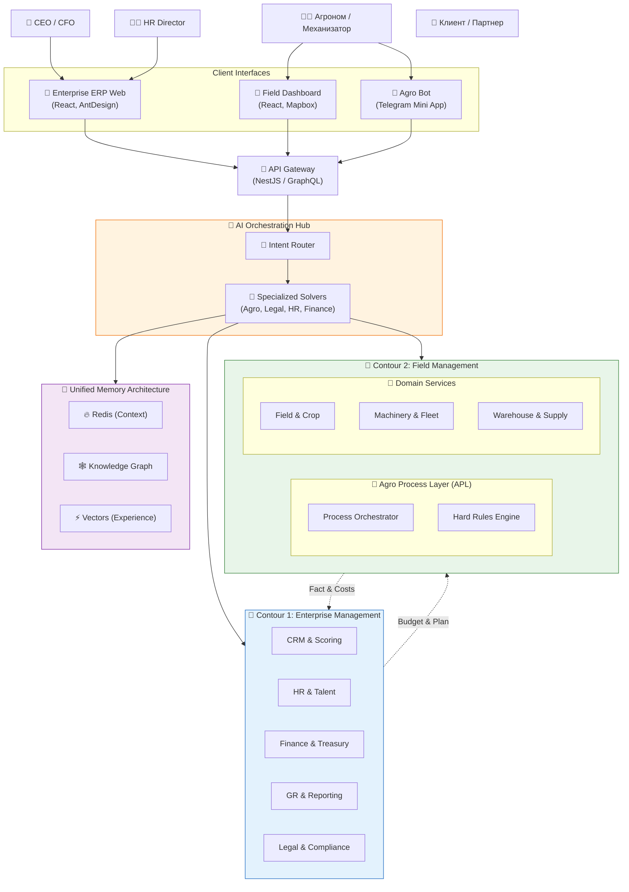

# Технологическая схема и архитектура системы RAI Enterprise Platform

> **Версия:** 2.0 (Enterprise Scope) | **Обновлено:** 2026.02.03

## 1. Обзор архитектуры (C4 Container Diagram)

Система разделена на **Два Контура**:
1.  **Back-Office (Enterprise):** Управление бизнесом (Стратегия, Кадры, Финансы).
2.  **Front-Office (Field):** Управление производством (Агрономия, Техника, Поле).

---

## 2. Модули системы (Детализация)

### 🏢 Contour 1: Enterprise Management (Back-Office)
*"Мозг бизнеса"*
1.  **CRM & Scoring:**
    *   Скоринг потенциала хозяйств (LTV Prediction).
    *   Smart-контракты (мониторинг KPI в реальном времени).
2.  **HR Ecosystem:**
    *   **Talent:** Рекрутинг узких специалистов.
    *   **Pulse:** Эмоциональная аналитика и предотвращение выгорания.
    *   **OKR:** Мотивация за результат.
3.  **Finance & Economy:**
    *   **What-if Simulation:** Просчет ROI до старта работ.
    *   **Treasury:** Управление ликвидностью и бюджетом.
4.  **GR (Gov Relations):**
    *   Авто-отчетность (Налоги, Субсидии, Статистика).
5.  **Legal Tech:**
    *   Генерация договоров, проверка контрагентов (API GigaLegal/Sber).

### 🚜 Contour 2: Field Management (Front-Office)
*"Руки бизнеса"*
1.  **Agro Process Layer (APL):**
    *   16 этапов выращивания (Canonical Graph).
    *   Hard Constraints (Блокировка ошибок).
2.  **Digital Agronomist:**
    *   AI-ассистент (Vision AI, Voice Input).
    *   Geo/Photo Validation задач.
3.  **Operations:**
    *   Склад (Just-in-Time supply).
    *   Техника (Fleet management).
4.  **Satellites:**
    *   NDVI/NDRE мониторинг.

### 🧠 Unified Memory (Cognitive Core)
*   **Semantic:** Граф знаний (Агрономия + Бизнес-правила).
*   **Episodic:** Векторная база ("Успешные и провальные кейсы").
*   **Procedural:** Скрипты и регламенты.

---

## 3. Технологический Стек

*   **Backend:** NestJS (Node.js), Microservices (gRPC/NATS).
*   **AI:** OpenAI (GPT-4), Local LLM (Fine-tuned), CV Models.
*   **Database:** PostgreSQL (Core), ClickHouse (Analytics), Redis (Cache).
*   **Memory:** pgvector (Vectors), Neo4j/Memgraph (Graph).
*   **Frontend:** React, Next.js, AntDesign (Enterprise UI).
*   **Mobile:** Telegram Mini Apps (Field usage).
*   **External API:** GigaChat/Legal, Sentinels (Satellites), Meteteo.
