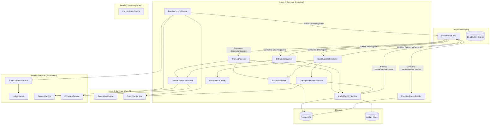

# LEVEL D — SERVICE TOPOLOGY (D6+ Hardened)
## Топология сервисов и связей

---

## 1. Топология Графа (D6+)

Включает полный цикл (Closed Loop) обучения, DLQ и явные потоки событий.

---

## 2. Зависимости и Контракты

| Сервис | Зависит от (Sync/Async) | Предоставляет | Артефакт (Output) |
|--------|-------------------------|---------------|-------------------|
| **FeedbackLoopEngine** | PredictionService, FinancialRead, SeasonService | Learning Calculation | `LearningEvent` (Async) |
| **DriftMonitorWorker** | `LearningEvent` (Async), ModelRegistry | Statistics Check | `DriftReport` (Async) |
| **ModelUpdateController** | `DriftReport` (Async), GovernanceConfig | Orchestration | `RetrainingDecision` (Async) |
| **TrainingPipeline** | `RetrainingDecision` (Async), DatasetSnapshot | Training Execution | `ModelArtifact` (S3) |
| **ModelRegistryService** | PostgreSQL, S3 | Version Control | `ModelVersionCreated` (Async) |
| **DatasetSnapshotService** | SeasonService, CompanyService | Snapshotting | `DatasetSnapshot` |
| **EvolutionReportBuilder** | `ModelVersionCreated` (Async) | Explainability | `EvolutionReport` |

---

## 3. Межуровневые связи и Изоляция

### A. Level D ← Level A (Foundation)
1.  **Financial Decoupling:** `FeedbackLoopEngine` использует CQRS-pattern через `FinancialReadService`.
2.  **Tenant Isolation:** `DatasetSnapshotService` валидирует контекст через `CompanyService`.

### B. Async Resilience (D6+)
*   **DLQ Strategy:** Все консьюмеры (`DMW`, `MUC`, `TP`) настроены на сброс "ядовитых" сообщений в `Dead Letter Queue` после 3 retries.
*   **Event Integrity:** Все события подписаны (Signed Payloads).
*   **Idempotency:** `MessageID` используется как Idempotency Key во всех консьюмерах.

---

## 4. Схема Хранения

| Таблица | Владелец | Тип | Invariant Check |
|---------|----------|-----|-----------------|
| `model_versions` | ModelRegistry | Append-only | Hash Check |
| `dataset_snapshots` | DatasetSnapshotService | Immutable | Tenant & Season FK |
| `learning_events` | FeedbackLoopEngine | Immutable | Signed Payload |
| `drift_reports` | DriftMonitorWorker | Immutable | Link to ModelVersion |
| `retraining_decisions`| ModelUpdateController | Immutable | Governance Sig |

---

## 5. Связанные документы
- [LEVEL_D_ARCHITECTURE.md](file:///f:/RAI_EP/docs/LEVEL_D_ARCHITECTURE.md)
- [RETRAINING_PIPELINE_ARCHITECTURE.md](file:///f:/RAI_EP/docs/01_ARCHITECTURE/CORE/LEVEL_D/RETRAINING_PIPELINE_ARCHITECTURE.md)
