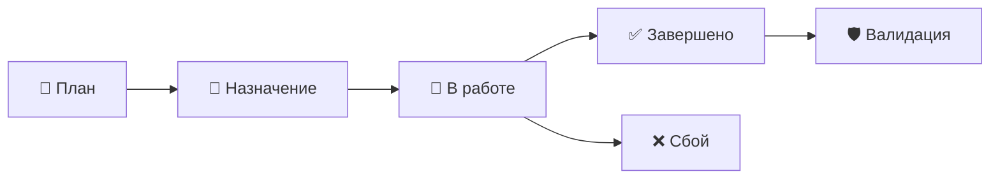

---
id: component-rai-process-execution
type: component
status: review
owners: [domain-experts]
aligned_with: [principle-vision]
---

# Process: Task Execution (Исполнение полевых работ) 🚜

> **Статус:** Канон | **Версия:** 1.0 | **Слой:** RAI/Processes

---

## 1. Обзор процесса
Исполнение задач — это "последняя миля" системы. Весь интеллект и планирование бесполезны без качественного выполнения операции в поле механизатором или агрономом.

Процесс объединяет **Core Task Engine** и специфические требования **RAI Domain**.

---

## 2. Жизненный цикл агро-задачи

1. **Генерация (План)**: На основе технологической карты система создает задачи (напр., "Посев рапса").
2. **Назначение**: Менеджер назначает исполнителя и технику. Уведомление летит в Telegram.
3. **Исполнение**: Механизатор нажимает "Начать" в боте. Фиксируется GPS-метка и время.
4. **Фиксация факта**: После завершения вносятся данные (сколько литров ГСМ потрачено, какая глубина выдержана).

---

## 3. Специфические параметры RAI
В отличие от обычной офисной задачи, агро-задача содержит `AgroPayload`:
- **Поле**: Координаты начала и конца.
- **Ресурсы**: Тип семян, удобрений (СЗР).
- **Параметры**: Глубина, скорость, давление.

---

## 4. Роль Telegram-бота
Бот является основным инструментом для полевого персонала:
- **Мгновенный доступ**: Не нужно открывать ноутбук.
- **Оффлайн-режим**: Фиксация времени даже без интернета (с последующей синхронизацией).
- **Голосовой ввод (Gamma)**: Диктовка комментариев по ходу выполнения.

---

## 5. Контроль и Аудит
Любое изменение статуса задачи — это событие для системы аудита. Если агроном завершил задачу "Посев" за 5 минут (хотя поле 100 Га), система подсветит это как аномалию для проверки менеджером.

---

## 6. Связанные документы
- [Task Engine System](../../01-ARCHITECTURE/CORE/CORE_SUBSYSTEMS/TASK_WORKFLOW.md)
- [Bot Scenarios](../../03-DESIGN/TELEGRAM_BOT/SCENARIOS.md)
