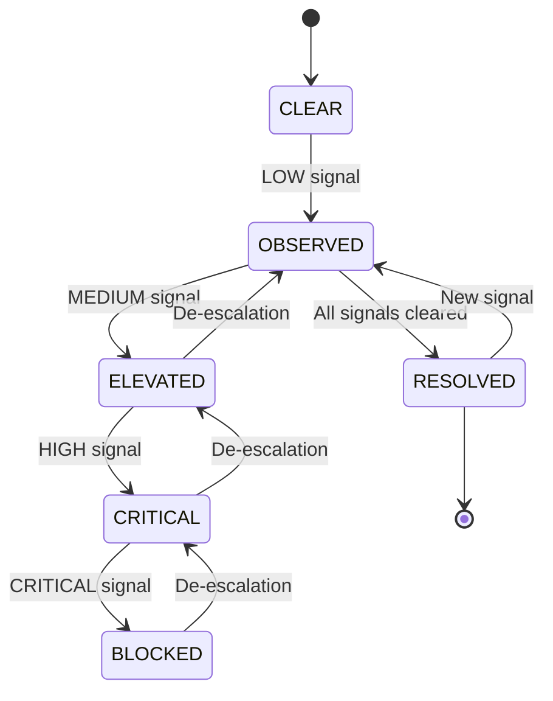

# Risk FSM — Evolution of Risk Over Time

**Контур:** B6 — Unified Risk Engine
**Тип:** Deterministic FSM (no ML, no heuristics)
**Назначение:** зафиксировать, как риск появляется, усиливается, стабилизируется и снимается

## 1. Базовая идея (ключевая)

Риск — это не оценка.
Риск — это **состояние допустимости действия во времени**.

FSM нужен, чтобы:
- риск не прыгал
- риск не “исчезал сам”
- система помнила, почему раньше было нельзя

## 2. Состояния Risk FSM (канонические)



### 2.1 CLEAR
**Значение:** Риск отсутствует или не выявлен.
**Условия:**
- нет активных RiskSignals
- все источники в допустимом состоянии
**Verdict:** `ALLOWED`

### 2.2 OBSERVED
**Значение:** Риск появился, но не влияет на допустимость.
**Примеры:**
- PolicySignal (будущая норма)
- LOW severity сигналы
- ранние отклонения Ops
**Verdict:** `ALLOWED`

### 2.3 ELEVATED
**Значение:** Риск значимый, требует внимания.
**Примеры:**
- R&D без финального conclusion
- Compliance = AT_RISK
- системные отклонения Ops
**Verdict:** `CONDITIONAL`

### 2.4 CRITICAL
**Значение:** Риск высокий, но ещё не формально запрещающий.
**Примеры:**
- HIGH severity сигналы
- Legal obligations не закрыты
- R&D deviation от протокола
**Verdict:** `RESTRICTED`

### 2.5 BLOCKED
**Значение:** Действие недопустимо.
**Примеры:**
- Compliance = VIOLATED
- CRITICAL Legal signal
- запрет регулятора
- отсутствие научного допуска
**Verdict:** `BLOCKED`

### 2.6 RESOLVED (terminal, но возвратный)
**Значение:** Риск был, но снят осознанно.
**Условия:**
- все причины устранены
- зафиксирован факт устранения
- есть traceability
**Verdict:** `ALLOWED` (но с историей)

## 3. Переходы Risk FSM (строго)

### 3.1 Escalation (усиление)
| From | To | Триггер |
|------|----|---------|
| CLEAR | OBSERVED | LOW signal |
| OBSERVED | ELEVATED | MEDIUM signal |
| ELEVATED | CRITICAL | HIGH signal |
| CRITICAL | BLOCKED | CRITICAL signal |

⚠️ **Перепрыгивать состояния нельзя** (кроме прямого → BLOCKED при Legal violation).

### 3.2 De-escalation (ослабление)
| From | To | Условие |
|------|----|---------|
| BLOCKED | CRITICAL | снят запрет, но не всё закрыто |
| CRITICAL | ELEVATED | закрыта часть причин |
| ELEVATED | OBSERVED | риск остался, но незначим |
| OBSERVED | RESOLVED | сигнал устранён |

⚠️ **Никогда напрямую BLOCKED → CLEAR**.

## 4. Связь FSM с RiskVerdict (B6)

| Risk FSM State | RiskVerdict |
|----------------|-------------|
| CLEAR | ALLOWED |
| OBSERVED | ALLOWED |
| ELEVATED | CONDITIONAL |
| CRITICAL | RESTRICTED |
| BLOCKED | BLOCKED |
| RESOLVED | ALLOWED (with history) |

FSM оборачивает Verdict, а не заменяет его.

## 5. Источники переходов (Events)

**Legal Engine**
- `ComplianceStatusChanged`
- `ObligationClosed`
- `SanctionApplied`

**R&D Engine**
- `ExperimentStateChanged`
- `ProtocolApproved`
- `ConclusionIssued`

**Operations**
- `DeviationDetected`
- `StageCompleted`
- `ATKViolation`

**Time**
- `RiskTimeoutExceeded`
- `PolicyEffectiveDateReached`

## 6. Архитектурные инварианты FSM (Non-negotiable)
- ❌ Нет ручного перевода состояния
- ❌ Нет UI-контроля FSM
- ❌ Нет “сбросить риск”
- ✅ Только события из доменов
- ✅ Каждое состояние имеет причины
- ✅ История сохраняется всегда

## 7. Persistence (как хранить)

Минимально:
```prisma
model RiskState {
  id           String @id @default(cuid())
  targetType   RiskTargetType
  targetId     String
  state        RiskFsmState
  reasons      Json
  changedAt    DateTime @default(now())
}
```

История: **append-only**, **audit-safe**.

## 8. Как это видит Strategic Front

Пример:
> **Risk Status:** 🔴 BLOCKED
> **Since:** 2026-02-02
> **Previous:** CRITICAL
> **Reasons:**
> - Legal: LR-124 (VIOLATED)
> - R&D: EXP-09 (NO_CONCLUSION)

Это объяснимо, защищаемо и не требует “доверия на слово”.

## 9. Почему Risk FSM критичен
- **Без FSM:** риск скачет, решения нестабильны, “вчера было нельзя, сегодня можно — почему?”.
- **С FSM:** риск эволюционирует, решения воспроизводимы, история защищает бизнес.

## 10. Короткая формула
Risk FSM — это память системы о том, почему ей было страшно.
