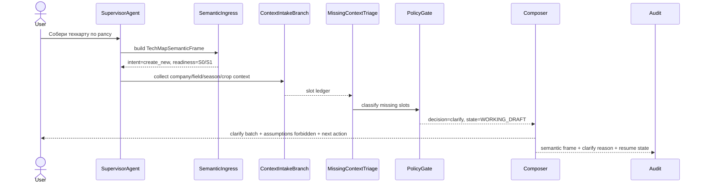
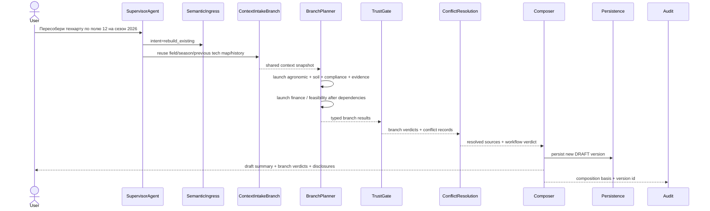
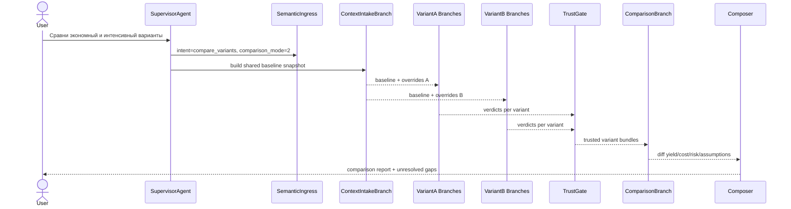
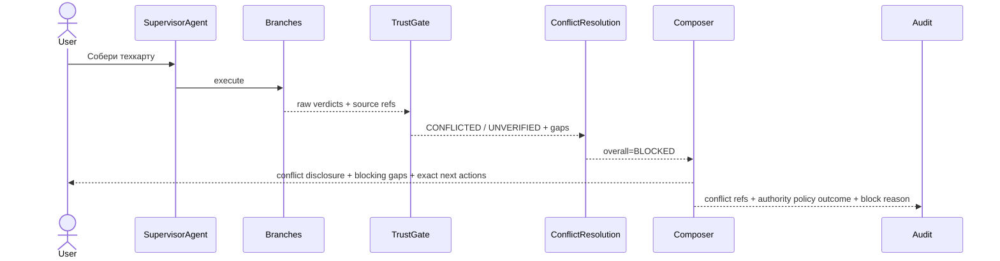
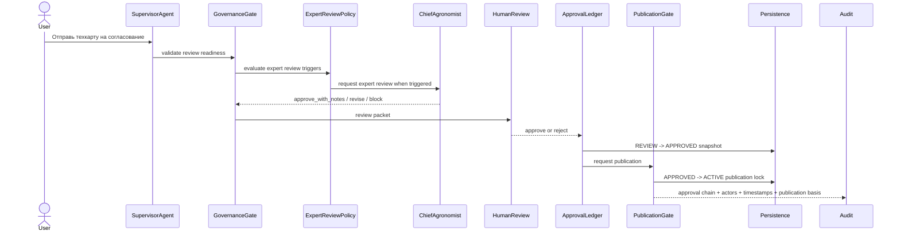
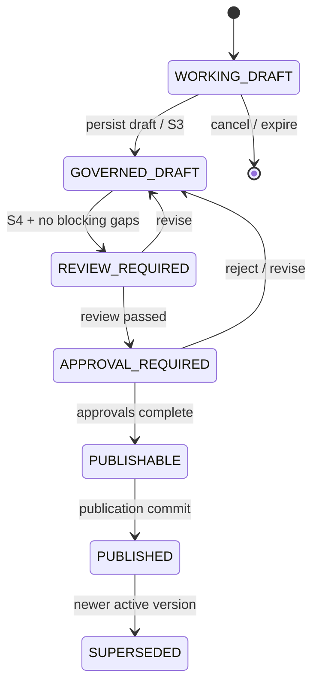
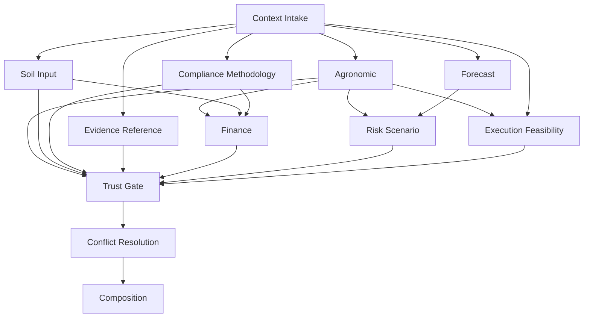
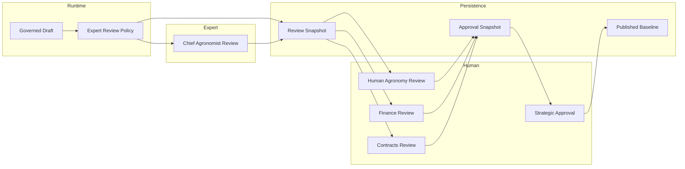

# TECH_MAP_GOVERNED_WORKFLOW

## CLAIM
id: CLAIM-ENG-TECH-MAP-GOVERNED-WORKFLOW-20260322
status: asserted
verified_by: manual
last_verified: 2026-03-22

Этот документ является канонической инженерной спецификацией для целевого governed workflow Техкарты в `RAI_EP`.

Он утверждает роль документа как основы для:

- `runtime`-архитектуры
- backend-имплементации
- policy/governance
- оркестрации агентов
- explainability/truthfulness-контуров
- дальнейшей декомпозиции в bounded implementation-пакеты

Документ не утверждает, что весь описанный workflow уже полностью реализован в runtime.
Любые тезисы о текущем поведении системы должны отдельно сверяться по `code/tests/gates`.

## 0. Исполнительный вывод

Техкарта в `RAI_EP` должна проектироваться не как ответ `LLM`, а как governed composite workflow первого класса.

Канонический путь:

```text
свободный пользовательский запрос
  -> semantic ingress normalization
  -> governed context intake
  -> missing context triage
  -> lead owner selection
  -> branch execution по typed JSON contracts
  -> branch trust gate
  -> honest composition
  -> draft / review / approval / publication boundary
  -> audit + forensics
```

Ключевое решение этого документа:

- бизнес-owner workflow Техкарты = `agronomist`
- orchestration-owner = `SupervisorAgent`
- `chief_agronomist` допускается только как conditional expert-review слой, а не как owner сборки
- межветочный обмен = только typed `JSON`, не prose
- финальная Техкарта собирается только из веток, прошедших trust-gate
- при нехватке критичного контекста система обязана делать `clarify`, а не импутацию
- статус `готовой техкарты` запрещён при unresolved blocking gaps
- `LLM` используется для semantic normalization, synthesis и explainability, но не как источник фактов, расчётов и нормативных оснований

## 1. Назначение и границы

Документ покрывает:

- создание новой Техкарты с нуля
- пересборку Техкарты по существующему полю/сезону
- multi-variant сравнение вариантов Техкарты
- governed draft assembly
- trust/evidence verification
- human review / approval / publication boundary
- explainability и audit trail

Документ не покрывает полностью:

- post-publication `change order` lifecycle
- детальную модель полевого исполнения задач
- юридическую механику `digital signature`
- low-level UI layout

Но документ задаёт обязательные handoff-границы к этим контурам.

## 2. Бизнес-смысл Техкарты

В `RAI_EP` Техкарта является одновременно:

- проектом урожая
- операционной моделью сезона
- финансовой моделью
- цифровым контрактом
- юридически значимым артефактом
- зафиксированной гипотезой достижения урожайности
- вычисленным результатом методологии на базе контекста, данных, ограничений и сценариев

Следствие:

- Техкарта не является просто текстом
- Техкарта не является шаблоном “на культуру вообще”
- Техкарта не может считаться достоверной без provenance, evidence и disclosure
- Техкарта не может становиться `ACTIVE` без governed approval

## 3. Почему workflow Техкарты должен быть governed

Техкарта требует governed runtime по пяти причинам:

1. Высокая цена ошибки.
   Неверная норма, ложное основание или скрытая дырка в контексте бьют по урожаю, экономике и доверию.

2. Многодоменная природа.
   В одном артефакте сходятся агрономия, экономика, техника, compliance, история поля, прогноз и контрактные ограничения.

3. Юридическая и финансовая значимость.
   Артефакт влияет не только на рекомендации, но и на обязательства, KPI, review и будущую монетизацию результата.

4. Наличие переменной полноты контекста.
   Пользовательский вход всегда свободный и часто неполный, поэтому система обязана отделять факты от пробелов.

5. Необходимость честного explainability.
   Пользователь должен видеть, из чего собрана Техкарта, что было рассчитано, что предположено и почему результат ещё может быть только `draft`.

## 4. Цели workflow

Workflow Техкарты должен обеспечивать:

- свободный `ingress` без командного синтаксиса
- строгую нормализацию в structured semantic frame
- owner-led orchestration вместо хаотического multi-agent fan-out
- typed branch execution с детерминированными расчётами там, где это возможно
- trust-verdict до финальной композиции
- различение `fact / derived metric / assumption / recommendation / gap`
- понятную publication boundary
- полный audit trail для forensics

## 5. Базовые принципы проектирования

1. `LLM is not source of truth`.
2. Контекст первичен, Техкарта вторична.
3. Нет blocking context -> нет ложной “готовой техкарты”.
4. Нет branch trust verdict -> нет фактической композиции.
5. Нет typed contract -> нет межагентного handoff.
6. Нет disclosure -> нет честного partial-result.
7. `SupervisorAgent` оркестрирует, но не забирает бизнес-ownership.
8. Один workflow должен иметь одного `lead business owner`.
9. Все write/publication переходы проходят policy/governance gate.
10. Workflow status и persisted `TechMapStatus` должны быть разведены.

## 6. Подтверждённая runtime-база и целевое расширение

| Контур | Что уже подтверждено кодом | Что вводит этот документ |
|---|---|---|
| `semantic ingress` | Есть `SemanticIngressFrame`, `SemanticIngressService`, `semantic_router_primary/shadow` | Специализированное tech-map расширение frame и readiness-модель Техкарты |
| branch trust | Есть `BranchResultContract`, `BranchTrustAssessment`, `BranchVerdict`, honest composition в `ResponseComposer` | Отраслевой trust-контур именно для branch-веток Техкарты и workflow verdict `BLOCKED` |
| governance | Есть `RuntimeGovernancePolicyService` с trust budgets и fallback policy | Publication/approval matrix именно для Техкарты |
| tech-map persistence | Есть `TechMapService`, `TechMapStatus`, `TechMapStateMachine`, draft/review/approved/active lifecycle | First-class governed workflow поверх текущего persistence-контура |
| текущий tool-surface | Есть `GenerateTechMapDraft`, но это узкий draft-path | Полноценный governed composite workflow с intake, clarify, branching, trust, compare, review |

Жёсткое разграничение:

- текущий `runtime truth` по техкарте доказывается кодом
- этот документ задаёт целевую инженерную модель
- новый workflow не должен противоречить текущему `TechMapStatus` и current branch-trust enum

## 7. Точки входа и пользовательские intents

| Интент пользователя | Пример запроса | Целевой workflow mode | Lead owner | Базовый выход |
|---|---|---|---|---|
| `create_new` | `собери техкарту по рапсу на поле 12` | `new_draft` | `agronomist` | clarify или governed draft |
| `rebuild_existing` | `пересобери техкарту по полю 12 на сезон 2026` | `rebuild` | `agronomist` | reuse context + new draft version |
| `compare_variants` | `сравни две техкарты: экономную и интенсивную` | `comparison` | `agronomist` | diff report + scenario matrix |
| `review_draft` | `покажи почему эта техкарта draft only` | `review_explain` | `agronomist` | explainability + missing approvals |
| `approve_publish` | `отправь техкарту на согласование` | `review_submission` | `agronomist` + governance | review packet |
| `resume_clarify` | `добавляю анализ почвы и бюджет` | `clarification_resume` | текущий owner | продолжение workflow |
| `explain_block` | `почему система не выпустила техкарту` | `blocked_analysis` | `agronomist` | gap/conflict disclosure |

## 8. Semantic ingress frame для Техкарты

Базовый `SemanticIngressFrame` уже существует в runtime.
Для Техкарты поверх него вводится tech-map specialization.

```ts
type TechMapWorkflowIntent =
  | "create_new"
  | "rebuild_existing"
  | "compare_variants"
  | "review_draft"
  | "approve_publish"
  | "resume_clarify"
  | "explain_block";

type TechMapWorkflowStageHint =
  | "intake"
  | "clarify"
  | "assemble"
  | "compare"
  | "review"
  | "approval"
  | "publication";

type TechMapRequestedArtifact =
  | "workflow_draft"
  | "persisted_draft"
  | "comparison_report"
  | "review_packet"
  | "publication_packet"
  | "block_explanation";

type TechMapContextReadiness =
  | "S0_UNSCOPED"
  | "S1_SCOPED"
  | "S2_MINIMUM_COMPUTABLE"
  | "S3_DRAFT_READY"
  | "S4_REVIEW_READY"
  | "S5_PUBLISHABLE";

interface TechMapSemanticFrame {
  workflow_kind: "tech_map";
  user_intent: TechMapWorkflowIntent;
  workflow_stage_hint: TechMapWorkflowStageHint;
  requested_artifact: TechMapRequestedArtifact;
  scope: {
    legal_entity_id?: string;
    farm_id?: string;
    field_ids: string[];
    season_id?: string;
    crop_code?: string;
    existing_tech_map_id?: string;
  };
  context_readiness: TechMapContextReadiness;
  required_actions: Array<"clarify" | "execute" | "confirm" | "human_review" | "block">;
  policy_constraints: string[];
  result_constraints: string[];
  comparison_mode?: {
    enabled: boolean;
    variant_count: number;
  };
}
```

Обязательные смысловые поля frame:

- `user_intent`
- `scope`
- `context_readiness`
- `requested_artifact`
- `required_actions`
- `policy_constraints`

Нормативные правила:

- `scope.field_ids` и `scope.season_id` не должны угадываться без evidence
- `requested_artifact` должен отделять `workflow_draft` от `publication_packet`
- `context_readiness` должен вычисляться детерминированно по slot-registry
- `required_actions` не должны определяться prose-моделью без policy layer

## 9. Required context model

### 9.1 Канонические группы контекста

Контекст Техкарты делится на семь групп:

1. `identity_scope`
2. `agronomic_basis`
3. `resource_feasibility`
4. `economic_basis`
5. `external_basis`
6. `history_and_evidence`
7. `methodology_and_governance`

### 9.2 Slot matrix

| Группа | Slot key | Критичность | Требуется на стадии | Допустимая замена | Freshness / special rule |
|---|---|---|---|---|---|
| `identity_scope` | `legal_entity_id` | `REQUIRED_BLOCKING` | `S1+` | нет | обязателен для persist/review/publication |
| `identity_scope` | `farm_id` | `REQUIRED_BLOCKING` | `S1+` | допустимо derive из `field_id` | нельзя публиковать без resolved owner scope |
| `identity_scope` | `field_ids[]` | `REQUIRED_BLOCKING` | `S1+` | нет | multi-field допускается только при explicit workflow mode |
| `identity_scope` | `season_id` | `REQUIRED_BLOCKING` | `S1+` | нет | must match field/company scope |
| `identity_scope` | `crop_code` | `REQUIRED_BLOCKING` | `S1+` | нет | must match plan/context |
| `agronomic_basis` | `predecessor_crop` | `REQUIRED_BLOCKING` | `S2+` | нет | отсутствие блокирует agronomic branch |
| `agronomic_basis` | `soil_profile` | `REQUIRED_BLOCKING` | `S2+` | только verified latest valid profile | stale profile не может стать `VERIFIED` |
| `agronomic_basis` | `target_yield_profile` | `REQUIRED_BLOCKING` | `S2+` | linked harvest plan или scenario set | является hypothesis, не fact |
| `agronomic_basis` | `field_history` | `REQUIRED_REVIEW` | `S3+` | historical snapshot | при rebuild желательно обязательно |
| `agronomic_basis` | `seed_or_hybrid` | `OPTIONAL_ENRICHING` | `S2+` | допустим variant alternative | exact publishable map требует resolved choice |
| `resource_feasibility` | `machinery_profile` | `REQUIRED_REVIEW` | `S3+` | verified contractor capacity | без этого execution feasibility не выше `PARTIAL` |
| `resource_feasibility` | `labor_or_contractor_profile` | `OPTIONAL_ENRICHING` | `S3+` | org default profile | default требует disclosure |
| `resource_feasibility` | `input_availability` | `REQUIRED_REVIEW` | `S3+` | warehouse snapshot / procurement status | publication без availability запрещена для critical inputs |
| `economic_basis` | `budget_policy` | `REQUIRED_BLOCKING` | `S2+` | performance plan / budget cap | finance branch без этого не публикуется |
| `economic_basis` | `price_book_version` | `REQUIRED_REVIEW` | `S3+` | company price snapshot | stale prices дают `PARTIAL` или `BLOCKED` |
| `economic_basis` | `currency_tax_mode` | `REQUIRED_REVIEW` | `S3+` | company accounting profile | must be fixed before approval |
| `external_basis` | `weather_normals` | `DERIVED` | `S2+` | trusted integration | derive автоматически, но с evidence ref |
| `external_basis` | `forecast_window` | `OPTIONAL_ENRICHING` | `S3+` | weather provider | forecast не может быть единственным основанием publication |
| `external_basis` | `irrigation_or_water_constraints` | `REQUIRED_REVIEW` | `S3+` | farm constraint profile | для соответствующих культур может стать blocking |
| `history_and_evidence` | `previous_tech_map` | `OPTIONAL_ENRICHING` | `S2+` | prior version | при `rebuild_existing` становится required |
| `history_and_evidence` | `execution_history` | `OPTIONAL_ENRICHING` | `S3+` | fact history snapshot | compare/rebuild без этого теряет trust depth |
| `history_and_evidence` | `past_outcomes` | `OPTIONAL_ENRICHING` | `S3+` | harvest result | используется для yield hypothesis calibration |
| `methodology_and_governance` | `methodology_profile_id` | `REQUIRED_BLOCKING` | `S2+` | default approved profile | must be versioned |
| `methodology_and_governance` | `allowed_input_catalog_version` | `REQUIRED_REVIEW` | `S3+` | company-approved catalog | publication без version lock запрещена |
| `methodology_and_governance` | `contract_mode` | `REQUIRED_REVIEW` | `S4+` | consulting default | влияет на approval chain |
| `methodology_and_governance` | `target_kpi_policy` | `REQUIRED_REVIEW` | `S4+` | linked performance model | must be disclosed in review packet |

### 9.3 Уровни readiness

| Уровень | Что означает | Что можно делать | Что запрещено |
|---|---|---|---|
| `S0_UNSCOPED` | не определён объект Техкарты | только intake и scope-clarify | branch execution |
| `S1_SCOPED` | определены поле/сезон/культура/owner scope | governed context collection | draft assembly |
| `S2_MINIMUM_COMPUTABLE` | есть минимум для агрономического и экономического расчёта | branch execution и workflow draft | review/publication |
| `S3_DRAFT_READY` | есть достаточный контекст для versioned `DRAFT` | persist draft, compare variants, explainability | approval/publication |
| `S4_REVIEW_READY` | закрыты review-critical slots и нет blocking conflicts | submit to review | publication without human review |
| `S5_PUBLISHABLE` | approval-critical контур закрыт, approvals complete | publication / activation handoff | auto-publish bypass |

Норматив:

- `S2` минимален для запуска branch execution
- `S3` минимален для persisted `DRAFT`
- `S4` минимален для review packet
- `S5` минимален для publication packet

### 9.4 Контекстные инварианты

Контекст Техкарты должен удовлетворять пяти обязательным инвариантам:

1. `scope invariant`
   Поле, сезон, культура и юрлицо должны находиться в одной согласованной области владения и времени.

2. `methodology invariant`
   Каждая publication-critical ветка должна знать точную `methodology_profile_id` и версию допускаемых справочников.

3. `baseline invariant`
   Все варианты внутри одного compare-workflow обязаны использовать один `baseline_context_hash`.

4. `traceability invariant`
   Каждый publication-critical slot должен иметь source lineage или честно быть раскрыт как gap/assumption.

5. `publishability invariant`
   Контекст, достаточный для `DRAFT`, не равен контексту, достаточному для `PUBLICATION`.

### 9.5 Canonical slot registry contract

`Slot matrix` выше является human-readable представлением.
Каноническим runtime authority для slot-логики должен быть typed registry.

```ts
type TechMapSlotGroup =
  | "identity_scope"
  | "agronomic_basis"
  | "resource_feasibility"
  | "economic_basis"
  | "external_basis"
  | "history_and_evidence"
  | "methodology_and_governance";

interface TechMapSlotFreshnessPolicy {
  mode: "NOT_REQUIRED" | "LATEST_VERIFIED" | "MAX_AGE_DAYS" | "SNAPSHOT_LOCKED";
  max_age_days?: number;
  stale_verdict: "ALLOW" | "PARTIAL" | "BLOCKED";
}

interface TechMapSlotAssumptionPolicy {
  allowed: boolean;
  allowed_kinds: Array<"USER_DECLARED" | "METHOD_DEFAULT" | "MODEL_ESTIMATE" | "TEMP_PLACEHOLDER">;
  max_until_readiness?: TechMapContextReadiness;
  publishable: boolean;
}

interface TechMapSlotImpactPolicy {
  blocks_branch_execution: boolean;
  review_impact: "BLOCKING" | "DISCLOSE" | "NONE";
  publication_impact: "BLOCKING" | "DISCLOSE" | "NONE";
  publication_critical: boolean;
}

interface TechMapSlotRegistryEntry {
  slot_key: string;
  group: TechMapSlotGroup;
  severity: TechMapMissingSlotSeverity;
  stage_required_from: TechMapContextReadiness;
  allowed_sources: string[];
  freshness_policy: TechMapSlotFreshnessPolicy;
  assumption_policy: TechMapSlotAssumptionPolicy;
  impact: TechMapSlotImpactPolicy;
}
```

Нормативный статус registry:

- slot должен быть зарегистрирован ровно один раз
- readiness scoring не должен жить отдельно от registry
- `clarify`, basis checks, freshness checks и publication gating должны вычисляться из registry
- изменение slot-policy должно быть versioned change, а не локальный if в service

## 10. Canonical Tech Map Domain Model

### 10.1 Разделение transient composition и persisted artifact

Workflow Техкарты оперирует двумя разными сущностями:

- `TechMapGovernedComposition`
  - transient runtime-результат композиции
  - используется для explainability, compare, honest disclosure и decisioning
  - может существовать без persisted `TechMap`

- `TechMapCanonicalDraft`
  - канонический доменный артефакт Техкарты
  - версия, которая сохраняется, ревьюится, одобряется и публикуется
  - служит основой для `DB`-модели, `API`-контрактов и `FSM`

### 10.2 Канонические объекты артефакта

| Объект | Роль | Persisted | Мутируемость |
|---|---|---|---|
| `TechMapCanonicalDraft` | корневой доменный артефакт версии Техкарты | да | mutable только до review submission |
| `TechMapVariant` | один сценарный вариант в рамках draft/comparison | да | mutable вместе с draft version |
| `TechMapOperation` | атомарная операция сезонного плана | да | mutable до review submission |
| `TechMapInputPlan` | потребность в семенах, удобрениях, СЗР и других inputs | да | mutable до review submission |
| `TechMapFinancialSummary` | итоговая экономическая модель варианта | да | mutable до review submission |
| `TechMapRiskRegister` | риски, вероятности, impact и mitigation | да | mutable до review submission |
| `TechMapEvidenceBundle` | bundle доказательной базы и provenance | да | mutable до review submission |
| `TechMapApprovalPacket` | immutable пакет для review/approval/publication | да | immutable после создания |

### 10.3 Канонические типы

```ts
interface TechMapArtifactHeader {
  workflow_id: string;
  tech_map_id?: string;
  version_id?: string;
  legal_entity_id: string;
  farm_id: string;
  field_ids: string[];
  season_id: string;
  crop_code: string;
  methodology_profile_id: string;
  baseline_context_hash: string;
  source_workflow_mode: "new_draft" | "rebuild" | "comparison";
}

interface TechMapOperation {
  operation_id: string;
  stage_code: string;
  operation_code: string;
  title: string;
  sequence_no: number;
  planned_window: {
    start_date?: string;
    end_date?: string;
    agronomic_trigger?: string;
  };
  dependencies: string[];
  input_plan_refs: string[];
  machinery_requirement_refs: string[];
  basis_statement_refs: string[];
  publication_critical: boolean;
}

interface TechMapInputPlan {
  input_plan_id: string;
  input_code: string;
  category: "seed" | "fertilizer" | "crop_protection" | "fuel" | "service" | "other";
  rate_per_ha?: number;
  total_quantity?: number;
  unit: string;
  operation_ref: string;
  allowed_by_catalog: boolean;
  evidence_refs: string[];
}

interface TechMapFinancialSummary {
  currency: string;
  area_ha: number;
  direct_cost_total: number;
  indirect_cost_total?: number;
  total_cost: number;
  cost_per_ha: number;
  target_yield: number;
  break_even_yield?: number;
  expected_revenue?: number;
  expected_margin?: number;
  roi_pct?: number;
  budget_fit: "WITHIN_POLICY" | "OVERRIDE_REQUIRED" | "OUT_OF_POLICY";
}

interface TechMapRiskRegisterItem {
  risk_id: string;
  title: string;
  category: "agronomic" | "weather" | "financial" | "compliance" | "execution";
  severity: "low" | "medium" | "high" | "critical";
  probability: "low" | "medium" | "high";
  mitigation: string[];
  evidence_refs: string[];
}

interface TechMapEvidenceBundle {
  bundle_id: string;
  source_refs: string[];
  coverage_pct: number;
  publication_critical_coverage_pct: number;
  unresolved_refs: string[];
  freshness_summary: Array<{ source_ref: string; status: "fresh" | "stale" | "unknown" }>;
}

interface TechMapApprovalPacket {
  packet_id: string;
  draft_version_id: string;
  immutable_snapshot_ref: string;
  required_reviews: Array<{
    role: string;
    status: "pending" | "approved" | "rejected";
    reason?: string;
  }>;
  required_signoffs: Array<{
    role: string;
    mandatory: boolean;
    status: "pending" | "approved" | "rejected";
  }>;
  locked_fields: string[];
  publication_basis_refs: string[];
}

interface TechMapVariant {
  variant_id: string;
  label: string;
  objective: "base" | "economy" | "intensive" | "risk_min" | "custom";
  overrides: Record<string, unknown>;
  operations: TechMapOperation[];
  input_plan: TechMapInputPlan[];
  financial_summary: TechMapFinancialSummary;
  risk_register: TechMapRiskRegisterItem[];
  evidence_bundle: TechMapEvidenceBundle;
  overall_verdict: TechMapWorkflowVerdict;
}

interface TechMapCanonicalDraft {
  header: TechMapArtifactHeader;
  readiness: TechMapContextReadiness;
  workflow_verdict: TechMapWorkflowVerdict;
  publication_state: TechMapPublicationState;
  review_status: TechMapReviewStatus;
  approval_status: TechMapApprovalStatus;
  persistence_status: TechMapPersistenceStatus;
  slot_ledger_ref: string;
  assumptions: TechMapAssumption[];
  gaps: TechMapGap[];
  conflicts: TechMapConflictRecord[];
  variants: TechMapVariant[];
  selected_variant_id?: string;
  approval_packet?: TechMapApprovalPacket;
  audit_refs: string[];
}
```

### 10.4 Доменные инварианты persisted артефакта

1. В persisted `TechMapCanonicalDraft` всегда должен существовать `header.baseline_context_hash`.
2. `selected_variant_id` обязателен для `REVIEW_REQUIRED` и выше.
3. `TechMapFinancialSummary` и `TechMapRiskRegister` не могут существовать без ссылки на variant.
4. `TechMapApprovalPacket` должен создаваться как immutable snapshot, а не как mutable view.
5. Публикуемый baseline обязан быть отдельным versioned snapshot, а не “живой” черновик.

## 11. Missing context / clarify model

### 11.1 Классы missing slots

```ts
type TechMapMissingSlotSeverity =
  | "REQUIRED_BLOCKING"
  | "REQUIRED_REVIEW"
  | "OPTIONAL_ENRICHING"
  | "ASSUMPTION_ALLOWED"
  | "DERIVED";
```

Правила по классам:

- `REQUIRED_BLOCKING`
  - не может быть выдуман
  - блокирует branch execution или composition
  - всегда уходит в `clarify` или `block`

- `REQUIRED_REVIEW`
  - допускает draft, но не publication
  - обязан быть раскрыт в disclosure

- `OPTIONAL_ENRICHING`
  - не блокирует draft
  - влияет на quality/trust score

- `ASSUMPTION_ALLOWED`
  - может быть временно закрыт только формализованным assumption object
  - assumption не имеет права превращаться в `fact`

- `DERIVED`
  - строится системой детерминированно или через trusted integration
  - должен нести `derived_from` и `evidence_refs`

### 11.2 Assumption policy

| Assumption kind | Описание | Допустимо в `DRAFT` | Допустимо в `REVIEW` | Допустимо в `PUBLICATION` |
|---|---|---|---|---|
| `USER_DECLARED` | пользователь прямо сообщил ограничение или выбор | да | да, с disclosure | да, если подтверждено ответственным лицом |
| `METHOD_DEFAULT` | approved methodology default | да | да, с versioned reference | да, если политика допускает default |
| `MODEL_ESTIMATE` | оценка модели или эвристики | да, только как hypothesis | только как advisory | нет |
| `TEMP_PLACEHOLDER` | временное заполнение для продолжения intake | да, только до `S2` | нет | нет |

### 11.3 Clarify contract

```ts
type TechMapClarifyResolutionTarget =
  | "MACHINE_RESOLVABLE"
  | "USER_RESOLVABLE"
  | "HUMAN_REVIEW_REQUIRED";

interface TechMapClarifyItem {
  slot_key: string;
  label: string;
  group_key: string;
  priority: number;
  severity: TechMapMissingSlotSeverity;
  resolution_target: TechMapClarifyResolutionTarget;
  reason: string;
  blocks_phases: Array<"branch_execution" | "composition" | "publication">;
  acceptable_sources: string[];
  can_be_assumed: boolean;
  assumption_kind?: "USER_DECLARED" | "METHOD_DEFAULT";
}
```

Clarify-пакет обязан содержать четыре секции:

- `missing_blocking_slots`
- `missing_review_slots`
- `assumptions_proposed`
- `derived_placeholders_used`

Система не должна:

- смешивать blocking и optional gaps в одном бесформенном сообщении
- задавать пользователю вопрос “на всякий случай”, если slot уже может быть безопасно поднят из record/integration
- закрывать conflict красивым текстом без explicit choice

## 12. Operational clarify loop как runtime subprocess

### 12.1 Runtime contracts

```ts
type TechMapClarifyMode = "ONE_SHOT" | "MULTI_STEP";

type TechMapClarifyBatchStatus =
  | "OPEN"
  | "PARTIALLY_RESOLVED"
  | "WAITING_USER"
  | "WAITING_SYSTEM"
  | "RESOLVED"
  | "EXPIRED"
  | "CANCELLED";

interface TechMapClarifyBatch {
  batch_id: string;
  workflow_id: string;
  mode: TechMapClarifyMode;
  status: TechMapClarifyBatchStatus;
  priority: number;
  group_key: string;
  items: TechMapClarifyItem[];
  blocking_for_phase: TechMapWorkflowPhase;
  resume_token: string;
  expires_at: string;
}

interface TechMapWorkflowResumeState {
  workflow_id: string;
  resume_token: string;
  resume_from_phase: TechMapWorkflowPhase;
  pending_batch_ids: string[];
  baseline_context_hash: string;
  external_recheck_required: boolean;
  expires_at: string;
}
```

### 12.2 Правила группировки и приоритизации

Clarify должен выполняться пакетами, а не россыпью вопросов.

Базовый порядок приоритета:

1. `scope_batch`
   - поле, сезон, культура, owner scope
   - без этого нельзя перейти к `S1`

2. `blocking_agronomy_batch`
   - predecessor, soil profile, target yield basis
   - без этого нельзя запускать agronomic / soil-input ветки

3. `blocking_economics_compliance_batch`
   - budget policy, price basis, methodology profile, allowed catalog version
   - без этого нельзя строить publishable finance/compliance basis

4. `review_critical_batch`
   - machinery, availability, contract mode, KPI policy
   - допускает draft, но блокирует review/publication

5. `enrichment_batch`
   - historical enrichments, forecast, optional operational detail
   - не должен тормозить draft unnecessarily

### 12.3 One-shot vs multi-step clarify

`ONE_SHOT` допустим, если:

- все missing slots независимы друг от друга
- нет необходимости сначала подтянуть machine-resolvable данные
- контекст достаточно стабилен для одного ответа пользователя

`MULTI_STEP` обязателен, если:

- последующие вопросы зависят от ответа на scope или crop selection
- нужно сначала добрать данные из integrations/registry, а потом спрашивать пользователя только остаток
- compare/rebuild сценарий требует выбора baseline или variant objective

Норматив:

- machine-resolvable slot всегда пробуется закрыть автоматически до вопроса пользователю
- user-resolvable slot не должен эскалироваться в human review без controlled attempt to clarify
- human-review-required slot не превращается в интерактивный spam-loop; он фиксируется в review packet

### 12.4 SLA, timeout и resume semantics

| Policy key | Нормативный default | Что означает |
|---|---|---|
| `clarify_batch_ttl` | `72h` | batch остаётся активным и resume-capable |
| `workflow_resume_ttl` | `30d` | paused workflow можно продолжить без полной пересборки |
| `external_recheck_on_resume` | `24h` для weather/price data | при возобновлении старые внешние данные обязаны перепроверяться |
| `review_gate_recheck` | `always` | перед review/publication freshness и conflicts пересчитываются заново |

Если batch истёк:

- workflow не теряется молча
- batch получает статус `EXPIRED`
- `resume_token` становится невалидным
- пользователь получает либо controlled restart, либо rehydrate path по текущему `workflow_id`

## 13. Lead owner и participating agents

### 13.1 Роли

| Роль | Статус в workflow | Ответственность |
|---|---|---|
| `SupervisorAgent` | orchestration-owner | semantic ingress, policy, branch graph, trust gate, audit |
| `agronomist` | lead business owner | agronomic intent ownership, draft semantics, final owner answer |
| `crm_agent` | context contributor | юрлицо, хозяйство, поле, сезон, registry context |
| `knowledge` | evidence owner | methodology lookup, reference grounding, evidence bundle |
| `economist` | advisory owner | cost model, budget fit, scenario economics |
| `monitoring` | signal owner | weather, climate, risk signals, forecast enrichments |
| `contracts_agent` | publication/compliance contributor | contract mode, approval implications, publication restrictions |
| human reviewers | approval authority | review, approval, publication decision |

### 13.2 Норматив выбора lead owner

Для Техкарты `lead business owner` фиксируется жёстко:

- `agronomist` для create/rebuild/compare/review/explain
- `SupervisorAgent` не подменяет бизнес-owner
- `economist`, `knowledge`, `monitoring`, `contracts_agent` не могут перехватить ownership у Техкарты

Будущее расширение:

- отдельный `chief_agronomist` должен появиться как `expert-review` слой
- `chief_agronomist` не должен становиться primary owner сборки или прямым редактором Техкарты
- до появления canonical expert-tier family policy-вызов `chief_agronomist` должен иметь честный bypass в human review, а не симуляцию вызова

### 13.2.1 Роль `chief_agronomist` в workflow Техкарты

`chief_agronomist` в этом workflow играет роль независимого экспертного ревьюера.

Он:

- не собирает Техкарту с нуля
- не владеет ownership пользовательского запроса
- не выполняет рутинную генерацию веток
- не изменяет persisted draft напрямую
- не подменяет человеческого агронома как final decision maker

Он делает только одно:

- выдаёт structured expert opinion по уже собранному governed draft

### 13.2.2 Когда вызывать `chief_agronomist`

`chief_agronomist` должен вызываться policy-driven, а не на каждую Техкарту подряд.

Минимальные trigger-классы:

- `trust_trigger`
  - publication-critical ветка получила `PARTIAL`, `UNVERIFIED` или workflow-level `BLOCKED`
- `assumption_trigger`
  - есть high-impact assumptions, которые materially влияют на yield, cost или feasibility
- `novelty_trigger`
  - новая культура, новая зона, новый methodology profile или нетипичный технологический сценарий
- `risk_trigger`
  - высокий риск сезона, бюджета или agronomy/compliance конфликта
- `human_requested`
  - человек явно запросил экспертную ревизию
- `dispute_trigger`
  - есть расхождение между draft-логикой, human position или смежными review-ветками

Нормативный анти-паттерн:

- `chief_agronomist` не вызывается как обязательный second pass для каждой стандартной Техкарты

### 13.2.3 Инварианты expert-review слоя

`chief_agronomist` обязан подчиняться пяти жёстким инвариантам:

1. expert review никогда не пишет canonical content напрямую
2. expert review возвращает только findings, challenged assumptions и requested revisions
3. только governed revision loop имеет право мутировать draft
4. verdict `chief_agronomist` не может bypass-ить human agronomy authority
5. expert review не может самостоятельно публиковать, approve-ить или активировать Техкарту

### 13.3 Parallel / sequential / blocking orchestration

| Блок | Тип | Примечание |
|---|---|---|
| intake from CRM/registry/history | `parallel` | безопасный read-only сбор контекста |
| missing slot triage | `blocking` | must run before branch execution |
| agronomic / soil-input / compliance / evidence branches | `parallel` | стартуют после `S2` |
| finance branch | `dependent` | зависит от agronomic + price/budget basis |
| risk/scenario branch | `dependent` | зависит от agronomic branch и external basis |
| execution feasibility branch | `dependent` | зависит от operation graph и machinery profile |
| conflict resolution | `blocking` | выполняется после trust gate и до composition |
| composition | `blocking` | только после trust verdict и conflict policy |
| review/publication | `blocking` | только после governance gate |

## 14. Фазы workflow

| Фаза | Вход | Выход | Авто/confirm/human boundary |
|---|---|---|---|
| `INTAKE` | user request | raw request + workflow candidate | auto |
| `SEMANTIC_NORMALIZATION` | message + workspace + history | `TechMapSemanticFrame` | auto |
| `CONTEXT_ASSEMBLY` | frame | structured context snapshot | auto |
| `MISSING_CONTEXT_TRIAGE` | context snapshot | clarify batch(es) или `S2+ readiness` | auto |
| `OWNER_HANDOFF` | normalized frame | owner-led branch plan | auto |
| `BRANCH_EXECUTION` | context + branch graph | typed branch results | auto |
| `TRUST_GATE` | branch results | branch assessments + workflow verdict | auto |
| `CONFLICT_RESOLUTION` | trust outputs + source policy | resolved conflicts / escalations / hard block | auto или human review boundary |
| `COMPOSITION` | trusted branches | governed draft / compare / block explanation | auto |
| `PERSIST_DRAFT` | `S3+` draft | versioned `DRAFT` | explicit command auto, otherwise confirm |
| `EXPERT_REVIEW` | governed draft + review trigger policy | `TechMapExpertReviewResult` или bypass reason | auto по policy trigger или explicit escalation; иначе skipped |
| `REVIEW_SUBMISSION` | `S4` review packet + optional expert review | persisted review request | human action |
| `HUMAN_REVIEW` | submitted review packet | human agronomist review decision | human action |
| `APPROVAL` | human-reviewed packet | approved or rejected decision | human approval |
| `PUBLICATION` | `S5` + approvals | publication packet / `ACTIVE` handoff | human approval only |

## 15. Branch architecture

| Branch | Назначение | Основные входы | Основные выходы | Publication critical |
|---|---|---|---|---|
| `context_intake_branch` | собрать и нормализовать весь входной контур | CRM, field registry, season, prior data | unified context snapshot | да |
| `agronomic_branch` | построить agronomic core и operation graph | crop, predecessor, target yield, field context | operations, stage windows, yield hypothesis | да |
| `soil_input_branch` | рассчитать soil/input basis | soil profile, nutrient history, catalog | dose basis, deficiencies, input requirements | да |
| `finance_branch` | собрать cost/ROI/budget model | operation graph, price book, budget policy | cost lines, totals, scenario economics | да |
| `risk_scenario_branch` | оценить варианты и риски | agronomic core, history, weather | scenario matrix, risk register | нет, но high-value |
| `compliance_methodology_branch` | проверить допустимость и методологическую базу | methodology profile, catalog version, rules | allowed/disallowed, required approvals | да |
| `execution_feasibility_branch` | проверить исполнимость | operations, machinery, labor, windows | bottlenecks, feasibility verdict | да |
| `evidence_reference_branch` | собрать provenance/evidence bundle | all source refs | source lineage, freshness coverage | да |
| `forecast_branch` | enrich по прогнозу и погоде | weather normals, forecast provider | weather-sensitive adjustments | нет |
| `comparison_branch` | сравнить variant outputs | results of variant A/B | diffs in yield/cost/risk/assumptions | нет, comparison-only |

### 15.1 Обязательное правило branch outputs

Каждая ветка обязана вернуть:

- branch envelope
- typed payload
- assumption list
- data gaps
- evidence refs
- derived_from chain
- freshness summary
- conflict records

Без этого branch result не имеет права идти в trust gate.

### 15.2 Минимальные branch dependencies

- `finance_branch` зависит от:
  - `agronomic_branch`
  - `soil_input_branch`
  - `compliance_methodology_branch`

- `execution_feasibility_branch` зависит от:
  - `agronomic_branch`
  - `context_intake_branch`

- `risk_scenario_branch` зависит от:
  - `agronomic_branch`
  - `forecast_branch`
  - `history_and_evidence` inputs

- `comparison_branch` зависит от:
  - completed variant bundles
  - shared `baseline_context_hash`

## 16. Typed contracts между ветками

### 16.1 Workflow-level types

```ts
type TechMapWorkflowPhase =
  | "INTAKE"
  | "SEMANTIC_NORMALIZATION"
  | "CONTEXT_ASSEMBLY"
  | "MISSING_CONTEXT_TRIAGE"
  | "OWNER_HANDOFF"
  | "BRANCH_EXECUTION"
  | "TRUST_GATE"
  | "CONFLICT_RESOLUTION"
  | "COMPOSITION"
  | "PERSIST_DRAFT"
  | "EXPERT_REVIEW"
  | "REVIEW_SUBMISSION"
  | "HUMAN_REVIEW"
  | "APPROVAL"
  | "PUBLICATION";

type TechMapWorkflowVerdict =
  | "VERIFIED"
  | "PARTIAL"
  | "UNVERIFIED"
  | "BLOCKED";

type TechMapReviewStatus =
  | "NOT_SUBMITTED"
  | "QUEUED"
  | "IN_REVIEW"
  | "REVISION_REQUIRED"
  | "REVIEW_PASSED"
  | "REVIEW_REJECTED";

type TechMapApprovalStatus =
  | "NOT_REQUESTED"
  | "PENDING_APPROVAL"
  | "APPROVED"
  | "REJECTED";

type TechMapPublicationState =
  | "WORKING_DRAFT"
  | "GOVERNED_DRAFT"
  | "REVIEW_REQUIRED"
  | "APPROVAL_REQUIRED"
  | "PUBLISHABLE"
  | "PUBLISHED"
  | "SUPERSEDED";

type TechMapPersistenceStatus =
  | "EPHEMERAL"
  | "WORKFLOW_RECORDED"
  | "DRAFT_PERSISTED"
  | "REVIEW_PACKET_PERSISTED"
  | "APPROVAL_SNAPSHOT_PERSISTED"
  | "PUBLICATION_SNAPSHOT_PERSISTED"
  | "ARCHIVED";

interface TechMapAssumption {
  assumption_id: string;
  kind: "USER_DECLARED" | "METHOD_DEFAULT" | "MODEL_ESTIMATE" | "TEMP_PLACEHOLDER";
  label: string;
  value: unknown;
  impact_level: "low" | "medium" | "high";
  publishable: boolean;
  requires_human_review: boolean;
  source_ref?: string;
}

interface TechMapGap {
  gap_id: string;
  kind: "missing_input" | "stale_input" | "conflict" | "policy_block" | "non_deterministic_basis";
  severity: "blocking" | "review" | "informational";
  branch_id?: string;
  slot_key?: string;
  disclosure: string;
}
```

### 16.2 Conflict contract

```ts
type TechMapConflictCategory =
  | "scope_conflict"
  | "measurement_conflict"
  | "freshness_conflict"
  | "policy_conflict"
  | "budget_conflict"
  | "version_conflict"
  | "user_override_conflict";

type TechMapConflictResolutionClass =
  | "AUTO_RESOLVED"
  | "REVIEW_REQUIRED"
  | "HARD_BLOCK";

interface TechMapConflictRecord {
  conflict_id: string;
  category: TechMapConflictCategory;
  slot_key?: string;
  source_refs: string[];
  authority_winner_ref?: string;
  resolution_class: TechMapConflictResolutionClass;
  status: "OPEN" | "RESOLVED" | "ESCALATED" | "BLOCKED";
  summary: string;
  resolution_reason?: string;
}
```

### 16.3 Branch envelope

```ts
interface TechMapBranchResultContract extends BranchResultContract {
  workflow_id: string;
  variant_id: string;
  branch_type:
    | "context_intake"
    | "agronomic"
    | "soil_input"
    | "finance"
    | "risk_scenario"
    | "compliance_methodology"
    | "execution_feasibility"
    | "evidence_reference"
    | "forecast"
    | "comparison";
  publication_critical: boolean;
  assumptions_detail: TechMapAssumption[];
  gaps_detail: TechMapGap[];
  conflicts?: TechMapConflictRecord[];
}
```

### 16.4 Composition contract

```ts
interface TechMapStatement {
  statement_id: string;
  kind:
    | "fact"
    | "derived_metric"
    | "assumption"
    | "recommendation"
    | "alternative"
    | "risk"
    | "gap"
    | "next_action";
  label: string;
  value: unknown;
  unit?: string;
  branch_ids: string[];
  verdict: TechMapWorkflowVerdict;
  evidence_refs: string[];
  disclosure: string[];
}

interface TechMapGovernedComposition {
  workflow_id: string;
  variant_id: string;
  publication_state: TechMapPublicationState;
  overall_verdict: TechMapWorkflowVerdict;
  facts: TechMapStatement[];
  derived_metrics: TechMapStatement[];
  assumptions: TechMapStatement[];
  recommendations: TechMapStatement[];
  alternatives: TechMapStatement[];
  risks: TechMapStatement[];
  gaps: TechMapStatement[];
  next_actions: TechMapStatement[];
}
```

### 16.5 Expert review contract

```ts
type TechMapExpertReviewVerdict =
  | "APPROVE_WITH_NOTES"
  | "REVISE"
  | "BLOCK";

type TechMapExpertReviewTrigger =
  | "trust_trigger"
  | "assumption_trigger"
  | "novelty_trigger"
  | "risk_trigger"
  | "human_requested"
  | "dispute_trigger";

interface TechMapExpertReviewFinding {
  finding_id: string;
  severity: "note" | "warning" | "blocking";
  area:
    | "agronomy"
    | "assumptions"
    | "methodology"
    | "feasibility"
    | "risk"
    | "compliance";
  statement_ref?: string;
  summary: string;
  recommended_action: string;
}

interface TechMapExpertReviewResult {
  workflow_id: string;
  variant_id: string;
  reviewer_role: "chief_agronomist";
  trigger: TechMapExpertReviewTrigger;
  verdict: TechMapExpertReviewVerdict;
  summary: string;
  findings: TechMapExpertReviewFinding[];
  challenged_assumption_ids: string[];
  required_revisions: string[];
  alternative_requests: string[];
  evidence_refs: string[];
  confidence: number;
  can_proceed_to_human_review: boolean;
}
```

Нормативные правила:

- `APPROVE_WITH_NOTES` не заменяет human review
- `REVISE` возвращает draft в controlled revision loop
- `BLOCK` запрещает review submission до устранения blocking findings
- результат `chief_agronomist` всегда advisory-to-governance, а не autonomous write

### 16.6 Mapping к текущему runtime enum

Текущий подтверждённый кодом raw enum branch trust:

- `VERIFIED`
- `PARTIAL`
- `UNVERIFIED`
- `CONFLICTED`
- `REJECTED`

Чтобы не создавать drift с runtime, workflow-layer использует mapping:

| Raw runtime verdict | Workflow verdict |
|---|---|
| `VERIFIED` | `VERIFIED` |
| `PARTIAL` | `PARTIAL` |
| `UNVERIFIED` | `UNVERIFIED` |
| `CONFLICTED` | `BLOCKED` |
| `REJECTED` | `BLOCKED` |

Дополнительно `BLOCKED` выставляется при:

- blocking missing slots
- policy block
- approval denial
- deterministic recompute failure на publication-critical branch

## 17. State taxonomy и persistence boundaries

### 17.1 Строгая taxonomy состояний

| Taxonomy | Значения | Кто authoritative | Зачем существует |
|---|---|---|---|
| `workflow_phase` | `INTAKE -> PUBLICATION` | orchestrator | показывает, где workflow находится прямо сейчас |
| `workflow_verdict` | `VERIFIED / PARTIAL / UNVERIFIED / BLOCKED` | trust gate + conflict policy | определяет factual usability результатов |
| `draft_readiness` | `S0..S5` | slot registry | показывает полноту контекста |
| `review_status` | `NOT_SUBMITTED .. REVIEW_REJECTED` | review service / human review ledger | отражает судьбу review-пакета |
| `approval_status` | `NOT_REQUESTED .. REJECTED` | approval ledger | отражает formal approval status |
| `publication_state` | `WORKING_DRAFT .. PUBLISHED / SUPERSEDED` | tech-map aggregate | отражает бизнес-состояние артефакта |
| `persistence_status` | `EPHEMERAL .. ARCHIVED` | persistence layer | отражает, какие snapshots реально сохранены |

Норматив:

- `workflow_phase` нельзя использовать как `UI`-замену `publication_state`
- `publication_state` нельзя использовать как замену `review_status`
- `persistence_status` не должен выводиться из текста ответа; он должен устанавливаться явным write-path

### 17.2 Mapping ключевых состояний

| Что спрашивает интерфейс / API | Какой state читать |
|---|---|
| “можно ли запускать ветки?” | `draft_readiness` |
| “можно ли считать это фактом?” | `workflow_verdict` |
| “это уже сохранённый draft?” | `persistence_status` |
| “готово ли к ревью?” | `review_status` + `draft_readiness` |
| “всё ли approvals закрыты?” | `approval_status` |
| “это опубликованная техкарта?” | `publication_state` |

### 17.3 Явные write boundaries по фазам

| Фаза | DB boundary | Разрешённая запись | Запрещённая запись |
|---|---|---|---|
| `INTAKE` | read-mostly | workflow audit event | создание published tech map |
| `SEMANTIC_NORMALIZATION` | read-mostly | workflow record при resolved intent | persisted draft |
| `CONTEXT_ASSEMBLY` | read-only для доменного артефакта | context snapshot / audit hash | мутировать `TechMapCanonicalDraft` |
| `MISSING_CONTEXT_TRIAGE` | read-only для draft | clarify batch / resume state | silent patch draft fields |
| `BRANCH_EXECUTION` | read-only для draft | branch artifacts / telemetry | persisted approval snapshot |
| `TRUST_GATE` | read-only для draft | trust assessments | изменение publication state |
| `CONFLICT_RESOLUTION` | read-only для draft | conflict records / escalations | скрытая замена authoritative source |
| `COMPOSITION` | ephemeral by default | governed composition artifact | persisted publication |
| `PERSIST_DRAFT` | first draft write boundary | создать/обновить head `DRAFT` version | in-place mutate immutable snapshot |
| `EXPERT_REVIEW` | side-effect bounded | expert review result | direct patch published baseline |
| `REVIEW_SUBMISSION` | immutable snapshot boundary | review packet snapshot | правка draft без новой версии |
| `HUMAN_REVIEW` | decision write only | review decisions | переписывать content snapshot |
| `APPROVAL` | immutable snapshot boundary | approval snapshot / status | редактировать approved content in place |
| `PUBLICATION` | publication lock boundary | published baseline + supersede prior active | автоизменение published baseline без versioning |

### 17.4 Правила versioning

1. Первый persisted артефакт создаётся только на `PERSIST_DRAFT`.
2. До `REVIEW_SUBMISSION` допускается patch только head draft version.
3. После `REVIEW_SUBMISSION` любое содержательное изменение требует новой draft version.
4. `Approval` и `Publication` создают immutable snapshots.
5. Изменение `ACTIVE` Техкарты возможно только через новую версию и последующий `SUPERSEDED/ARCHIVED` path.

### 17.5 Mapping к текущему `TechMapStatus`

| Workflow / publication state | Persisted `TechMapStatus` |
|---|---|
| `WORKING_DRAFT` | ещё может не существовать persisted record |
| `GOVERNED_DRAFT` | `DRAFT` |
| `REVIEW_REQUIRED` | `REVIEW` |
| `APPROVAL_REQUIRED` | `REVIEW` или `APPROVED`, в зависимости от шага |
| `PUBLISHABLE` | `APPROVED` |
| `PUBLISHED` | `ACTIVE` |
| `SUPERSEDED` | `ARCHIVED` |

## 18. Truth / trust / evidence model

### 18.1 Проверки trust gate

Для каждой ветки обязательно выполняются проверки:

1. `schema_check`
2. `source_resolution`
3. `ownership_check`
4. `deterministic_recompute`
5. `cross_branch_consistency`
6. `freshness_check`
7. `gap_disclosure`
8. `policy_compliance_check`

### 18.2 Правила verdict

| Verdict | Критерий | Как можно использовать |
|---|---|---|
| `VERIFIED` | все critical checks пройдены, blocking assumptions отсутствуют | можно включать как подтверждённый факт |
| `PARTIAL` | branch usable, но есть non-blocking gaps или allowed assumptions | можно включать только с disclosure |
| `UNVERIFIED` | нет достаточного основания для утверждения факта, но нет hard conflict | только advisory/explanatory use |
| `BLOCKED` | conflict, reject, policy block или blocking gap | в factual composition не участвует |

### 18.3 Truth classes финального артефакта

| Класс | Что это | Может ли подаваться как факт |
|---|---|---|
| `fact` | подтверждённые входные данные | да, только при `VERIFIED` |
| `derived_metric` | пересчитываемый результат по данным и формулам | да, если формула deterministic и basis trusted |
| `assumption` | допущение или default | нет, всегда отдельно раскрывается |
| `recommendation` | предлагаемое решение | нет, это рекомендация, не факт |
| `alternative` | сравнимый вариант | нет, это вариант сценария |
| `risk` | риск или ограничение | да, как risk statement с basis/disclosure |
| `gap` | пробел или ограничение | да, как честное раскрытие отсутствия данных |

### 18.4 Критические truth-rules

1. `target_yield` всегда трактуется как hypothesis, а не факт.
2. `expected_cost` является `derived_metric`, а не “реальной стоимостью”.
3. Нормы, ограничения и допустимость препаратов не могут браться из prose `LLM`.
4. `MODEL_ESTIMATE` не может перейти в publication fact.
5. Открытый blocking gap запрещает статус “готово”.

### 18.5 Workflow verdict aggregation matrix

Workflow verdict должен агрегироваться детерминированно, а не prose-логикой composer-а.

```ts
type TechMapAggregationArtifactKind =
  | "workflow_draft"
  | "comparison_report"
  | "review_packet"
  | "publication_packet";

interface TechMapWorkflowVerdictAggregationInput {
  requested_artifact: TechMapAggregationArtifactKind;
  selected_variant_verdict?: TechMapWorkflowVerdict;
  publication_critical_branch_verdicts: TechMapWorkflowVerdict[];
  primary_artifact_branch_verdict?: TechMapWorkflowVerdict;
  advisory_branch_verdicts: TechMapWorkflowVerdict[];
  expert_review_verdict?: "APPROVE_WITH_NOTES" | "REVISE" | "BLOCK" | "SKIPPED";
  unresolved_blocking_gaps: number;
  unresolved_hard_blocks: number;
}
```

Канонический порядок агрегации:

1. если `unresolved_blocking_gaps > 0` -> `BLOCKED`
2. если `unresolved_hard_blocks > 0` -> `BLOCKED`
3. если `expert_review_verdict = BLOCK` -> `BLOCKED`
4. если хотя бы один publication-critical branch = `BLOCKED` -> `BLOCKED`
5. если `requested_artifact = comparison_report` и `primary_artifact_branch_verdict = UNVERIFIED` -> `UNVERIFIED`
6. если `selected_variant_verdict = UNVERIFIED` или хотя бы один publication-critical branch = `UNVERIFIED` -> `UNVERIFIED`
7. если `expert_review_verdict = REVISE` -> минимум `PARTIAL`
8. если `requested_artifact = comparison_report` и `primary_artifact_branch_verdict = PARTIAL` -> `PARTIAL`
9. если `selected_variant_verdict = PARTIAL` или хотя бы один publication-critical branch = `PARTIAL` -> `PARTIAL`
10. advisory branches не понижают overall workflow verdict, если selected artifact не зависит от них как от primary basis
11. во всех остальных случаях -> `VERIFIED`

Нормативные уточнения:

- для `workflow_draft` verdict selected variant и publication-critical branches всегда приоритетнее `comparison_branch`
- для `comparison_report` comparison branch становится primary artifact branch и участвует в aggregation
- `APPROVE_WITH_NOTES` не повышает и не понижает verdict сам по себе
- `REVISE` не превращает `VERIFIED` в `BLOCKED`, но запрещает трактовать результат как fully ready without revision

## 19. Conflict resolution и source authority policy

### 19.1 Source authority classes

| Authority class | Примеры | Базовый ранг |
|---|---|---|
| `REGULATORY_OR_SIGNED` | регуляторика, подписанный контракт, legal lock | самый высокий |
| `APPROVED_INTERNAL_MASTER` | field registry, company-approved catalog, approved methodology profile | высокий |
| `VERIFIED_MEASUREMENT` | лабораторный анализ почвы, verified field observation | высокий |
| `EXECUTION_FACT` | подтверждённая история исполнения и harvest facts | средний-высокий |
| `PREVIOUS_TECH_MAP` | предыдущая версия Техкарты | средний |
| `USER_DECLARATION` | свободный ввод пользователя | низкий-средний |
| `MODEL_ESTIMATE` | модельная оценка или эвристика | самый низкий |

### 19.2 Precedence по семействам данных

| Slot family | Authority order high -> low |
|---|---|
| `identity_scope` | `REGULATORY_OR_SIGNED -> APPROVED_INTERNAL_MASTER -> PREVIOUS_TECH_MAP -> USER_DECLARATION -> MODEL_ESTIMATE` |
| `agronomic_measurement` | `VERIFIED_MEASUREMENT -> EXECUTION_FACT -> PREVIOUS_TECH_MAP -> USER_DECLARATION -> MODEL_ESTIMATE` |
| `economic_basis` | `REGULATORY_OR_SIGNED -> APPROVED_INTERNAL_MASTER -> EXECUTION_FACT -> PREVIOUS_TECH_MAP -> USER_DECLARATION -> MODEL_ESTIMATE` |
| `methodology_and_compliance` | `REGULATORY_OR_SIGNED -> APPROVED_INTERNAL_MASTER -> PREVIOUS_TECH_MAP -> USER_DECLARATION -> MODEL_ESTIMATE` |

Дополнительные правила:

- внутри одного authority class выигрывает более свежий `verified_at`
- при одинаковой свежести выигрывает более специфичный scope: `field > farm > company default`
- `MODEL_ESTIMATE` никогда не может победить verified source
- `PREVIOUS_TECH_MAP` никогда не может переопределить текущий approved catalog или regulatory lock

### 19.3 Категории конфликтов и класс разрешения

| Category | Пример | Класс разрешения по умолчанию |
|---|---|---|
| `scope_conflict` | CRM и field registry расходятся по полю/сезону | `REVIEW_REQUIRED` или `HARD_BLOCK` |
| `measurement_conflict` | два soil profile дают разные значения | `AUTO_RESOLVED` или `REVIEW_REQUIRED` |
| `freshness_conflict` | есть новый price book и старый draft basis | `AUTO_RESOLVED` |
| `policy_conflict` | методология разрешает одно, compliance запрещает другое | `HARD_BLOCK` |
| `budget_conflict` | cost model выходит за approved budget ceiling | `REVIEW_REQUIRED` или `HARD_BLOCK` |
| `version_conflict` | old tech map basis vs current approved profile | `AUTO_RESOLVED` |
| `user_override_conflict` | пользователь говорит третье значение поверх authoritative source | `REVIEW_REQUIRED` |

### 19.4 Auto-resolve / review / hard-block policy

`AUTO_RESOLVED` допустим, если одновременно выполнено всё:

- есть явный authority winner
- нет regulatory/contract collision
- конфликт не меняет publication-critical basis beyond tolerance
- resolution может быть честно записан в `TechMapConflictRecord`

`REVIEW_REQUIRED` обязателен, если:

- у источников разная authority, но human override policy допускает выбор
- расхождение materially влияет на cost, yield или feasibility
- пользовательский override допустим только после подтверждения человека

`HARD_BLOCK` обязателен, если:

- нет authoritative winner
- конфликт касается scope, regulatory/compliance rule или prohibited input
- publication-critical basis не может быть приведён к одной truth basis

## 20. Deterministic vs LLM responsibilities

| Задача | Deterministic / data-grounded | `LLM` |
|---|---|---|
| извлечение field/season/crop из record/workspace | да | только fallback normalization |
| slot completeness scoring | да | нет |
| clarify batching / priority order | да | только wording |
| source authority ranking и conflict class | да | только explanation |
| дозировки, нормы, агрегаты, суммы, unit conversion | да | нет |
| построение operation graph по approved methodology | да | нет |
| price/cost recompute | да | нет |
| finance/compliance threshold checks | да | нет |
| freshness и conflict detection | да | допускается assistive explanation |
| semantic normalization user request | частично | да |
| controlled clarify wording | нет | да |
| сравнение вариантов по готовым typed payloads | частично | да |
| final human-readable explanation | нет | да |
| policy decision `execute/confirm/clarify/block` | да | нет |

Норматив:

- `LLM` не может быть единственным источником для agronomy/finance/compliance assertions
- `LLM` не может придумывать отсутствующий blocking context
- `LLM` не может повышать trust verdict ветки

## 21. Finance / compliance hard constraints

### 21.1 Канонические constraint contracts

```ts
interface TechMapBudgetConstraint {
  approved_budget_ceiling: number;
  currency: string;
  variance_tolerance_pct: number;
  override_required_above_pct: number;
  source_ref: string;
}

interface TechMapUnitEconomicsConstraint {
  max_cost_per_ha?: number;
  min_margin_pct?: number;
  min_roi_pct?: number;
  sensitivity_dimensions: Array<"yield" | "price" | "fx" | "input_cost">;
}

interface TechMapComplianceConstraint {
  prohibited_input_codes: string[];
  contract_linked_constraints: Array<{
    constraint_id: string;
    summary: string;
    source_ref: string;
  }>;
  regulatory_lock_fields: string[];
  sign_off_requirements: Array<{
    role: string;
    mandatory: boolean;
    trigger: string;
  }>;
}
```

### 21.2 Publication-critical constraint rules

| Constraint | Нарушение | Нормативный эффект |
|---|---|---|
| `approved_budget_ceiling` | total cost > ceiling | `REVIEW_REQUIRED` или `BLOCKED` по policy threshold |
| `unit economics threshold` | margin/ROI ниже допустимого | `REVIEW_REQUIRED`; если контрактно запрещено, то `BLOCKED` |
| `prohibited_input_codes` | запрещённый input попал в plan | `HARD_BLOCK` |
| `contract_linked_constraints` | нарушено договорное условие | `REVIEW_REQUIRED` или `HARD_BLOCK` |
| `regulatory_lock_fields` | попытка изменить lock-поля после review submission | только через новую версию |
| `sign_off_requirements` | отсутствует обязательный sign-off | нельзя перейти в `S5_PUBLISHABLE` |

### 21.3 Нормативный баланс доменов

`agronomist` остаётся business-owner workflow, но:

- `finance_branch` authoritative для cost truth и budget fit
- `compliance_methodology_branch` authoritative для publishability locks
- агрономическая состоятельность не может переопределять legal/compliance hard blocks
- экономическая оптимизация не может скрывать agronomic infeasibility

## 22. Governance, approvals и publication rules

### 22.1 Decision matrix

| Действие | Auto | Confirm | Human approval | Forbidden auto-execute |
|---|---|---|---|---|
| intake и context retrieval | да | нет | нет | нет |
| missing slot triage и clarify packet | да | нет | нет | нет |
| branch execution для workflow draft | да | нет | нет | нет |
| persisted `DRAFT` при explicit direct command | да | нет | нет | нет |
| persisted `DRAFT` без explicit write-intent | нет | да | нет | нет |
| expert review by `chief_agronomist` | да, если trigger policy сработала и expert-tier path доступен | нет | нет | нет |
| compare variants | да | нет | нет | нет |
| review submission | нет | нет | да | да |
| approval to `APPROVED` | нет | нет | да | да |
| activation/publication to `ACTIVE` | нет | нет | да | да |
| contract publication / signature side effects | нет | нет | да | да |

### 22.1.1 Policy вызова expert review

`chief_agronomist` должен вызываться только если выполнено хотя бы одно условие:

- есть publication-critical `PARTIAL / UNVERIFIED / BLOCKED`
- есть high-impact assumptions
- detected novelty case
- detected risk/dispute trigger
- человек явно запросил expert review

Если trigger policy сработала, но expert-tier path недоступен, workflow обязан:

- честно зафиксировать `expert_review_bypassed`
- передать тот же риск в human review packet
- не делать вид, что экспертная ревизия выполнена

### 22.2 Publication boundary

Workflow обязан различать:

- `WORKING_DRAFT`
  - эпизодический workflow result
  - ещё не authoritative

- `GOVERNED_DRAFT`
  - versioned persisted draft
  - branch-trusted
  - explainable
  - не является approved execution baseline

- `REVIEW_REQUIRED`
  - пакет готов к expert review и/или human review

- `APPROVAL_REQUIRED`
  - expert review и human review пройдены, но нужны formal approvals

- `PUBLISHABLE`
  - publication gate зелёный

- `PUBLISHED`
  - опубликованный baseline для исполнения

### 22.3 Approval chain

Минимальная approval chain:

- optional `chief_agronomist` expert review при policy trigger
- agronomy review
- finance review, если бюджет или ROI materially affected
- legal/contracts review, если Техкарта участвует в contract/publication contour
- strategic approval для перехода в `ACTIVE`

Норматив:

- `chief_agronomist` даёт экспертное заключение, но не финальное approval
- human agronomy review остаётся обязательным authority layer

### 22.4 Review and approval trigger matrix

| Trigger | Required reviewer role | Mandatory | Blocking | SLA | Re-review condition | What invalidates prior approval |
|---|---|---|---|---|---|---|
| `agronomy_baseline_review` | `human_agronomist` | да | да | `2 business days` | любое изменение operations, yield basis или high-impact assumptions | изменение selected variant, operation graph, challenged assumptions |
| `finance_threshold_review` | `finance_reviewer` | условно | да, если trigger сработал | `2 business days` | любое изменение cost model, budget policy, ROI basis | изменение `TechMapFinancialSummary`, `budget_policy`, `price_book_version` |
| `compliance_contract_review` | `legal_or_contracts_reviewer` | условно | да, если trigger сработал | `2 business days` | любое изменение contract mode, prohibited inputs, regulatory locks | изменение contract-linked constraints, allowed catalog lock, prohibited inputs |
| `expert_review_escalation` | `chief_agronomist` | условно по policy trigger | да только при `BLOCK`; при `REVISE` возвращает в revision loop | `1 business day` | любой material agronomy revision после expert request | изменение challenged assumptions, methodology profile, feasibility basis |
| `strategic_publication_approval` | `strategic_approver` | да для `ACTIVE` | да | `1 business day` | любая новая version или changed approval packet | новая version, expired packet, changed approval prerequisites |

### 22.5 Approval invalidation rules

Предыдущее review/approval считается невалидным, если после него произошло хотя бы одно событие:

- изменён `selected_variant_id`
- изменён operation graph
- изменён `TechMapFinancialSummary` materially above tolerance
- изменены contract/compliance lock fields
- изменены challenged assumptions из expert-review
- создана новая draft version

Норматив:

- invalidated approval не может считаться “частично действительным”
- post-review revision всегда должна явно пересчитать required reviews

## 23. Explainability model

Финальный пользовательский explainability-пакет обязан отвечать на восемь вопросов:

1. Из каких данных собрана Техкарта.
2. Какие assumptions были использованы.
3. Какие ограничения и policy были учтены.
4. Какие ветки `VERIFIED / PARTIAL / UNVERIFIED / BLOCKED`.
5. Какие конфликты были auto-resolved, а какие эскалированы.
6. В каком состоянии сейчас workflow, review и publication.
7. Почему предложен именно этот вариант.
8. Что мешает публикации, если результат остаётся draft-only.

Минимальный explainability bundle:

```ts
interface TechMapExplainabilityBundle {
  workflow_id: string;
  state_summary: {
    workflow_phase: TechMapWorkflowPhase;
    readiness: TechMapContextReadiness;
    review_status: TechMapReviewStatus;
    approval_status: TechMapApprovalStatus;
    publication_state: TechMapPublicationState;
    persistence_status: TechMapPersistenceStatus;
  };
  source_summary: Array<{ source: string; kind: string; freshness: string }>;
  branch_summary: Array<{ branch_id: string; verdict: string; summary: string }>;
  clarify_summary?: {
    open_batches: number;
    expired_batches: number;
    resume_available: boolean;
  };
  conflict_resolution_summary: Array<{
    conflict_id: string;
    category: string;
    resolution_class: string;
    authority_winner_ref?: string;
    summary: string;
  }>;
  expert_review?: {
    triggered: boolean;
    verdict?: string;
    summary?: string;
  };
  assumptions: TechMapAssumption[];
  gaps: TechMapGap[];
  why_this_variant: string[];
  why_not_publishable?: string[];
  next_actions: string[];
}
```

Пользовательский ответ обязан визуально и смыслово разделять:

- `что подтверждено`
- `что рассчитано`
- `что предположено`
- `где есть пробелы`
- `какие конфликты были обнаружены`
- `что нужно сделать дальше`

## 24. Audit / forensics model

### 24.1 Что писать в аудит

Обязательные audit artifacts:

- `trace_id`
- `workflow_id`
- `semantic frame`
- `context snapshot hash`
- `owner role`
- `branch graph`
- `tool usage`
- `branch results`
- `branch trust assessments`
- `clarify batches / resume state`
- `conflict records / authority decisions`
- `policy decisions`
- `expert review request/result/bypass`
- `state transitions`
- `version writes`
- `approval decisions`
- `final composition basis`
- `publication outcome`

### 24.2 Event model

| Event | Когда пишется | Зачем нужен |
|---|---|---|
| `tech_map_workflow_started` | после semantic normalization | реконструкция старта |
| `tech_map_context_collected` | после intake | восстановление входных оснований |
| `tech_map_clarify_batch_opened` | при missing slots | why workflow paused |
| `tech_map_clarify_batch_resolved` | после закрытия batch | trace intake loop |
| `tech_map_clarify_batch_expired` | при timeout | честная фиксация незавершённого intake |
| `tech_map_branch_started` | перед каждой веткой | execution trace |
| `tech_map_branch_completed` | после каждой ветки | raw outputs |
| `tech_map_branch_trust_assessed` | после trust gate | why included / why blocked |
| `tech_map_conflict_resolved` | после conflict policy | why chosen source won |
| `tech_map_composed` | после composition | basis финального артефакта |
| `tech_map_version_persisted` | после `PERSIST_DRAFT` и последующих snapshots | versioning trail |
| `tech_map_expert_review_requested` | при policy-triggered escalation | почему понадобился `chief_agronomist` |
| `tech_map_expert_review_completed` | после экспертной ревизии | structured expert verdict |
| `tech_map_expert_review_bypassed` | если trigger был, но expert-tier path недоступен | честный bypass без ложной симуляции |
| `tech_map_review_submitted` | при переходе в review | audit review chain |
| `tech_map_approval_recorded` | при human decision | юридически значимый trail |
| `tech_map_publication_committed` | при публикации | publication boundary |

### 24.3 Forensics questions, которые должны решаться по логу

Аудит должен позволять без домыслов ответить:

- почему система запросила `clarify`
- почему конкретная ветка получила `PARTIAL` или `BLOCKED`
- из какого источника взят каждый publication-critical input
- почему именно этот source стал authoritative
- почему результат остался `draft only`
- вызывался ли `chief_agronomist`, по какому trigger и с каким verdict
- кто и на каком основании одобрил публикацию

## 25. Failure modes и anti-hallucination safeguards

| Failure mode | Риск | Guardrail |
|---|---|---|
| отсутствует blocking input, но система продолжает как будто всё известно | ложная готовность | `clarify` вместо generation |
| `LLM` генерирует операции без approved methodology | галлюцинация agronomy logic | только deterministic blueprint/rule engine |
| stale soil profile используется как свежий | неверные дозировки | freshness gate + `PARTIAL/BLOCKED` |
| field/season mismatch | scope error | source resolution + cross-branch consistency |
| currency/unit mismatch в finance | ложная экономика | deterministic recompute + unit normalization |
| target yield подан как факт | ложная истинность | semantic class = `assumption/hypothesis` |
| variant comparison идёт по разным baseline context | ложное сравнение | shared baseline hash required |
| publication-critical branch остаётся `UNVERIFIED`, но compose всё равно “сглаживает” ответ | ложная техкарта | honest composition rules |
| conflict между compliance и agronomic branch скрыт | нормативный риск | raw `CONFLICTED/REJECTED` -> workflow `BLOCKED` |
| user declaration тихо переопределяет authoritative source | ложная truth basis | source authority policy + conflict record |
| review packet редактируется in place после submission | юридический и audit drift | immutable review snapshot |
| `workflow_phase` смешивается с `publication_state` | `UI/DB/runtime` drift | strict state taxonomy |
| `chief_agronomist` становится скрытым owner вместо экспертного ревьюера | архитектурный drift | отдельный expert-review слой без write-authority |

Дополнительные запреты:

- запрет `prose -> fact promotion`
- запрет silent fallback для blocking missing slots
- запрет auto-publication
- запрет скрытых `default` без assumption object
- запрет patch published baseline без новой версии

## 26. Sequence diagrams ключевых сценариев

### 26.1 Сценарий 1. Новая Техкарта с нуля, контекст неполный



Нормативный результат:

- persisted `TechMap` ещё не обязателен
- система формирует controlled clarify batch
- статус результата = `WORKING_DRAFT`, не “готовая техкарта”

### 26.2 Сценарий 2. Пересборка по существующему полю/сезону



Нормативный результат:

- reuse контекста обязателен
- новая версия создаётся только как `DRAFT`
- финальная композиция строится после trust gate и conflict policy

### 26.3 Сценарий 3. Сравнение двух вариантов Техкарты



Нормативный результат:

- сравниваются не prose-ответы, а variant payloads
- baseline context должен быть общим
- пользователь видит различия по `assumptions / cost / risk / yield`

### 26.4 Сценарий 4. Конфликт данных или недостаток критичного основания



Нормативный результат:

- система не имеет права выдать “готовую техкарту”
- конфликт обязан быть показан как конфликт
- `BLOCKED` лучше ложной завершённости

### 26.5 Сценарий 5. Draft -> expert review -> human review -> approval -> publication



Нормативный результат:

- `draft` и `published` — разные truth states
- `chief_agronomist` даёт expert-review, но не заменяет human agronomy review
- publication требует human approval chain
- audit trail обязан быть полным

### 26.6 State diagram



### 26.7 Branch dependency graph



### 26.8 Approval swimlane



## 27. MVP slice

### 27.1 Что входит в MVP

- single field
- single season
- single crop
- intents:
  - `create_new`
  - `rebuild_existing`
  - `compare_variants` на 2 варианта
  - `review_draft`
  - `explain_block`
- branches:
  - `context_intake`
  - `agronomic`
  - `soil_input`
  - `finance`
  - `compliance_methodology`
  - `evidence_reference`
  - `execution_feasibility`
- canonical `TechMapCanonicalDraft` schema
- operational clarify loop с batch/resume semantics
- source authority + conflict policy
- trust gate + honest composition
- conditional expert-review contract и bypass semantics
- `DRAFT -> REVIEW -> APPROVED -> ACTIVE` handoff mapping

### 27.2 Что не входит в MVP

- multi-field optimization
- autonomous publication
- legal digital signature
- full `change order` loop
- fully automated weather-driven adaptive replanning
- обязательный policy-driven `chief_agronomist` review для каждого publish path

### 27.3 Рекомендуемая первая декомпозиция в implementation-пакеты

| Пакет | Смысл | Ожидаемый эффект |
|---|---|---|
| `TMW-1 Slot Registry` | ввести canonical registry контекстных slot-ов Техкарты | controlled clarify и readiness перестанут быть эвристикой |
| `TMW-2 Canonical Artifact Schema` | ввести `TechMapCanonicalDraft`, variants, operations, evidence и approval packet | backend и `DB` получат устойчивую доменную модель артефакта |
| `TMW-3 Clarify Loop Engine` | реализовать batch/resume/expiration subprocess | сбор недостающего контекста станет управляемым intake loop |
| `TMW-4 Semantic Frame Extension` | расширить ingress frame tech-map specialization | оркестратор начнёт видеть именно workflow Техкарты, а не общий chat intent |
| `TMW-5 Workflow Orchestrator` | собрать owner-led phase engine Техкарты | появится first-class governed pipeline |
| `TMW-6 Branch Contracts + Conflict Authority` | ввести typed payloads, conflict records и source authority policy | межветочный обмен и truth resolution станут машинно проверяемыми |
| `TMW-7 Trust + Composition` | применить trust gate и final composition rules | ложная “готовая техкарта” перестанет проходить |
| `TMW-8 Persistence / Versioning Gate` | зафиксировать state taxonomy, write boundaries и immutable snapshots | draft/review/publication boundary станет enforceable на `DB/FSM`-уровне |
| `TMW-9 Expert Review Gate` | встроить `chief_agronomist` как policy-driven expert-review слой | сложные и спорные техкарты получат второй экспертный контур до human approval |

## 28. Future evolution

Целевое развитие после MVP:

- dedicated `tech_map_workflow_owner` service поверх `SupervisorAgent`
- полноценный scenario optimizer для `min/base/max/intensive` вариантов
- versioned methodology registry и catalog locks
- explicit contract-signature handoff поверх `approval packet`
- change-order governed loop после публикации
- tighter integration с execution facts и plan/fact feedback
- evidence-backed learning loop: `tech map -> execution -> outcome -> knowledge`

## 29. Нормативный итог

Техкарта в `RAI_EP` должна существовать как governed artifact со следующими обязательными свойствами:

- свободный вход
- жёсткая semantic normalization
- каноническая доменная модель persisted артефакта
- owner-led orchestration
- typed branch contracts
- strict state taxonomy без drift между runtime/`DB`/`UI`
- source authority policy и честное conflict resolution
- trust verdict до composition
- честное различение фактов, расчётов, допущений и пробелов
- publication только после governance и approvals
- explainability и audit trail по умолчанию

Любая реализация Техкарты, которая:

- строит финальный ответ раньше trust gate
- скрывает blocking gaps
- поднимает `LLM` до источника истины
- смешивает workflow state с publication state
- патчит published baseline без новой версии

считается некорректной относительно этого документа.
