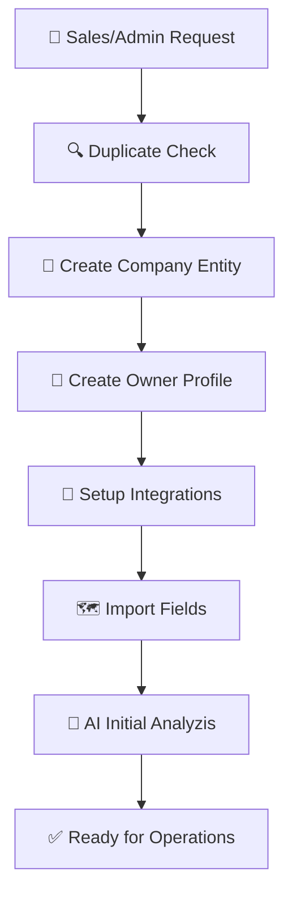

# Process: Client Onboarding (Создание Клиента) 🚀

> **Статус:** Драфт | **Приоритет:** Высокий | **Слой:** Processes / Workflows

---

## 1. Схема процесса

---

## 2. Пошаговый алгоритм

### 2.1. Инициация (Sales / SuperAdmin)
Так как мы Enterprise B2B, клиент не регистрируется сам "по кнопке на сайте". Процесс запускает Менеджер или Администратор.
*   **Входные данные**: Название юрлица, ИНН, Регион, Контактное лицо (Email/Phone).
*   **Действие**: `AdminService.createCompany()`

### 2.2. Создание структуры (Business Core)
1.  **Registry**: Создается корневая запись `Company`.
2.  **IAM**: Генерируется инвайт-ссылка для Владельца (Owner).
3.  **Billing**: Создается счетчик лицензий и квот (SaaS Limits).

### 2.3. Первичный Налив Данных (Data Ingestion)
Клиент (или менеджер) загружает "Цифровой профиль хозяйства":
*   **Геометрия полей**: KML/Shapefile.
*   **История полей**: Прошлые сезоны, культуры.
*   **Техника**: Список активов.

### 2.4. AI-Валидация (Роль ИИ) 🤖
Здесь вступает в игру **Router-Solver** архитектура:
1.  **Validation**: ИИ проверяет импортированные KML (нет ли пересечений, не лежат ли поля в воде/лесу).
2.  **Enrichment**: По координатам полей ИИ подтягивает:
    *   Тип почвы (из публичных карт).
    *   Агрометеоданные за 5 лет.
3.  **Engram Initialization**: Система сканирует историю клиента и формирует первые "Энграммы" (например, "У данного клиента на суглинке рапс дает 40ц/га").

---

## 3. Техническая реализация

### API Endpoints
- `POST /api/v1/admin/companies` — создание тенанта.
- `POST /api/v1/import/kml` — загрузка геометрии.
- `POST /api/v1/ai/onboarding/scan` — запуск AI-анализа.

### Безопасность
- Создание компании доступно только роли `PLATFORM_ADMIN`.
- Все данные нового клиента сразу получают тег `companyId`. Изоляция гарантирована с первой миллисекунды.
