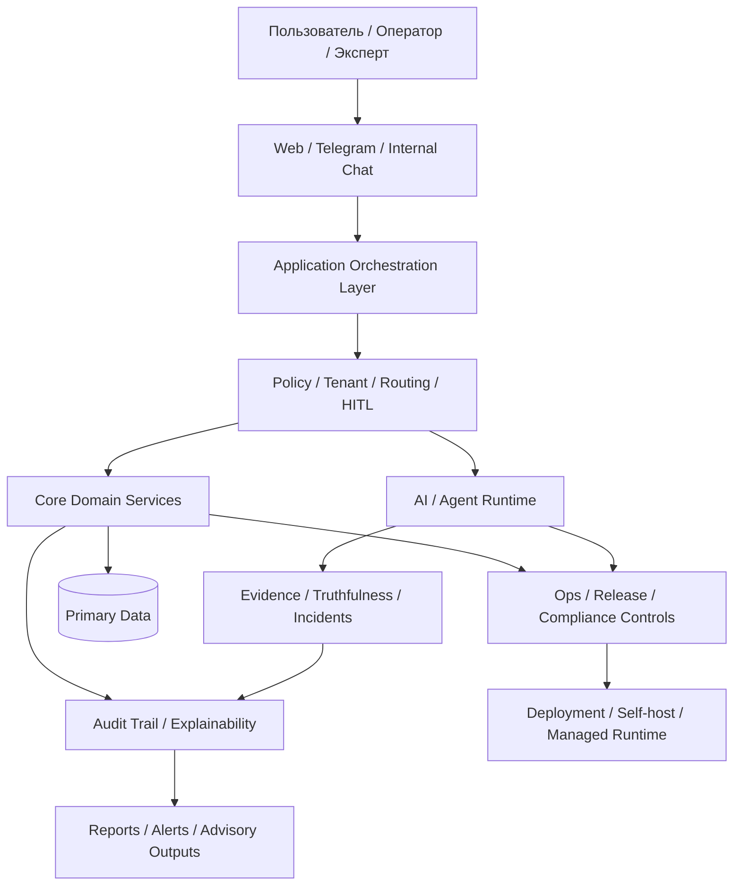

# RAI_EP — Системная карта и генеральный план

**Версия:** 0.1-draft  
**Дата:** 2026-03-28  
**Назначение:** единый управляющий документ уровня `north star + target architecture + execution plan`  
**Рекомендуемое каноническое размещение в репозитории:** `docs/00_STRATEGY/RAI_EP_SYSTEM_BLUEPRINT_AND_GENERAL_PLAN.md`

---

## 1. Зачем нужен этот документ

Аудит подтвердил, что в репозитории уже есть много полезных и зрелых частей: рабочий runtime map, evidence matrix, privacy/data-flow map, legal/compliance packet, AI-governance контур, quality gates и зелёный baseline по основным build/test/gates. Но эти части в основном отвечают на вопросы:

- что уже есть;
- что сейчас работает;
- где риски;
- что блокирует enterprise launch.

При этом не хватает единого документа, который отвечает на более важные управленческие вопросы:

- **что именно мы строим как систему в целом;**
- **какой у этой системы конечный целевой облик;**
- **какие контуры являются ядром, а какие вторичны;**
- **в какой последовательности систему надо доводить до зрелости;**
- **как увязаны продукт, архитектура, governance, legal, deployment и AI-агенты в одну модель.**

Этот документ закрывает именно этот пробел.

---

## 2. От чего мы отталкиваемся

По аудиту на 2026-03-28:

- система уже не выглядит как аварийный прототип: основной монорепозиторный контур имеет зелёный quality baseline по `api`, `web`, `telegram-bot`, routing и governance gates;
- репозиторий описан как `pnpm`/`Turborepo` monorepo для multi-tenant платформы агроопераций, финансово-экономического контура, CRM/commerce, explainability/audit trail, web/telegram front-office и Stage 2 `agent-first governed runtime`;
- главный барьер сейчас не архитектурный, а доказательный: unresolved dependency risk, внешний legal/privacy evidence gap и неполный install/ops packet;
- controlled pilot возможен, но внешний production с ПДн граждан РФ пока подтверждать нельзя. fileciteturn0file3

Это означает важную вещь: **нам не нужен документ-мечта в отрыве от реальности. Нам нужен документ, который опирается на текущий кодовый baseline и при этом задаёт целевую траекторию.**

---

## 3. Стратегическое определение системы

### 3.1. Что такое RAI_EP

`RAI_EP` — это не просто чат с агентами и не просто ERP/CRM для агробизнеса.

**Целевое определение:**

> `RAI_EP` — это governed multi-agent operating system для управления урожаем, агрооперациями, экономикой сезона, исполнением техкарты, explainability, контролем рисков и управленческой координацией вокруг хозяйства / группы хозяйств.

### 3.2. Центральный бизнес-артефакт системы

**Техкарта** в системе должна быть не “документом для генерации текста”, а центральным исполнимым артефактом, вокруг которого собираются:

- агрономическая гипотеза;
- операционный план сезона;
- бюджет и финансовая модель;
- контроль исполнения;
- журнал отклонений;
- рекомендации и предупреждения;
- explainability и evidence trail;
- контур согласования, утверждения и публикации.

### 3.3. Что является ядром продукта

Ядро продукта — это не интерфейс и не отдельный агент.

**Ядро = `TechMap + Governed Runtime + Execution Control + Evidence/Truthfulness + Auditability`.**

Именно это должно стать несущей конструкцией всей системы.

---

## 4. North Star: к какому состоянию должна прийти система

### 4.1. Целевое состояние

Система считается достигшей целевого состояния не тогда, когда “все фичи дописаны”, а когда она умеет надёжно делать следующее:

1. **Создавать и сопровождать техкарту как проект урожая.**
2. **Управлять исполнением сезона, а не только хранить справочники и записи.**
3. **Поддерживать управленческие решения доказательствами, а не красивыми ответами.**
4. **Безопасно использовать AI/агентов в governed-контуре, без произвольной автономии.**
5. **Давать прозрачный audit trail по данным, решениям, изменениям и рекомендациям.**
6. **Работать как multi-tenant enterprise система с понятными legal, security и ops-границами.**
7. **Поддерживать self-host / localized deployment как реалистичный основной путь внедрения.**

### 4.2. Практический “финал” системы

У такой платформы нет финала в смысле “дописали и всё”. Но есть **состояние архитектурной зрелости**, после которого развитие идёт уже как масштабирование платформы, а не как борьба за целостность.

Это состояние выглядит так:

- техкарта становится главным объектом orchestration;
- все high-impact действия проходят через policy/HITL/governance;
- AI-контур подчинён evidence-first и release-gated safety evals;
- продуктовые контуры увязаны в единый domain model;
- deployment, privacy, legal и security становятся частью release discipline, а не внешним хаосом;
- появляется installable, controlled, explainable enterprise product.

---

## 5. Что не должно стать системой

Чтобы не размазать разработку, важно явно зафиксировать анти-цели.

`RAI_EP` **не должен** превратиться в:

- очередной “чат с агентами”, где архитектура подчинена демонстрации AI;
- набор слабо связанных модулей `CRM + dashboard + bot + AI`, живущих каждый сам по себе;
- документогенератор без операционного исполнения;
- автономный AI без универсальной policy map, evidence thresholds и HITL для high-impact flows;
- SaaS-first продукт, если legal/compliance и residency пока толкают систему в self-host/localized path.

---

## 6. Системная модель: из каких слоёв состоит RAI_EP

Ниже — целевая карта системы. Она опирается на уже подтверждённые активные runtime-компоненты: `apps/api`, `apps/web`, `apps/telegram-bot`, shared `packages/*`, `infra/*`, workflows/scripts и ops/compliance packet. fileciteturn0file6 fileciteturn0file4

### 6.1. Слой 1. Interaction Layer

Точки входа пользователя и операторов:

- web interface;
- telegram contour;
- internal advisory/operational interfaces;
- в перспективе — внутренний чат и role-based control surfaces.

**Назначение слоя:** дать удобный вход в систему, но не хранить в интерфейсе бизнес-логику.

### 6.2. Слой 2. Governed Application Layer

Это orchestration-слой, где происходит:

- auth и tenant context;
- workflow routing;
- policy checks;
- command/query separation;
- orchestration пользовательских действий;
- подготовка вызовов доменных сервисов и AI-контуров.

**Назначение слоя:** быть нервной системой приложения, а не свалкой фич.

### 6.3. Слой 3. Core Domain Layer

Это основное доменное ядро платформы:

- техкарты;
- агрооперации;
- статусы, review/approval/publication;
- сезонные сценарии исполнения;
- экономика и бюджет;
- риски и отклонения;
- контрагенты и front-office сущности;
- юридически и операционно значимые события.

**Назначение слоя:** сделать так, чтобы система управляла предметной областью, а не только маршрутами интерфейсов.

### 6.4. Слой 4. AI / Agent Runtime Layer

Подтверждённый аудитом контур уже содержит routing, truthfulness, incidents, explainability, PII masking и human-gated advisory paths, но не замкнут в единый release-gated AI safety suite. fileciteturn0file0

Целевой состав слоя:

- semantic routing;
- governed tool access;
- evidence-first generation;
- uncertainty handling;
- incident registration;
- HITL for high-impact actions;
- agent scorecards;
- release safety evals.

**Назначение слоя:** усиливать доменную систему, а не подменять её.

### 6.5. Слой 5. Data / Evidence / Audit Layer

Сюда входят:

- primary domain data;
- audit trail;
- explainability traces;
- incident feeds;
- retention metadata;
- WORM / immutable artifacts;
- evidence registry.

Privacy/data-flow audit уже подтверждает наличие data subject categories, PII categories, trace/explainability contours и external provider paths. fileciteturn0file5

**Назначение слоя:** сделать любое важное действие, решение и рекомендацию проверяемыми задним числом.

### 6.6. Слой 6. Governance / Security / Compliance Layer

Этот слой уже имеет существенный progress: security audit, secret scanning, SBOM, license inventory, legal evidence lifecycle, owner-routing, acceptance runbooks и deployment/transborder matrix. Но legal/compliance verdict пока остаётся `NO-GO` для внешнего запуска с ПДн граждан РФ. fileciteturn0file3 fileciteturn0file7

**Назначение слоя:** превратить enterprise-требования из “последующего согласования” в часть самой системы управления выпуском.

### 6.7. Слой 7. Deployment / Operations Layer

Текущий наиболее реалистичный pilot path — `on-prem / self-hosted`, тогда как `SaaS` и `managed deployment` пока частичны и опираются на незамкнутые legal/ops evidence. fileciteturn0file3

**Назначение слоя:** обеспечить installability, reproducibility, backup/restore, DR, support boundary и predictable ownership.

---

## 7. Ключевая логика ценности для бизнеса

### 7.1. Главная полезность продукта

Система должна снижать не только ручной труд, но и **стоимость неправильного решения**.

Это достигается через связку:

- техкарта как управленческий контракт;
- цифровое сопровождение исполнения;
- своевременные сигналы об отклонениях;
- контроль evidence-based рекомендаций;
- прозрачно зафиксированные действия и решения;
- multi-role coordination между собственником, агрономом, оператором, финансами, контролем и front-office.

### 7.2. Откуда возникает ценность

Не из “наличия AI”, а из того, что система:

- уменьшает хаос вокруг сезона;
- структурирует исполнение и ответственность;
- снижает риск потерь из-за неисполнения техкарты;
- ускоряет управленческий цикл;
- делает рекомендации проверяемыми;
- создаёт цифровой след для контроля, споров, аудита и масштабирования.

---

## 8. Целевая карта потоков

### Смысл схемы

- пользователь общается не напрямую с “агентом”, а с governed application layer;
- policy/routing/HITL стоят перед high-impact действиями;
- AI-контур проходит через evidence/truthfulness/incidents;
- любые важные действия должны оставлять audit/explainability след;
- deployment и compliance не отделены от runtime, а связаны с ним через release discipline.

---

## 9. Приоритеты ядра: что в системе первично, а что вторично

### 9.1. Первичный контур

Это то, без чего система теряет смысл:

1. TechMap lifecycle.
2. Governed orchestration.
3. Execution control по сезону.
4. Explainability / evidence / audit trail.
5. Multi-tenant integrity.
6. Security / privacy / legal / ops gates.

### 9.2. Вторичный, но важный контур

Это усиливающие направления, которые нельзя делать ценой разрушения ядра:

- расширенный front-office;
- CRM/commerce надстройки;
- growth features;
- дополнительные агенты;
- внешние интеграции;
- витрины и executive dashboards.

### 9.3. Запрет на инверсию приоритетов

Нельзя допускать ситуацию, где:

- новые агенты появляются раньше универсальной tool-permission matrix и HITL matrix;
- внешние интеграции множатся раньше formal transborder/legal decision pack;
- продуктовая визуальная сложность растёт быстрее, чем execution integrity;
- SaaS ambitions опережают self-host/installability discipline.

---

## 10. Текущая реальность системы и главный разрыв

### 10.1. Что уже реально есть

По аудиту уже подтверждены:

- зелёный quality baseline по основным build/test/gates;
- routing corpus и case-memory baseline;
- invariant hygiene по guards/raw SQL;
- reproducible security baseline: audit, secrets, licenses, SBOM;
- active legal/privacy/compliance packet;
- owner-routed evidence lifecycle;
- AI/agent runtime с truthfulness, incidents, explainability и PII masking. fileciteturn0file3 fileciteturn0file4 fileciteturn0file0

### 10.2. Чего не хватает

Не хватает не отдельных “фич”, а трёх замыкающих слоёв:

1. **Единой стратегической модели** — этот документ и должен её зафиксировать.
2. **Release discipline уровня enterprise launch** — security, legal, AI safety, backup/restore, installability.
3. **Единой универсальной policy map** для high-impact flows, agents, tools, evidence thresholds и deployment constraints.

### 10.3. Главный системный разрыв

Сейчас система выглядит сильнее как **совокупность зрелых контуров**, чем как **единая управленческая машина с формально зафиксированным замыслом**.

Именно это и надо исправить.

---

## 11. Главный принцип архитектуры на ближайший этап

### Принцип

**Не “добавлять новые куски системы”, а “собирать текущие куски вокруг центрального управленческого ядра”.**

Практически это означает:

- любой новый модуль должен объясняться через роль в lifecycle техкарты и сезона;
- любой новый агент должен объясняться через governed execution model;
- любой новый deployment шаг должен объясняться через enterprise installability и legal boundary;
- любая новая UI-функция должна объясняться через операционную пользу, а не визуальное заполнение продукта.

---

## 12. Целевая дорожная карта развития

## Этап 1. Зафиксировать управляющую модель системы

**Цель:** прекратить архитектурное расползание.

Что должно быть результатом этапа:

- утверждён этот документ как верхнеуровневый source of intent;
- из него выведены linked docs по domain map, target architecture, AI policy map и launch roadmap;
- все новые решения сверяются с этим документом.

**Эффект:** команда начинает строить одну систему, а не набор параллельных инициатив.

## Этап 2. Собрать продукт вокруг TechMap Operating Core

**Цель:** сделать техкарту центром исполнения.

Что должно быть результатом этапа:

- techmap lifecycle formalized end-to-end;
- review/approval/publication связаны с execution state;
- события сезона и отклонения подвязаны к техкарте;
- финансово-экономический контур связан с планом и фактом.

**Эффект:** продукт становится системой управления урожаем, а не просто цифровым рабочим пространством.

## Этап 3. Замкнуть governed AI runtime

**Цель:** сделать AI полезным и управляемым.

Что должно быть результатом этапа:

- universal tool-permission matrix;
- universal HITL matrix для high-impact actions;
- release-gated AI safety eval suite;
- evidence thresholds и uncertainty policy;
- agent scorecards и incident drill discipline.

**Эффект:** AI-контур перестаёт быть источником скрытого enterprise-риска.

## Этап 4. Замкнуть enterprise release discipline

**Цель:** перевести систему из “сильной разработки” в “управляемый enterprise product”.

Что должно быть результатом этапа:

- закрытие top dependency/AppSec debt;
- backup/restore drill с evidence;
- install/upgrade packet;
- external legal evidence closeout;
- access review / branch protection evidence;
- privacy/legal/deployment checks как часть release gate.

**Эффект:** появляется право честно говорить о controlled rollout и enterprise readiness по конкретным моделям внедрения.

## Этап 5. Масштабировать роли, контуры и агентов

**Цель:** расширять систему без потери управляемости.

Что должно быть результатом этапа:

- новые агентные роли вводятся поверх policy framework;
- CRM/commerce/front-office расширяются как надстройка над ядром;
- executive analytics и control tower работают на общем audit/evidence слое.

**Эффект:** рост продукта перестаёт ломать базовую архитектуру.

---

## 13. Что считать завершением каждого этапа

Чтобы не работать “до ощущения”, надо зафиксировать критерии завершения.

### Этап 1 завершён, когда:

- есть утверждённый system blueprint;
- по нему создан package из дочерних canonical docs;
- новые архитектурные решения ссылаются на него явно.

### Этап 2 завершён, когда:

- lifecycle техкарты связан с execution control;
- critical season flows описаны как domain workflows;
- план/факт/отклонения видны системно.

### Этап 3 завершён, когда:

- AI actions проходят через policy + tool matrix + HITL rules;
- safety eval suite запускается как release gate;
- evidence bypass и unsafe autonomy покрыты тестами и правилами. fileciteturn0file0

### Этап 4 завершён, когда:

- legal/compliance перестаёт быть `NO-GO` по текущему verdict flow;
- backup/restore evidence актуален;
- installability и support boundary формально зафиксированы;
- security backlog опускается до приемлемого release threshold. fileciteturn0file3 fileciteturn0file7

### Этап 5 завершён, когда:

- новые агенты и каналы не создают governance drift;
- система расширяется за счёт шаблонов, а не ad hoc-исключений.

---

## 14. Главные архитектурные решения, которые надо принять явно

Это список решений, которые нельзя оставлять в подразумеваемом виде.

1. **TechMap-first principle** — техкарта действительно центр системы или только один из модулей?
2. **Pilot deployment principle** — базовый путь внедрения на ближайший период: `self-host/localized first` или нет?
3. **AI operating principle** — advisory-first/HITL-first как обязательное правило или нет?
4. **Evidence principle** — может ли система рекомендовать без достаточной evidence coverage?
5. **Data residency principle** — какие внешние providers допустимы по классам данных?
6. **Product scope principle** — CRM/front-office это ядро или надстройка?
7. **Release principle** — какие оси обязаны быть зелёными для каждого класса релиза?

Пока эти решения не оформлены канонически, система будет постоянно спорить сама с собой.

---

## 15. Рекомендуемый комплект следующих канонических документов

Из этого blueprint логично развернуть пакет из 6 дочерних документов.

### 15.1. `RAI_EP_TARGET_OPERATING_MODEL.md`

Что в нём:

- роли;
- контуры ответственности;
- как пользователь, оператор, эксперт, AI и контроль взаимодействуют между собой.

### 15.2. `RAI_EP_TECHMAP_OPERATING_CORE.md`

Что в нём:

- жизненный цикл техкарты;
- связи с execution, review, approval, publication, deviations, economics.

### 15.3. `RAI_EP_TARGET_ARCHITECTURE_MAP.md`

Что в нём:

- слои системы;
- bounded contexts;
- integration boundaries;
- deployment topologies;
- source-of-truth map.

### 15.4. `RAI_EP_AI_GOVERNANCE_AND_AUTONOMY_POLICY.md`

Что в нём:

- tool matrix;
- HITL matrix;
- safety evals;
- evidence and uncertainty policy;
- incident model.

### 15.5. `RAI_EP_ENTERPRISE_RELEASE_CRITERIA.md`

Что в нём:

- какие оси обязательны для pilot / managed / external production;
- security/legal/ops thresholds.

### 15.6. `RAI_EP_EXECUTION_ROADMAP.md`

Что в нём:

- 30/60/90/180-day decomposition;
- owners;
- checkpoints;
- measurable exit criteria.

---

## 16. Правило source of truth для этого документа

Этот документ **не должен подменять** код, тесты, gates и generated manifests.

Он должен работать так:

- **Blueprint** отвечает за `intent`, `system shape`, `priority order`, `target state`.
- **Architecture/docs** отвечают за детализацию слоёв и bounded contexts.
- **Code/tests/gates** отвечают за фактическую истину исполнения.
- **Generated artifacts** отвечают за измеримую готовность и verdicts.

Это согласуется с уже зафиксированным audit principle: `code/tests/gates > generated manifests > docs`. fileciteturn0file3

---

## 17. Главный управленческий вывод

Проблема системы сейчас не в том, что “непонятно что программировать вообще”.

Программировать уже есть что, и аудит это показал. Проблема в другом:

- системные части уже созрели быстрее, чем появился единый замысел верхнего уровня;
- поэтому архитектура рискует развиваться как сильный, но фрагментированный организм;
- без генерального плана легко перепутать ядро и периферию, продукт и демонстрацию, пилотную реальность и SaaS-фантазии.

Поэтому следующий зрелый шаг — **не очередная локальная доработка, а канонизация общего плана системы.**

---

## 18. Финальная формула

> `RAI_EP` надо развивать как **governed operating system управления урожаем**, где **техкарта — центральный исполнимый артефакт**, **AI — подчинённый evidence-governed слой**, а **security, legal, privacy, ops и deployment — часть release discipline, а не внешний хвост**.

Если это зафиксировать как канон, дальше станет понятнее:

- что является ядром;
- какие модули вторичны;
- как выглядит “финал” зрелости;
- что делать в какой последовательности;
- какие решения реально приближают систему к enterprise launch-grade состоянию.

