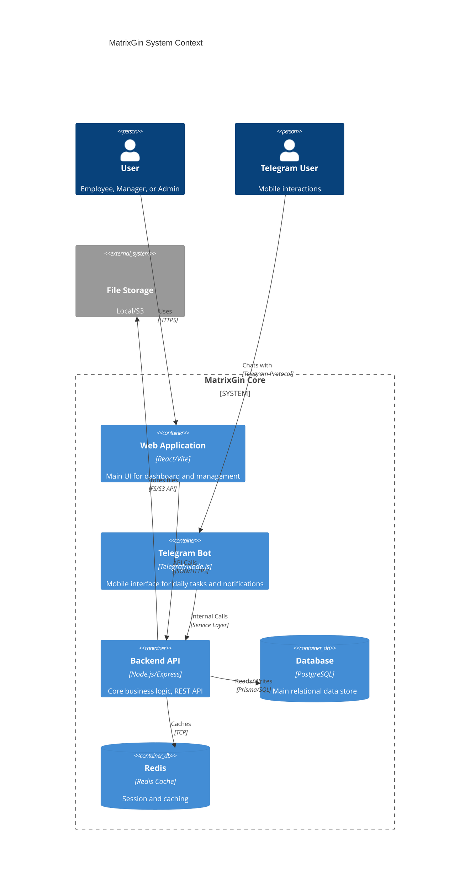
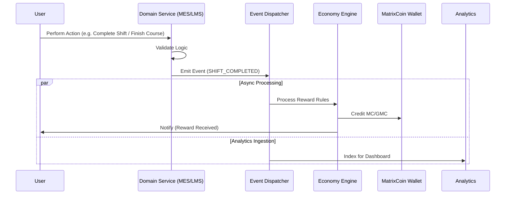

# MatrixGin Architecture (AS-IS)

> [!NOTE]
> Documented Status as of 2026-01-30.
> Reference: `backend/src` structure and `schema.prisma`.

## 1. C4 Context & Container Diagram



## 2. Backend Modular Architecture

This diagram reflects the directory structure and logical separation in `backend/src`.

```mermaid
graph TD
    subgraph "Interface Layer"
        API[REST API (Controllers)]
        Bot[Telegram Bot Service]
    end

    subgraph "Core Domain Modules"
        Auth[01. Auth & IAM]
        Emp[02. Employee Management]
        Tasks[03. Task Engine]
        OFS[04. OFS (Org Structure)]
        PSEE[05. PSEE (Production)]
        Univ[06. Corporate University]
        Eco[08. Economy & MatrixCoin]
        Game[09. Gamification & Ranks]
        Reg[Registry Core]
    end

    subgraph "Infrastructure"
        Prisma[Prisma ORM]
        Redis[Redis Client]
        Audit[Audit Logger]
        Events[Event Dispatcher]
    end

    API --> Auth
    API --> Emp
    API --> Tasks
    API --> OFS
    API --> PSEE
    API --> Univ
    API --> Eco
    API --> Reg

    Bot --> Auth
    Bot --> Emp
    Bot --> Tasks
    Bot --> Univ
    
    Auth --> Prisma
    Emp --> Prisma
    Tasks --> Prisma
    
    PSEE --> Events
    Univ --> Events
    
    Events --> Eco : "Triggers Reward"
    Events --> Game : "Triggers XP/Rank"
```

## 3. Event Flow Diagram (Event-Driven Core)

Focuses on how actions flow through the system, specifically towards Economy and Analytics.



## 4. Logical Constraints (AS-IS)

1. **Registry is King**: Logic validation relies on `RegistryEntity` state where applicable.
2. **Canonical Economy**: All writes to `Wallet` MUST go through `EconomyService` -> `Transaction` log. Direct DB edits are forbidden.
3. **Audit Trail**: All critical mutations trigger an `AuditLog` entry.
