# MatrixGin ERD (AS-IS)

> [!NOTE]
> Generated from `backend/prisma/schema.prisma` on 2026-01-30.
> Represents the **Canonical State** of the database.

## System Domains

- **Auth & IAM**: User identity, roles, sessions, foundation status.
- **Employees / OFS**: Org structure, departments, positions, HR records, hierarchy.
- **Tasks**: Universal task engine.
- **Economy**: MatrixCoin wallet, transactions, store, purchases, governance.
- **University**: LMS, courses, quizzes, foundation blocks, certifications.
- **Gamification**: Levels, achievements, quests, leaderboards, ranks.
- **PSEE / MES**: Production orders, work orders, quality checks, events.
- **System / Meta**: Registry, audit logs, notifications, library.

## Full ERD (Mermaid)

```mermaid
erDiagram
    %% ==========================================
    %% DOMAIN: AUTH / IAM
    %% ==========================================
    User {
        String id PK
        String email UK
        String role_id FK "Link to RBAC Role (optional)"
        String department_id FK
        Enum role "UserRole"
        Enum status
        Enum foundation_status
        Enum admission_status
        Enum profile_completion_status
    }
    Role {
        String id PK
        String name UK
        String code UK
    }
    RoleContract {
        String id PK
        String role_id FK
    }
    AuthSession {
        String id PK
        String user_id FK
    }
    
    UserRequest ||--|| User : "linked to"
    User ||--o{ AuthSession : "has sessions"
    Role ||--o{ RoleContract : "defines"
    Role ||--o{ User : "assigned to"

    %% ==========================================
    %% DOMAIN: EMPLOYEES / OFS
    %% ==========================================
    Department {
        String id PK
        String parent_id FK
        String head_id FK
    }
    Employee {
        String id PK
        String user_id FK "1-to-1 with User"
        String department_id FK
    }
    Position {
        String id PK
        String name UK
    }
    Location {
        String id PK
        String name UK
    }
    ReportingRelationship {
        String id PK
        String subordinate_id FK
        String supervisor_id FK
    }
    EmployeeRegistrationRequest {
        String id PK
        String telegram_id UK
        Enum registration_status
    }
    PersonalFile {
        String id PK
        String employeeId FK
    }

    Department ||--o{ Department : "parent/child"
    Department ||--o{ Employee : "employs"
    User ||--|| Employee : "profile"
    Employee ||--|| PersonalFile : "has HR file"
    User ||--o{ ReportingRelationship : "subordinate"
    User ||--o{ ReportingRelationship : "supervisor"

    %% ==========================================
    %% DOMAIN: TASKS
    %% ==========================================
    Task {
        String id PK
        String creator_id FK
        String assignee_id FK
        String department_id FK
        Enum status "TODO, DONE..."
    }
    TaskComment {
        String id PK
        String task_id FK
        String user_id FK
    }
    TaskAttachment {
        String id PK
        String task_id FK
    }

    User ||--o{ Task : "created/assigned"
    Task ||--o{ TaskComment : "comments"
    Task ||--o{ TaskAttachment : "files"

    %% ==========================================
    %% DOMAIN: ECONOMY
    %% ==========================================
    Wallet {
        String id PK
        String user_id FK
        Decimal mc_balance
        Decimal gmc_balance
    }
    Transaction {
        String id PK
        String sender_id FK
        String recipient_id FK
        Enum type
        Decimal amount
    }
    Product {
        String id PK
    }
    StoreItem {
        String id PK
    }
    Purchase {
        String id PK
        String userId FK
        String itemId FK
    }

    User ||--|| Wallet : "owns"
    User ||--o{ Transaction : "sends/receives"
    User ||--o{ Purchase : "buys"
    StoreItem ||--o{ Purchase : "sold"

    %% ==========================================
    %% DOMAIN: UNIVERSITY
    %% ==========================================
    Academy {
        String id PK
    }
    Course {
        String id PK
        String academy_id FK
    }
    CourseModule {
        String id PK
        String course_id FK
        String material_id FK
    }
    Material {
        String id PK
        Enum type
    }
    Enrollment {
        String id PK
        String user_id FK
        String course_id FK
    }
    ModuleProgress {
        String id PK
        String enrollment_id FK
        String module_id FK
    }
    Quiz {
        String id PK
        String material_id FK
    }
    Certification {
        String id PK
        String user_id FK
    }
    FoundationAcceptance {
        String id PK
        String person_id FK
    }

    Academy ||--o{ Course : "offers"
    Course ||--o{ CourseModule : "contains"
    Course ||--o{ Enrollment : "students"
    User ||--o{ Enrollment : "studies"
    Enrollment ||--o{ ModuleProgress : "tracks"
    Material ||--o{ Quiz : "tests"
    User ||--o{ Certification : "earns"
    User ||--o{ FoundationAcceptance : "accepts law"

    %% ==========================================
    %% DOMAIN: GAMIFICATION
    %% ==========================================
    GamificationLevel {
        String id PK
        Int level
    }
    UserGamificationStatus {
        String id PK
        String user_id FK
        String status_id FK
    }
    Achievement {
        String id PK
    }
    UserAchievement {
        String id PK
        String user_id FK
        String achievement_id FK
    }
    Quest {
        String id PK
    }
    QuestProgress {
        String id PK
        String user_id FK
        String quest_id FK
    }
    Leaderboard {
        String id PK
        Enum metric
    }

    User ||--o{ UserGamificationStatus : "has status"
    GamificationLevel ||--o{ UserGamificationStatus : "defines"
    User ||--o{ UserAchievement : "unlocks"
    Achievement ||--o{ UserAchievement : "awarded"
    User ||--o{ QuestProgress : "participates"
    Quest ||--o{ QuestProgress : "instances"

    %% ==========================================
    %% DOMAIN: PSEE / MES
    %% ==========================================
    ProductionOrder {
        String id PK
        String created_by_id FK
        Enum status
    }
    WorkOrder {
        String id PK
        String production_order_id FK
        String assigned_to_id FK
    }
    QualityCheck {
        String id PK
        String production_order_id FK
    }
    Defect {
        String id PK
        String production_order_id FK
    }
    Event {
        String id PK
        Enum type
        String subject_id
    }
    KPI {
        String id PK
    }
    KPIRecord {
        String id PK
        String kpi_id FK
    }

    ProductionOrder ||--o{ WorkOrder : "steps"
    ProductionOrder ||--o{ QualityCheck : "checks"
    ProductionOrder ||--o{ Defect : "issues"
    User ||--o{ ProductionOrder : "creates"
    KPI ||--o{ KPIRecord : "history"

    %% ==========================================
    %% DOMAIN: SYSTEM / META
    %% ==========================================
    RegistryEntity {
        String urn PK
        String entity_type_urn FK
    }
    AuditLog {
        String id PK
        String user_id FK
    }
    Notification {
        String id PK
        String user_id FK
    }
    LibraryDocument {
        String id PK
    }
    Kaizen {
        String id PK
        String author_id FK
    }

    User ||--o{ AuditLog : "actions"
    User ||--o{ Notification : "receives"
    User ||--o{ Kaizen : "proposes"
```

