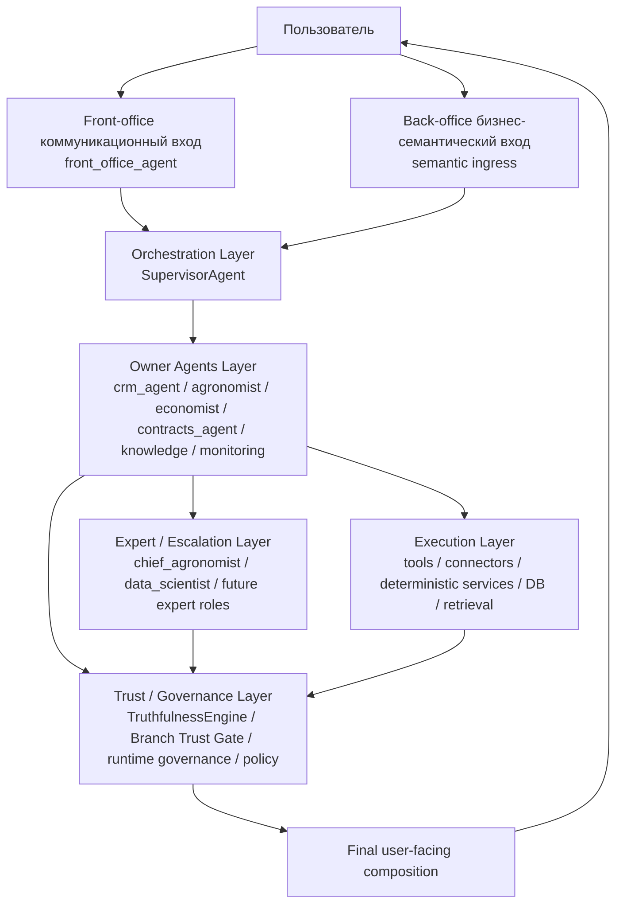
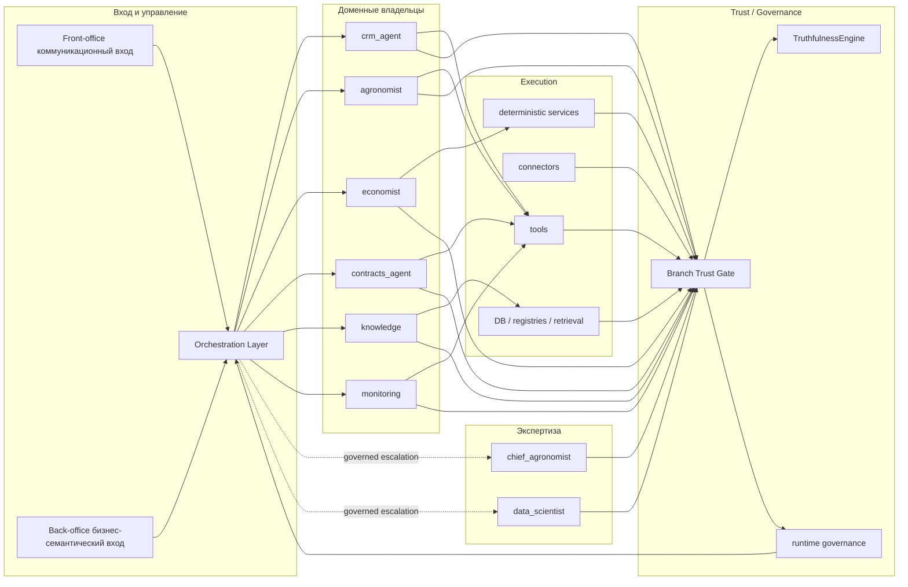

# Agent Module Org Structure

## CLAIM
id: CLAIM-EXE-AGENT-MODULE-ORG-STRUCTURE-20260325
status: asserted
verified_by: manual
last_verified: 2026-03-25

## 0. Назначение

Этот документ фиксирует рабочую оргструктуру агентского модуля `RAI_EP` как системы уровней ответственности, а не как списка агентов.

Цель:

- развести роли входа, оркестрации, доменного владения, экспертной эскалации, trust/governance и execution;
- задать каноническую схему под `semantic ingress -> governed handoff -> branch trust gate`;
- убрать смешение ролей, когда один и тот же агент пытается быть одновременно ingress, owner, verifier и презентатором.

Эффект:

- команда получает общую карту ответственности агентного модуля;
- новые агенты и новые доменные сценарии можно добавлять в уже заданную структуру;
- runtime и docs можно выравнивать по одной схеме, а не по набору локальных договорённостей.

## 1. Базовый принцип

Оргструктура агентского модуля строится по типам ответственности:

1. кто принимает коммуникационный вход;
2. кто оркестрирует;
3. кто владеет доменом;
4. кто подключается как эксперт;
5. кто проверяет доверие и governance;
6. кто реально исполняет операции и даёт фактические данные.

Канонический путь:

```text
Communication Ingress Layer
  -> Orchestration Layer
  -> Owner Agents Layer
  -> Expert / Escalation Layer
  -> Trust / Governance Layer
  -> Execution Layer
  -> Final user-facing composition
```

### 1.1 Визуальная схема уровней



### 1.1.1 Что именно означает `front_office_agent`

`front_office_agent` это канонический агент **только front-office коммуникационного ingress**, а не универсальный вход для всех запросов.

Он отвечает за:

- входящие и исходящие коммуникации;
- диалоговые треды;
- классификацию сообщения как коммуникационного сигнала;
- эскалацию в доменный owner-agent.

Он не означает:

- что любой бизнес-запрос сначала обязан проходить через него;
- что он владеет CRM, финансами, агро или договорами;
- что он заменяет `SupervisorAgent` как оркестратор бизнес-сценариев.

Важно:

- `front_office_agent` относится только к `front-office` коммуникационному слою;
- он не является общим коммуникатором для всей системы;
- back-office и обычный `rai-chat` бизнес-вход не проходят через него как через общий коммуникатор;
- для back-office бизнес-сценариев путь идёт через `rai-chat -> semantic ingress -> SupervisorAgent -> owner-agent`.

### 1.1.2 Два разных входа

```text
Вход 1: front-office коммуникационный
Пользователь / Telegram / thread / front-office message
    -> front_office_agent
    -> orchestrator
    -> owner-agent

Вход 2: back-office бизнес-семантический
Пользователь / rai-chat / business question
    -> semantic ingress
    -> SupervisorAgent
    -> owner-agent
```

Смысл разделения:

- коммуникационный вход нужен для front-office диалогов, тредов и эскалаций;
- бизнес-семантический вход нужен для back-office вопросов и действий по доменным задачам;
- оба входа законны, но они не должны быть слиты в один универсальный ingress.

### 1.1.3 Что не идёт через `front_office_agent`

Через `front_office_agent` не должны маршрутизироваться как primary path:

- обычные business questions из `rai-chat`;
- CRM-запросы по контрагентам и карточкам;
- агрономические, финансовые и договорные задачи;
- multi-source аналитические вопросы.

Для этих случаев нужен путь:

```text
rai-chat / business message
  -> semantic ingress
  -> SupervisorAgent
  -> owner-agent
```

Смысл:

- `front_office_agent` обслуживает front-office коммуникации;
- `rai-chat` обслуживает бизнес-диалог и доменные запросы через оркестратор;
- один не заменяет другой.

### 1.2 Визуальная схема отношений между уровнями



### 1.3 Очень простая схема на русском

```text
Пользователь
    |
    v
Коммуникационный вход
    |
    v
front_office_agent
    |
    +--> диалоги / thread / эскалации
    |
    v
Оркестратор
    ^
    |
Бизнес-семантический вход
    |
    v
semantic ingress
    |
    v
Оркестратор
    |
    +--> CRM
    |
    +--> Агро
    |
    +--> Финансы
    |
    +--> Договоры
    |
    +--> Знания
    |
    +--> Мониторинг
    |
    +--> Экспертная проверка
    |
    +--> Проверка доверия
    |
    v
Исполнение через инструменты и БД
    |
    v
Ответ пользователю
```

### 1.4 Как читать схему

- `front_office_agent` принимает только front-office коммуникационный вход: диалог, thread, эскалацию.
- `Бизнес-семантический вход` это отдельный back-office путь для доменных вопросов и действий из `rai-chat`.
- `Оркестратор` решает, куда направить запрос, независимо от того, пришёл он через front-office коммуникационный вход или через back-office бизнес-семантический вход.
- `CRM / Агро / Финансы / Договоры / Знания / Мониторинг` это доменные владельцы.
- `Экспертная проверка` включается только когда нужен усиленный разбор.
- `Проверка доверия` проверяет, можно ли верить данным.
- `Инструменты и БД` дают реальные факты и действия.
- `Ответ пользователю` собирается только после проверки.

### 1.5 Таблица маршрутов

| Тип запроса | Куда идёт сначала | Primary owner | Не owner |
|---|---|---|---|
| Диалог, thread, эскалация, front-office message | `front_office_agent` | `front_office_agent` | `crm_agent`, `agronomist`, `economist`, `contracts_agent` |
| Бизнес-вопрос по CRM | `rai-chat` -> `semantic ingress` -> `SupervisorAgent` | `crm_agent` | `front_office_agent` как business owner |
| Бизнес-вопрос по агро | `rai-chat` -> `semantic ingress` -> `SupervisorAgent` | `agronomist` | `front_office_agent` как business owner |
| Бизнес-вопрос по финансам | `rai-chat` -> `semantic ingress` -> `SupervisorAgent` | `economist` | `front_office_agent` как business owner |
| Бизнес-вопрос по договорам | `rai-chat` -> `semantic ingress` -> `SupervisorAgent` | `contracts_agent` | `front_office_agent` как business owner |
| Multi-source вопрос | `rai-chat` -> `semantic ingress` -> `SupervisorAgent` | `lead owner-agent` по домену финального эффекта | `front_office_agent` как universal entry |

Смысл таблицы:

- `front_office_agent` владеет только front-office коммуникационным входом;
- доменные запросы из `rai-chat` идут через semantic ingress сразу в нужного owner-agent;
- `front_office_agent` не превращается в универсальный owner всех входящих сообщений;
- multi-source вопросы должны иметь lead owner-agent, но не обязательно `front_office_agent`.

## 2. Уровни оргструктуры

## 2.1 Communication Ingress Layer

### Роль

Принять front-office коммуникационный поток и превратить его во входной управляемый объект.

### Важная граница

Это не универсальный вход для всех доменных запросов и не общий коммуникатор системы. Он владеет только front-office ingress: диалог, thread, escalation, routing of messages.

### Канонический агент

- `front_office_agent` только для front-office коммуникационного ingress

### Ответственность

- определить режим взаимодействия;
- отделить `free_chat` от `task_process`, `client_request`, `escalation_signal`;
- подготовить ingress-frame;
- не решать доменную задачу за owner-agent.

### Не имеет права

- захватывать ownership чужого домена;
- выполнять доменные write-операции как основной владелец;
- подменять оркестратор.

### Эффект уровня

- пользователь может писать свободно;
- доменные агенты получают уже нормализованный вход, а не сырую фразу.

## 2.2 Orchestration Layer

### Роль

Управлять сценарием исполнения, а не доменным содержанием.

### Канонические компоненты

- `SupervisorAgent`
- orchestration spine

### Ответственность

- получить semantic ingress frame из `rai-chat` business path;
- выбрать `lead owner-agent`;
- построить `sub-intent graph`;
- определить `parallel / sequential / blocking`;
- запустить governed handoff;
- применить `Branch Trust Gate`;
- собрать orchestration result для composer.

### Не имеет права

- становиться доменным owner;
- придумывать факты вместо execution-слоя;
- напрямую подменять trust/governance произвольной LLM-логикой.

### Эффект уровня

- сложные сценарии становятся управляемыми;
- multi-agent path не разваливается в mesh-хаос.

## 2.3 Owner Agents Layer

### Роль

Быть каноническими владельцами конкретных бизнес-доменов.

### Текущий состав

- `crm_agent`
- `agronomist`
- `economist`
- `contracts_agent`
- `knowledge`
- `monitoring`

### Ответственность

- владеть своим primary domain;
- возвращать typed `JSON` branch-result;
- различать факт, расчёт, advisory и недостающие данные;
- не выдавать чужой домен за свой без governed handoff.

### Не имеют права

- быть universal assistant;
- захватывать ownership только потому, что у них есть похожий tool;
- скрытно звать друг друга peer-to-peer в обход orchestration spine.

### Эффект уровня

- у каждого бизнес-intent есть ясный primary owner;
- оркестратор работает с owner-map, а не с хаотическим набором инструментов.

## 2.4 Expert / Escalation Layer

### Роль

Подключаться не как primary owner, а как условный экспертный слой.

### Текущий состав

- `chief_agronomist`
- `data_scientist`

### Перспективные роли

- `legal_advisor`
- `strategist`
- другие expert-tier роли по тем же правилам

### Ответственность

- давать expert-review;
- подключаться при low confidence, conflict, high-risk advisory;
- возвращать экспертное заключение как branch-result или review packet.

### Не имеют права

- быть общим входом;
- подменять owner-agent по умолчанию;
- становиться always-on second-pass для любого запроса.

### Эффект уровня

- экспертная эскалация становится формальной, а не случайной;
- high-risk вопросы получают управляемый review path.

## 2.5 Trust / Governance Layer

### Роль

Проверять и ограничивать, а не консультировать.

### Канонические компоненты

- `TruthfulnessEngine`
- `Branch Trust Gate`
- runtime governance
- policy / confirmation / fallback layer
- trace summary / telemetry / explainability

### Ответственность

- присваивать branch verdict;
- проверять evidence, provenance и consistency;
- не пропускать неподтверждённые ветки как установленные факты;
- считать runtime quality и latency budgets;
- включать selective cross-check только по сигналу риска.

### Не имеет права

- играть роль доменного owner;
- заменять execution facts своими эвристиками;
- превращаться в постоянный second-pass verifier на каждый branch.

### Эффект уровня

- система получает реальный anti-hallucination контур;
- trust и performance управляются как инженерные параметры.

## 2.6 Execution Layer

### Роль

Быть нижним слоем фактов, инструментов и детерминированного исполнения.

### Состав

- tools registry
- connectors
- deterministic calculators
- DB / registries / retrieval
- domain services

### Ответственность

- возвращать фактические данные;
- выполнять реальные операции;
- давать basis для recompute и verification.

### Не имеет права

- становиться user-facing reasoning слоем;
- подменять semantic routing и ownership.

### Эффект уровня

- агенты перестают быть “источником истины”;
- факты и действия опираются на реальный execution spine.

## 3. Owner map по уровням

| Уровень | Канонический владелец | Что делает | Что не делает |
|---|---|---|---|
| Ingress | `front_office_agent` | принимает front-office коммуникационный вход и нормализует режим общения | не владеет доменной бизнес-логикой |
| Orchestration | `SupervisorAgent` | строит execution path и handoff | не подменяет owner-agent |
| CRM domain | `crm_agent` | владеет CRM-сценариями и counterparty/account flows | не владеет агрономией или договорами |
| Agro domain | `agronomist` | владеет агро-фактами, техкартами, отклонениями | не владеет финансами как primary owner |
| Finance domain | `economist` | владеет plan/fact, cost, scenario, financial interpretation | не владеет CRM execution path |
| Contracts domain | `contracts_agent` | владеет договорами и AR review | не владеет CRM registration |
| Knowledge evidence | `knowledge` | даёт read/evidence support | не должен захватывать primary ownership |
| Monitoring signals | `monitoring` | даёт signal/advisory слой | не должен подменять business owner |
| Expert review | `chief_agronomist`, `data_scientist` | expert escalation и high-risk analysis | не являются общим ingress-owner |
| Trust/Governance | `TruthfulnessEngine`, `Branch Trust Gate`, runtime governance | проверяют доверие и policy | не владеют доменным решением |
| Execution | tools/connectors/services | выполняют факты и операции | не общаются с пользователем как owner |

## 4. Правила эскалации

### 4.1 Когда включается expert-layer

- low confidence у owner-agent;
- `CONFLICTED` branch-result;
- high-risk advisory;
- domain-specific review requirement;
- policy-triggered human/expert boundary.

### 4.2 Когда включается trust-layer

- всегда в минимальном deterministic режиме;
- в расширенном режиме при:
  - `UNVERIFIED`
  - `CONFLICTED`
  - low trust
  - explicit policy trigger

### 4.3 Когда не допускается escalation

- без evidence и без runtime signal;
- просто потому, что “на всякий случай хочется проверить всё второй моделью”;
- если это ломает agreed latency budget на happy path.

## 5. Правила запрета на смешение ролей

Запрещено:

1. использовать `front_office_agent` как скрытого owner-agent всех доменов или как общий коммуникатор для `rai-chat`;
2. использовать `knowledge` как универсальный primary owner только потому, что он умеет retrieval;
3. заставлять `SupervisorAgent` генерировать доменное решение вместо orchestration;
4. превращать expert-layer в постоянный second-pass по умолчанию;
5. выдавать branch-result без явного owner или scope;
6. позволять direct peer-to-peer `agent -> agent` обход orchestration spine;
7. считать trust/governance “ещё одним агентом-советчиком”.

Эффект этих запретов:

- платформа сохраняет управляемую topology;
- роли не расползаются по системе;
- новая функциональность добавляется в уже заданную структуру.

## 6. Как применять эту оргструктуру

При добавлении нового агента или нового сценария нужно последовательно отвечать на вопросы:

1. это ingress, orchestration, owner, expert, trust или execution слой;
2. кто primary owner этого домена;
3. кто может быть только secondary evidence/advisory branch;
4. нужен ли expert escalation path;
5. какой trust/gov слой обязателен;
6. какой execution basis подтверждает факт или действие.

Без этого новый агент считается архитектурно неоформленным.

## 7. Первое практическое применение

Эта оргструктура должна стать опорной схемой для:

- дальнейшего развития `semantic ingress`;
- `Branch Trust Gate`;
- owner-map для composite и multi-source сценариев;
- обновления agent profiles;
- выравнивания runtime-routing и docs.

Ближайший прикладной эффект:

- при любом новом сценарии команда сможет сначала положить его в слой оргструктуры, а уже потом решать детали routing, trust и UI surface.
