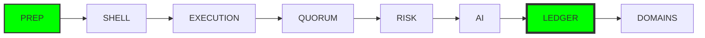

# Архитектурный Роадмап: Institutional Build Plan
## Стратегия реализации RAI Enterprise Platform

> [!IMPORTANT]
> Мы придерживаемся строгой последовательности внедрения:
> **Governance Core → Institutional Infrastructure → Business Domains**
> Строительство бизнес-логики до готовности ядра управления запрещено. Любое отклонение считается архитектурным нарушением.

---

## Enforcement Model:
Все фазы исполняются в Institutional Enforcement Mode.
Любая реализация обязана соблюдать:

AuthorityContext

FSM-based transitions

Two-Phase Execution

Escalatory Governance

Ledger Binding

---

## Общий поток реализации



---

## PHASE 0: Подготовка (Foundation / PREP)
**Срок:** 2–3 дня  
**Цель:** Подготовить каркас проекта под стандарты Institutional Frontend.

### Задачи:
*   **0.1 Базовая структура (apps/web/) [DONE]:**
    - `app/` (Router) [DONE]
    - `core/` (Services, Logic) [DONE]
    - `modules/` (Feature domains) [DONE]
    - `shared/` (UI Components, Utils) [DONE]
*   **0.2 Технологический стек [DONE]:**
    - Next.js App Router [DONE]
    - Tailwind + CSS Variables (Theming Layer) [DONE]
    - React Query (Server State) [DONE]
    - Zustand (Global State) [DONE]
    - XState (Governance FSM) [DONE]
    - Event Bus (mitt или rxjs) [DONE]
*   **0.3 Strict Mode & Linting [DONE]:**
    **Запретить [ENFORCED]:**
    - Прямые `role-check` в компонентах.
    - Использование `any`.
    - Mutable shared state (строгая иммутабельность).

> [!CHECKLIST]
> **Definition of Done (Phase 0):**
> - [x] Проект компилируется без ошибок в Strict Mode.
> - [x] Dev-server работает стабильно.
> - [x] Базовый `layout.tsx` существует и соответствует канону.
> - [x] Система темизации (Dark/Light) инициализирована.
> - [x] Библиотеки состояний (Zustand, XState) подключены и сконфигурированы.

---

## PHASE 1: Governance Shell (Institutional Skeleton)
**Срок:** Неделя 1  
**Цель:** Построить каркас системы управления без бизнес-логики.

### Задачи:
*   **1.1 App Layout (Без бизнес-логики):**
    - Создание `<GovernanceBar />`
    - Создание `<DomainTree />`
    - Создание `<WorkSurface />`
*   **1.2 AuthorityContext Layer:**
    ```typescript
    interface AuthorityContext {
      canOverride: boolean;
      canSign: boolean;
      canEscalate: boolean;
      canEdit: boolean;
      canApprove: boolean;
    }
    ```
    - Реализация `AuthorityProvider` и хука `useAuthority()`.
    - **Жесткий запрет:** Использование `user.role` внутри UI.
*   **1.3 Role Simulation Layer:**
    - Создание Mock-пользователей: `CEO`, `Director`, `Manager`, `Agronomist`.
    - Реализация переключения ролей через dev-панель для тестирования.

> [!CHECKLIST]
> **Definition of Done (Phase 1):**
> - [x] `GovernanceBar` корректно адаптируется под флаги `Authority`.
> - [x] В компонентах отсутствуют проверки ролей (только флаги полномочий).
> - [x] `DomainTree` фильтруется на основе `capability`.
> - [x] Механизм переключения Mock-ролей работает корректно.

---

## PHASE 2: Two-Phase Execution Engine (FSM Core)
**Срок:** Неделя 2  
**Цель:** Реализовать протокол Deferred Commit через XState.

### Задачи:
*   **2.1 Canonical FSM:**
    - Состояния: `initiated`, `pending`, `approved`, `rejected`, `executed`.
    - Каждое governance-действие обязано проходить через эту машину.
*   **2.2 GovernanceAction Hook:**
    - `useGovernanceAction()`: запуск FSM, инициация эскалации, возврат `state` + `traceId`.
*   **2.3 UI State Binding:**
    - При `state === pending`: отображение `EscalationBanner`, блокировка дублирующих действий.

> [!CHECKLIST]
> **Definition of Done (Phase 2):**
> - [x] Все кнопки управления (Decision Buttons) используют FSM.
> - [x] Отсутствуют прямые `setState` переходы для критических действий.
> - [x] Состояние PENDING визуально отображается и блокирует UI.
> - [x] Реализовано предотвращение дублирующих экшенов.
> - [x] `TraceID` корректно генерируется и отображается.

---

## PHASE 3: Escalation & Quorum Layer (Governance UI)
**Срок:** Неделя 3  
**Цель:** Визуализировать процессы эскалации и M-of-N подписей.

### Задачи:
*   **3.1 EscalationBanner (Canonical):**
    - Обязательные пропсы: `escalationId`, `committee`, `quorumProgress`, `traceId`, `riskLevel`.
*   **3.2 QuorumVisualizer:**
    - Отображение: `required X of N`, список подписантов, текущий прогресс.
*   **3.3 SignatureGateModal:**
    - Слой mTLS handshake (симуляция), `payload preview`, подтверждение.

> [!CHECKLIST]
> **Definition of Done (Phase 3):**
> - [x] `EscalationBanner` используется во всех точках эскалации.
> - [x] Прогресс кворума визуально понятен и обновляется.
> - [x] Флоу подписи нельзя обойти (Bypass-proof).
> - [x] `Override` требует обязательного ввода причины (Reason).
> - [x] Флаг `canSign` корректно влияет на доступность кнопок подписи.

---

## PHASE 4: Risk Triage & Causal Loops [IN PROGRESS]
**Срок:** Неделя 4  
**Цель:** Слой аналитики рисков и кросс-доменных связей.

### Задачи:
*   **4.1 Risk Stratification (R1–R4) [DONE]:**
    - Визуализация уровней.
    - **R4 (Critical):** Жесткая эскалация, блокировка только связанных действий (не всей системы).
*   **4.2 Triggered Effects Panel:**
    - Отображение: затронутые домены, создаваемые записи, ссылки на объекты.
*   **4.3 Conflict Component:**
    - Явная маркировка (labels), путь эскалации. Запрещен пассивный конфликт (скрытый в логах).

> [!CHECKLIST]
> **Definition of Done (Phase 4):**
> - [/] Уровень риска (R1-R4) виден на каждом десижн-карточке.
> - [ ] Авто-эскалация срабатывает при R3/R4.
> - [ ] Отрисовывается панель `Triggered Effects`.
> - [ ] Конфликты инвариантов визуально выделены и требуют реакции.

---

## PHASE 5: AI Explainability (Trust & Forensic)
**Срок:** Неделя 5  
**Цель:** Реализовать 3-уровневое обоснование решений ИИ.

### Задачи:
*   **5.1 ExplainabilityPanel:**
    - **Surface:** Recommendation, Confidence.
    - **Analytical:** Factors, Counterfactual (что если?).
    - **Forensic:** Model version, Ledger link.
*   **5.2 Progressive Disclosure:**
    - Переходы без переключателей (toggles) — только по интенту (клик -> глубже, трейс -> форенсик).

> [!CHECKLIST]
> **Definition of Done (Phase 5):**
> - [ ] Нет выводов ИИ без указания `confidence %`.
> - [ ] Реализован контрфактуальный анализ в UI.
> - [ ] Каждая рекомендация имеет прямую ссылку на запись в Ledger.
> - [ ] ИИ не позиционируется как абсолютный авторитет.

---

## PHASE 6: Ledger Integrity & Mismatch Protocol (Safety)
**Срок:** Неделя 6  
**Цель:** Гарантировать институциональную целостность данных в UI.

### Задачи:
*   **6.1 Ledger Sync Watcher:**
    - Сравнение локального хеша состояния с серверным (хеш дерева Меркла).
*   **6.2 Mismatch Handling:**
    - При расхождении: `Global ErrorBoundary`, полная блокировка UI (Freeze), уведомление Risk Officer.

> [!CHECKLIST]
> **Definition of Done (Phase 6):**
> - [ ] Ситуация расхождения хешей успешно воспроизводится в тестах.
> - [ ] UI блокируется корректно при десинхроне.
> - [ ] Отсутствует риск "тихой десинхронизации".
> - [ ] Функционал `Trace Replay` (воспроизведение цепи событий) работает.

---

## PHASE 7: Business Domains (Expansion)
**Срок:** Неделя 7+  
**Цель:** Подключение прикладных модулей CRM, Agronomy, Finance, Strategy.

> [!CHECKLIST]
> **Definition of Done (Phase 7):**
> - [ ] Прикладные модули интегрированы строго через Governance Core.
> - [ ] Кросс-доменные переходы фиксируются в Ledger.

---

## 🔎 Global Institutional Review Checklist

Каждое изменение (PR) проверяется на соответствие:
- [ ] **Authority:** Прямые role-check отсутствуют? Все кнопки полномочий активны?
- [ ] **Execution:** Используется ли канонический FSM? Видно ли состояние PENDING?
- [ ] **Escalation:** Наличие `EscalationBanner`, видимость кворума, наличие `escalationId`.
- [ ] **Ledger:** Наличие `TraceID`, видимость статуса `Immutable`.
- [ ] **AI:** Наличие `Confidence %`, `Counterfactual` и панели обоснования.
- [ ] **Risk:** Классификация R1–R4 соблюдена? Включена ли защита от alert fatigue?

---

## 🧪 Обязательные симуляции (Stress Testing)

Каждый спринт завершается прохождением симуляций. Провал любой = **Halt**.

1.  **Role Simulation:** Адаптация интерфейса под `AuthorityContext` (не роли).
2.  **Escalation Simulation:** Искусственный триггер рисков R3/R4, проверка баннеров и кворума.
3.  **Ledger Mismatch Simulation:** Симуляция расхождения хешей, проверка блокировки UI.
4.  **Duplicate Action Simulation:** Попытка двойного клика/действия в состоянии `PENDING`.
5.  **Replay Test:** Восстановление состояния UI через воспроизведение цепочки Ledger.

---
*Lead Architecture: Antigravity AI Engine*  
*Status: Institutional Ready (VERIFIED VERSION)*