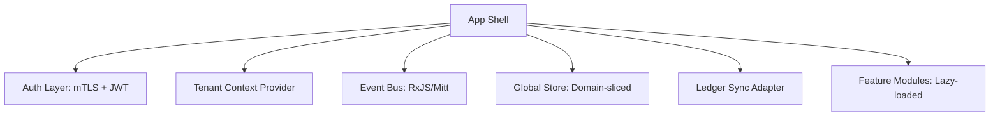

# RAI Enterprise — Frontend Control Plane
## Engineering Blueprint (Production-Ready Specification)

> [!WARNING]
> **STATUS: SUPERSEDED BY [Master Frontend Architecture](file:///f:/RAI_EP/docs/00_STRATEGY/Master%20Frontend%20Architecture.md)**
> Данный документ является архивным и оставлен для истории эволюции проекта.

**Основание**: [Frontend Control Plane Strategy](file:///f:/RAI_EP/docs/00_STRATEGY/Frontend%20Control%20Plane%20Strategy.md)
**Цель**: Трансформация концептуальной стратегии в техническую спецификацию для реализации фронтенд-слоя.

---

### 1. System Architecture (Frontend)

#### 1.1 Architectural Model
*   **Type**: Modular SPA (Domain-driven, Event-driven)
*   **Design Language**: Control Plane UI (Institutional-grade)
*   **Isolation**: Strict Tenant-aware rendering

**High-Level Structure:**

#### 1.2 Technology Constraints
| Layer | Requirement | Implementation Detail |
| :--- | :--- | :--- |
| **Routing** | Nested domain routing | React Router / Next.js Parallel Routes |
| **State** | Domain-sliced + Event Bus | Redux Toolkit / Zustand + RxJS |
| **Data** | Typed API contracts | OpenAPI / TypeScript DTOs |
| **Realtime** | WebSocket stream | SignalR / Socket.io for alerts |
| **Auth** | mTLS + Role Claims | Client certificates + JWT |
| **Security** | Signature Gateway | Client-side signature handshake |

---

### 2. Domain Modules (Engineering Decomposition)

Каждый модуль реализуется как изолированный domain-slice с собственной навигацией и состоянием.

#### 2.1 Harvest Module (Управление урожаем)
*   **Path**: `/harvest/*`
*   **Slices**: `Registry`, `Plans`, `TechMaps`, `Execution`, `Deviations`, `Results`

#### 2.2 Strategy Module (Стратегия)
*   **Path**: `/strategy/*`
*   **Characteristics**: Read-heavy, High visualization density. Derived-state dominant.

#### 2.3 Economy Module (Экономика)
*   **Path**: `/economy/*`
*   **Critical UI**: Risk Corridor (Canvas/SVG), Predictive modeling viz.

#### 2.4 Finance Module (Финансы)
*   **Path**: `/finance/*`
*   **Requirement**: Ledger-binding is mandatory. Every action MUST generate a `TraceID`.

#### 2.5 GR Module (Governance/Legal)
*   **Path**: `/gr/*`
*   **Constraint**: All transformative actions require `SignatureGate`.

#### 2.6 Production Module (Производство)
*   **Path**: `/production/*`
*   **Characteristics**: High realtime dependency (IoT/Logistics tracking).

#### 2.7 Knowledge Module (Знания)
*   **Path**: `/knowledge/*`
*   **Status**: MVP (Read-only knowledge base).

#### 2.8 Settings Module (Настройки)
*   **Path**: `/settings/*`
*   **Features**: `MerkleTreeExplorer`, `TraceVerificationPanel`, `RBAC Manager`.

---

### 3. Core Infrastructure

#### 3.1 Event Bus Architecture
Глобальная шина событий для синхронизации состояния между модулями (например, обновление Heatmap при выявлении отклонения).

**Primary Events:**
- `DeviationDetected`
- `PlanCommitted`
- `TechMapPublished`
- `LedgerEntryCreated`
- `SignatureRequested / Completed`
- `RiskUpdated`
- `EconomyDriftDetected`

---

### 4. Component Governance

#### 4.1 Institutional Component Library
Обязательный набор компонентов для обеспечения прозрачности и безопасности.

| Component | Ledger-bound | Signature-aware | Explainable |
| :--- | :---: | :---: | :---: |
| `TraceIDBadge` | ✔ | ✖ | ✖ |
| `ExplainabilityPanel` | ✖ | ✖ | ✔ |
| `LedgerLink` | ✔ | ✖ | ✖ |
| `SignatureGate` | ✔ | ✔ | ✖ |
| `OverrideModal` | ✔ | ✔ | ✔ |
| `IntegrityBadge` | ✔ | ✖ | ✖ |

---

### 5. Lifecycle State Machines

#### 5.1 Deviation Lifecycle
`Detected` → `Triaged` → `DecisionPending` → `Resolved` → `LedgerClosed`

**Transition Rules:**
1.  Emit Event
2.  Generate Trace ID
3.  Require mTLS Signature (for resolution)
4.  Log to Audit Trail

---

### 6. Signature & mTLS Flow
Все "Governance" действия проходят через шлюз подписи.

1.  **Trigger**: User initiates action.
2.  **Gate**: `SignatureGate` checks for required Level (M-of-N).
3.  **Handshake**: Client-side certificate auth.
4.  **Commit**: Action sent to API with signature payload.
5.  **Audit**: Trace ID returned and linked to UI state.

---

### 7. Performance & UX Standards
- **Virtualization**: Обязательно для таблиц (10k+ объектов).
- **No Silent Failures**: Любая ошибка Ledger-синхронизации должна отображать `ConflictResolutionPanel`.
- **Audit Mode**: Поддержка "historical travel" режима (просмотр состояния системы на момент конкретного Trace ID).

---

### 8. Definition of Done (Production Grade)
Модуль считается завершенным, если:
- [ ] Все действия логируются с `TraceID`.
- [ ] Все критические гейты защищены `SignatureGate`.
- [ ] Все решения ИИ снабжены `ExplainabilityPanel`.
- [ ] Состояние синхронизировано с глобальной шиной событий.
- [ ] Реализованы Loading/Empty/Error стейты.

---
*Engineering Lead: Antigravity AI Engine*