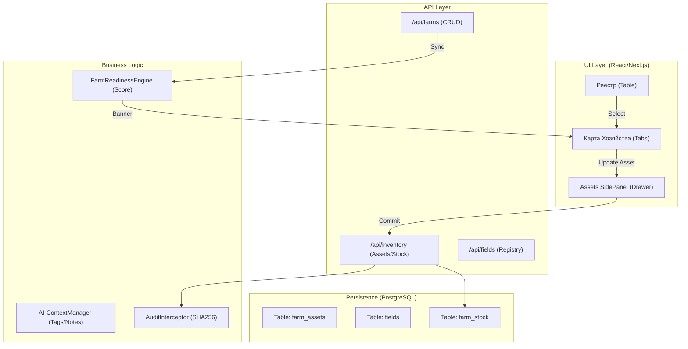

# Экран: Реестр и Карта Хозяйства (`/consulting/crm/farms`)

## 0. Статус и Версия

- **Статус:** HARDENING REQUIRED (Pilot Ready)
- **Версия:** 2.0.0 (Refactored)
- **Дата последнего обновления:** 2026-02-28
- **Соответствие канону:** [DESIGN_SYSTEM.md](file:///root/RAI_EP/docs/03_PRODUCT/UI_UX/DESIGN_SYSTEM.md) v2.0 (B, C, J patterns)

---

## 1. Функциональная роль

`Реестр хозяйств` — операционный хаб и "микроскоп" сущности `Хозяйство` (Farm). Модуль обеспечивает глубокое управление производственными активами: полями, техникой, складами ТМЦ и техкартами в привязке к конкретной географической и юридической локации.

### Ключевые принципы:
- **Operational Focus:** Хозяйство — это не юрлицо (Party), а место исполнения технологии (Asset).
- **Resource Binding:** Все ресурсы (семена, удобрения, техника) привязаны к хозяйству через инвентарные интерфейсы.
- **Season Readiness:** Система J-Pattern оценивает готовность хозяйства к старту сезона (наличие планов, ресурсов, техники).

---

## 2. Архитектура UI (Tabs & Micro-focus)

### Реестр (`/consulting/crm/farms`)
- **Вид:** Таблица с фильтрацией по культуре, статусу риска (`severity`) и площади.
- **Micro-KPIs:** Быстрые счетчики «В норме / Риск / Критично» для оперативной навигации.
- **Completeness Indicator:** Процент готовности хозяйства к текущему/будущему сезону.

### Карта хозяйства (`/consulting/crm/farms/:id`)
Использует систему вкладок для декомпозиции операционной сложности:

1.  **Профиль:** Базовые данные, координаты, связь с владельцем (Юрлицо). Содержит баннер полноты данных.
2.  **Поля:** Реестр полей хозяйства в табличном виде (C-Pattern). Площадь, культура, индекс здоровья.
3.  **Техника:** Доступный флот техники с привязкой к операционным мощностям.
4.  **Склады / ТМЦ:** Текущие остатки семян, удобрений и СЗР на складах хозяйства.
5.  **Планы & Техкарты:** Список активных и архивных планов (HarvestPlan) с Drill-down в техкарту.
6.  **AI-Контекст:** Централизованный блок аннотаций, тегов и заметок для обучения моделей.

---

## 3. Инженерные паттерны (Institutional Grade)

### B-Pattern: View / Edit Mode
- Все атрибуты хозяйства (название, площадь, описание) обернуты в `DataField`.
- Переключение режимов через `EditModeProvider`.
- В `ViewMode` — чистая типографика без визуального шума.

### C-Pattern: Tabular Scalability
- Списки полей, техники и ТМЦ — строго таблицы.
- **Drawers (SidePanelForm):** Добавление нового поля или списание ТМЦ происходит в боковой панели без потери контекста карты.
- **Empty States:** Иллюстрированные заглушки с CTA "Добавить первое поле / технику".

### J-Pattern: Readiness Scoring
- Утилита `calculateFarmReadiness` проверяет: наличие структуры полей, привязку техники и финализацию техкарт.
- **Completeness Banner:** Выводит список блокирующих факторов для старта сезона.

---

## 4. Схема потоков данных (Data Flow)

---

## 5. API-контракты

- `GET /api/farms`: Реестр с фильтрами и `readinessScore`.
- `GET /api/farms/:id/map`: Агрегированные данные (Fields + Assets + Stock).
- `POST /api/farms/:id/context`: Сохранение индексированных ИИ-заметок.
- `PATCH /api/farms/:id`: Редактирование профиля (View/Edit).

---

## 6. Чек-лист готовности (Definition of Done)

- [x] Четкое разделение сущностей `Farm` и `Counterparty` в UI.
- [x] Использование `shortName` в заголовке карты.
- [x] Наличие таблиц с `Empty States` для всех операционных вкладок.
- [x] Работает `Smart Routing` с подсветкой по `?severity=critical`.
- [x] Кнопка `Сохранить` — Primary действие в SidePanelForm.

---
*Lead Architecture: Antigravity UI Engine*  
*Ref: RAI-UI-FARMS-2026*

