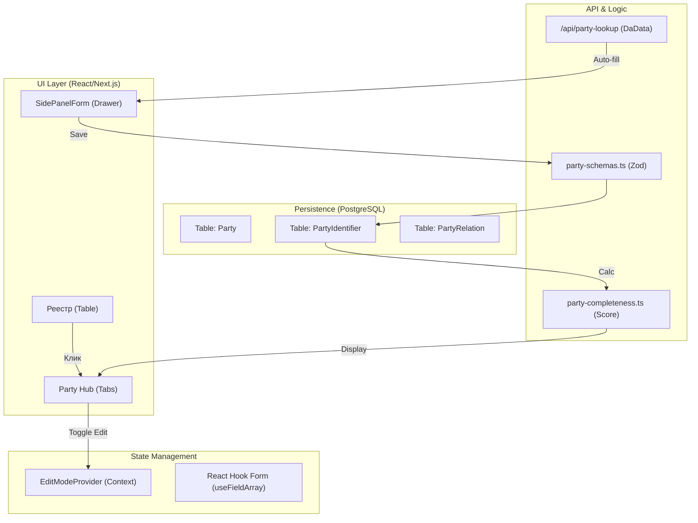

# Экран: Реестр и Карточка Контрагента (`/consulting/crm/counterparties`)

## 0. Статус и Версия

- **Статус:** PRODUCTION READY (Institutional Grade 10/10)
- **Версия:** 2.0.0 (Refactored)
- **Дата последнего обновления:** 2026-02-28
- **Соответствие канону:** [DESIGN_SYSTEM.md](file:///root/RAI_EP/docs/03_PRODUCT/UI_UX/DESIGN_SYSTEM.md) v2.0 (B, C, J patterns)

---

## 1. Функциональная роль

Единый хаб управления институциональными субъектами (Party). Модуль обеспечивает строгий учет иерархии холдингов, юридических лиц и их связи с операционными активами (Farms/Fields).

### Ключевые принципы:
- **Separation of Concerns:** Контрагент (Party) и Актив (Asset) — разные сущности, связанные через роли (`AssetPartyRole`).
- **Jurisdiction-Aware:** Набор реквизитов и правил валидации зависит от юрисдикции (RU, BY, KZ).
- **Audit-Ready:** Каждое поле поддерживает режим View/Edit и систему оценки полноты профиля.

---

## 2. Архитектура UI (Tabs & Hierarchy)

### Реестр (`/consulting/crm/counterparties`)
- **Вид:** Компактная таблица с фильтрацией по типу, статусу, риску и ответственному.
- **Completeness Indicator:** Отображение процента заполнения карточки прямо в списке.
- **Short Name Branding:** В списке используется сокращенное наименование объекта.

### Карточка (`/consulting/crm/counterparties/:id`)
Использует систему вкладок для декомпозиции данных:

1.  **Профиль:** Основные данные, ИНН, Юрисдикция. Содержит баннер полноты данных.
2.  **Реквизиты:** Специфические для юрисдикции поля (КПП, ОГРН, БИН и др.).
3.  **Банковские счета:** Табличный вид + Drawer для CRUD. Поддержка валют и признака основного счета.
4.  **ЛОПР / Контакты:** Таблица лиц, принимающих решения, с историей полномочий (`validFrom/To`).
5.  **Структура:** 
    *   **Корпоративная структура:** Связи Party-to-Party (Холдинги, Дочерние общества).
    *   **Операционные активы:** Связи Party-to-Asset (Владение/Аренда полей и ферм).
    *   **Графовый превью:** Плейсхолдер Graph Engine v2.

---

## 3. Инженерные паттерны (Institutional Grade)

### B-Pattern: View / Edit Mode
- Все поля обернуты в `DataField`.
- Переключение через глобальный `EditModeProvider` в шапке карточки.
- В `ViewMode` интерфейс максимально чист: только текст и метки, без input-рамок.

### C-Pattern: Tabular Scalability
- Вместо карточек используются таблицы.
- **Drawers (SidePanelForm):** Все формы добавления/редактирования элементов списков вынесены в боковые панели.
- **Empty States:** Каноничные заглушки с иконками и CTA.

### J-Pattern: Profile Completeness
- Универсальная утилита `calculatePartyCompleteness` проверяет обязательные поля.
- В шапке отображается красный список незаполненных полей в режиме предупреждения.
- Валидация Zod синхронизирована с UI-подсказками.

---

## 4. Схема потоков данных (Data Flow)

---

## 5. API-контракты

- `GET /api/parties`: Реестр с фильтрами и `completenessScore`.
- `GET /api/parties/:id/workspace`: Полный агрегат данных для всех вкладок.
- `POST /api/party-lookup`: Автозаполнение по ИНН (RU/BY/KZ).
- `PATCH /api/parties/:id`: Частичное обновление через детерминированные DTO.

---

## 6. Чек-лист готовности (Definition of Done)

- [x] Поля `legalName`, `shortName`, `inn`, `jurisdictionId` обязательны.
- [x] Использование `shortName` в хлебных крошках и хедерах.
- [x] Наличие `Empty State` для всех таблиц.
- [x] Кнопка `Сохранить` — единственная Primary на экране редактирования.
- [x] Работает `Automatic Identification` (DaData).

---
*Lead Architecture: Antigravity UI Engine*  
*Ref: RAI-UI-PARTIES-2026*
