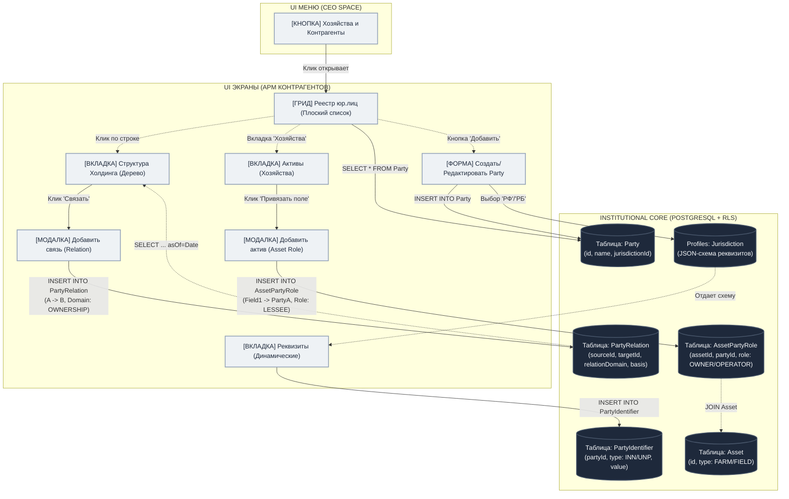

# PARTY MANAGEMENT UX FLOW & ARCHITECTURE

## ВВЕДЕНИЕ
Настоящий документ описывает связь между архитектурным контрактом `Party Management` (разработанным по принципу Jurisdiction-Aware Institutional Core) и пользовательским интерфейсом модуля "Хозяйства и Контрагенты" в CEO Space. 

Схема визуализирует, как элементы UI проецируются на строгую графовую и реляционную структуру данных.

---

## ВИЗУАЛИЗАЦИЯ СВЯЗИ UI <-> БАЗА ДАННЫХ

---

## ДЕТАЛИЗАЦИЯ UX-СЦЕНАРИЕВ

Ниже описано, как именно пользовательский интерфейс проецирует действия в утвержденный нами контракт.

### 1. Добавление нового юрлица (Party)
*   **UX Действие:** Пользователь нажимает «Добавить контрагента».
*   **UX Шаг 1:** Появляется выпадающий список `Юрисдикция` (обязательный шаг). Пользователь выбирает «РФ».
*   **Под капотом:** Бэкенд отдает схему, и UX динамически отрисовывает инпуты: `ИНН`, `КПП`, `ОГРН`. Если бы выбрал «РБ», появился бы только `УНП`.
*   **Связь с БД:** Создается запись в таблице `Party` и несколько записей в таблице `PartyIdentifier`.

### 2. Выстраивание холдинга (Relation)
*   **UX Действие:** Пользователь открывает карточку «АгроХолдинг Звезда». Переходит на вкладку `Структура`.
*   **UX Шаг 1:** Нажимает «Добавить дочернюю компанию». Выбирает из справочника «Колхоз Рассвет».
*   **UX Шаг 2:** Система просит указать роль (Домен) и долю. Пользователь выбирает «Собственность (OWNERSHIP)» и указывает «51%».
*   **UX Шаг 3:** Система (опционально) просит `basisDocumentId` — скан решения учредителей.
*   **Связь с БД:** Идет запись в `PartyRelation`. Проверяется инвариант на отсутствие циклов (чтобы "Рассвет" случайно не владел "Звездой").

### 3. Привязка хозяйства (Asset)
*   **UX Действие:** В карточке «Колхоз Рассвет» (Party) пользователь открывает вкладку `Активы/Хозяйства`.
*   **UX Шаг 1:** Нажимает «Привязать хозяйство». Выбирает из реестра хозяйств «Поле №15».
*   **UX Шаг 2:** Выбирает роль отношения: `Арендатор (LESSEE)`.
*   **UX Шаг 3:** Указывает срок действия аренды (`validFrom` ... `validTo`).
*   **Связь с БД:** Создается запись в `AssetPartyRole`. Никакого `operatinPartyId` в самой таблице `Farm` не перезаписывается. Аренда юридически зафиксирована во времени.

---

## КАК ЭТО ЛОЖИТСЯ НА БОКОВОЕ МЕНЮ 

Твое левое меню остается абсолютно таким же:
1.  **Обзор** (Дашборд).
2.  **Хозяйства и Контрагенты** — Это точка входа в Реестр `Party` и Реестр `Asset`.
3.  **Планы Урожая / Техкарты Урожая** — Создание документов. При выборе контрагента в этих документах, бэкенд будет подтягивать только тех, кто имеет нужную юрисдикцию или роль по графу `PartyRelation`.
4.  **Исполнение Техкарт** — Выставленные инвойсы будут закидываться в Ledger, строго опираясь на правила из профиля юрисдикции `Party` на дату `asOf`.
