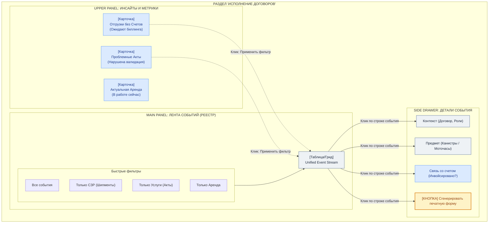

# FULFILLMENT UX ARCHITECTURE (ИСПОЛНЕНИЕ ДОГОВОРОВ / ЛЕНТА СОБЫТИЙ)

## ВВЕДЕНИЕ
Раздел «Исполнение договоров» (Fulfillments) — это ядро операционного контроля. Здесь фиксируются все физические и юридические факты реального мира: отгрузка товара, оказание услуг, факт отработки арендованной техники.

С точки зрения UX, этот раздел не может быть просто скучной таблицей, потому что он выполняет две разные функции:
1. **Операционный контроль (Дашборд)** — понимать, "где мы сейчас", что отгружено, что не закрыто документально.
2. **Аудиторский след (Реестр)** — строгий список всех событий (`FulfillmentEvent`) для сквозного поиска и генерации инвойсов.

Поэтому UX строится как **Комбинированный Master-Detail View (Реестр + Инсайты)**.

---

## ВИЗУАЛИЗАЦИЯ UX-ЛОГИКИ (РЕЕСТР + ДАШБОРД)

---

## 3. ДЕТАЛЬНЫЙ РАЗБОР UX

Как именно это будет выглядеть на экране:

### БЛОК 1: Визуальные Инсайты (Мини-Дашборд наверху)
Это не полотно графиков, а 3-4 ключевые "живые" цифры-карточки (Widgets) над основной таблицей.
**Смысл:** Дать кладовщику или агроному точку фокусировки.
- *Виджет 1:* "Неотфактурованные акты (12 шт)" (События есть, а Invoice еще не выставили. Деньги зависли!). При клике таблица внизу фильтруется только по ним.
- *Виджет 2:* "Отгрузки без Честного Знака (2 шт)". (Regulatory Profile заблокировал закрытие).

### БЛОК 2: Универсальный Реестр (Лента Событий)
Под дашбордом идет мощная, плоская таблица (Data Grid).
Поскольку в архитектуре `FulfillmentEvent` унифицирован, в одной таблице мирно соседствуют отгрузка химии и акт по аренде.
**Колонки таблицы:**
- `Дата` (Когда произошло)
- `Событие` (Тип: Shipment, Service, Lease Reading)
- `Договор` (Ссылка на рамку)
- `Контрагент` (Вторая сторона)
- `Сумма/Объем`
- `Статус` (Draft, Signed, Invoiced)

**Ключевая фишка UI (Табы над таблицей):**
Чтобы не пугать пользователя мешаниной, над таблицей делаются быстрые табы (Tabs):
`[Все] [Товарные отгрузки] [Услуги] [Аренда]`
Выбираешь "Аренда" — таблица на лету отфильтровывает только факты работы техники.

### БЛОК 3: Выезжающая панель (Drawer / Side Panel)
Когда пользователь кликает на строку в реестре, вместо перехода на новую страницу, справа выезжает шторка (Drawer).
**Что внутри:**
- Полная детализация события (что конкретно отгрузили или сколько часов намотал трактор).
- **Связь с Инвойсом:** Статус "Счет выставлен (ссылка на Invoice #123)" или кнопка "Создать Инвойс".
- **Связь с Договором:** Быстрый переход к рамке.
- **Документальное подтверждение:** Ссылка на прикрепленный скан или кнопка генерации печатной формы (PDF ТТН или Акта).

---

## ПОЧЕМУ ТАКОЙ UX - ЭТО CANON?
1. **Высокая плотность данных:** Таблица дает возможность быстрой фильтрации и пакетного выделения (например, выделить галочками 10 событий за месяц -> нажать кнопку "Сформировать сводный Инвойс").
2. **Оперативный фокус:** Карточки дашборда сверху сразу подсвечивают проблемы (не закрыто, нет счета, грязные данные).
3. **Без потери контекста:** Выезжающая шторка позволяет просматривать детали актов, не уходя со списка. Это экономит агроному/бухгалтеру часы жизни.
