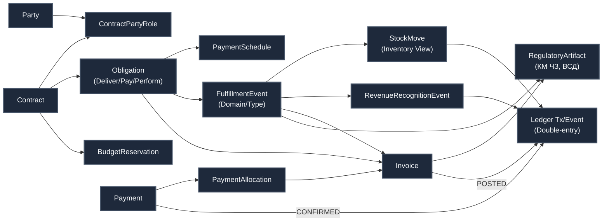

# THE COMMERCE & PARTY INTEGRATION MATRIX
*(Матрица влияния нового коммерческого движка на глобальную архитектуру RAI Enterprise)*

## ВВЕДЕНИЕ
Мы только что спроектировали модули **Party Management** (Контрагенты, Хозяйства, Роли, Юрисдикции) и **Commerce** (Договоры, Исполнение договоров, Документы, Оплаты).
Это не просто изолированные кнопки в меню «Управление Урожаем». Это — **институциональное ядро (Institutional Core)**, которое своими щупальцами проникает практически в каждый раздел `00_MASTER_MENU_MAP.md`. 

Ниже показано, как "вновьсоздаваемый движок" питает всю остальную платформу.

---

## 0. АРХИТЕКТУРА ЯДРА (ENTITY GRAPH)
*Базовая схема передачи данных от справочника до финансовой транзакции в Ledger.*

---

## 1. БЛОК: УПРАВЛЕНИЕ УРОЖАЕМ (`/consulting/*`)
*Здесь движок выступает как главный поставщик фактов для агрономов и менеджеров.*

*   **CRM (Хозяйства и Контрагенты)**: Это витрина (UI) поверх нашего `Party Management`. Все иерархии (Холдинг -> Юрлицо -> Хозяйство) живут в таблице `Party` и связях `PartyRelation`.
*   **Исполнение: агроном / менеджер (`/execution`)**: Когда агроном списывает удобрения на поле, создается `FulfillmentEvent (Domain: PRODUCTION)`. Когда менеджер отгружает урожай клиенту — это `FulfillmentEvent (Domain: COMMERCIAL)`. Строгое разделение доменов гарантирует, что производственные списания не смешаются с коммерческими актами.
*   **Бюджеты (`/budgets`)**: Бюджет хозяйства проактивно защищен через механизм **`BudgetReservation`**. Создание расходного `Contract` (закупка СЗР) резервирует (замораживает) сумму бюджета _до_ выставления `Invoice`, блокируя перерасход в режиме реального времени.

---

## 2. БЛОК: ФИНАНСЫ (`/finance/*`)
*Для финансистов наш модуль — это Альфа и Омега. Весь блок Финансов строится поверх наших таблиц.*

*   **Cashflow (ДДС - Движение денежных средств)**: 
    *   *План* строится на базе **`PaymentSchedule`** (1..n строк с датами, %, суммами), привязанного к `Contract` или `Invoice`. Это делает ДДС предсказуемым и нечувствительным к частичным поставкам.
    *   *Факт* базируется исключительно на слое `Payment` и `PaymentAllocation`.
*   **Invoices (Взаиморасчеты)**: Бухгалтерия работает напрямую в спроектированном нами узле **[Документы (Счета, Акты, ТТН, AR/AP)]**.
*   **Performance (P&L - Прибыли и убытки)**: Выручка и себестоимость признаются не жестко "по событию", а через **`RevenueRecognitionEvent`** на основании `recognitionPolicyId` в RegulatoryProfile. Это развязывает руки для разных методов учета (по отгрузке, по переходу права собственности, услуги распределенные во времени).

---

## 3. БЛОК: ПРОИЗВОДСТВО (`/production/*`)
*Логистика и склады полностью сидят на рельсах Исполнения (Fulfillment).*

*   **Закупки (`procurement`)**: Тендерные процедуры завершаются созданием записи в таблице `Contract`, которая генерирует `Obligation` (обязательство поставить).
*   **Склады (`storage`)**: Движение ТМЦ (партии, сроки годности, UOM, пересчеты) вычислимо поверх `FulfillmentEvent` через строгую view-model сущность **`StockMove`** (`itemId`, `uom`, `qty`, `fromLocation`, `toLocation`, `batchId`). `FulfillmentEvent` не становится "бог-сущностью", оставаясь чистым бизнес-фактом.
*   **Логистика (`logistics`)**: Перемещение зерна с элеватора в порт — это серия `FulfillmentEvent (Domain: LOGISTICS)` с привязкой логистического `Asset` (Зерновоз) и заполнением ролей `ContractPartyRole` (Перевозчик).

---

## 4. БЛОК: GR И КОМПЛАЕНС (`/gr/*`)
*Налоговые и регуляторные движки тесно переплетены с коммерцией.*

*   **Compliance (`compliance`)**: Юристы здесь задают правила (RegulatoryProfile), которые превращают регуляторные требования в *данные*, а не if-else в коде. Порождаются **`RegulatoryArtifact`** (например: payload Честного Знака, код ФГИС "Зерно") и **`ProductTaxCode`**, жестко привязанные к `FulfillmentEvent` или `Invoice`.
*   **Contracts (`contracts`)**: GR-подразделение мониторит здесь сделки с повышенным риском, основываясь на связях `PartyRelation` (нет ли аффилированности между Seller и Buyer).

---

## 5. БЛОК: ЭКОНОМИКА (`/economy/*`)
*Экономисты парсят данные нашего движка для аналитики.*

*   **Unit (Юнит-экономика)**: Чтобы посчитать точную стоимость выращивания 1 тонны пшеницы на Поле №5, экономический модуль суммирует все `FulfillmentEvent` (амортизация техники, стоимость списанных СЗР по `Invoices`) в привязке к этому полю (через `AssetId`).
*   **Aggregation (Консолидация)**: Детерминированная элиминация внутригрупповых оборотов. Система опирается на формализованную функцию `isIntercompany(sellerPartyId, buyerPartyId, asOf)`, которая возвращает `true`, если оба узла принадлежат RAI Holding по отношению `OWNERSHIP` на указанную дату. Это делает аудит прозрачным и математически точным.

---

## ВЫВОД (АРХИТЕКТУРНЫЙ ИМПАКТ)
Созданное нами ядро: `Party` → `Contract` → `Obligation` → `Fulfillment` → `Invoice` → `Payment` — это **неразрывный позвоночник ERP-системы**. 

*Важное разграничение зон ответственности:* **CRM и Commerce хранят бизнес-документы (намерения и факты операций), а Ledger хранит исключительно неизменяемые финансовые и контрольные события (double-entry), со строгими ссылками на первичные документы.**

Оно избавляет архитектуру от "спагетти-кода", когда склады, финансы и агрономы ведут свои собственные реестры, исключая двойной учёт и споры о том, "где истина".
