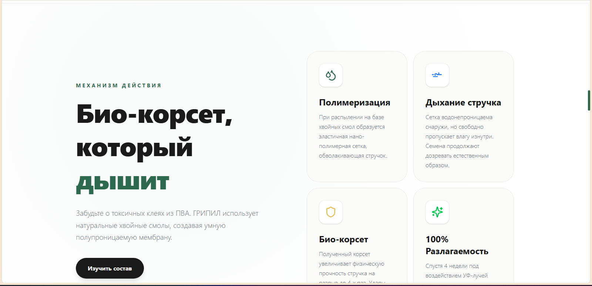

# ТЗ на дизайн и внедрение фронтенда: ГРИПИЛ

## CLAIM
id: CLAIM-GRIPIL-002
status: asserted
verified_by: manual
last_verified: 2026-03-25

Этот блядский документ детализирует конкретную реализацию интерфейса и архитектуры сайта ГРИПИЛ. Он является техническим контрактом для дизайнера (Figma) и фронтенд-команды (Next.js/React).

## 1. Вводные для команды
**Основа:** JTBD-спецификация в `docs/02_PRODUCT/GRIPIL_WEBSITE.md`.
**Суть:** Премиальный B2B сайт для агрорынка. Выглядит дорого, работает моментально. Строгий отказ от стоковых векторов — только живой фотореализм и осмысленный моушен.
**Форм-фактор:** Адаптивный Single/Multi-page Landing.

---

## 2. Дизайн-система (UI Kit)

### Цветовая палитра
- **Primary (Конверсия):** `Golden Seed` (`#E5C058`). Исключительно для CTA и акцентов ценности (иконки, результат в калькуляторе).
- **Secondary (Технология):** `Agro Graphite` (`#1A1D20`). Цвет текста, подложек блоков с характеристиками.
- **Surface (Экология):** `Natural Green` (`#2D6A4F`). Градиенты, фоны для блоков про растение.
- **Backgrounds:** Глубокий белый/светло-серый (`#F9F9F9`) для читаемости, и черный (`#000000`) для премиальных темных блоков.

### Типографика
- **Headers (H1-H4):** `Inter` или `Outfit` (Bold/ExtraBold) — массивные, читаемые, уверенные.
- **Body:** `Inter` (Regular/Medium) — фокус на читаемости для суровых агрономов.
- Поддержка оптического выравнивания и строгого `line-height` (`1.2` для заголовков, `1.6` для текста).

---

## 3. Компонентная структура (Frontend Contract)

Фронтенду собирать атомарно. Обязательные независимые компоненты:

1. `HeroSection`: Полный экран, видео/фото фон на Absolute, жирный заголовок, две CTA-кнопки (Primary и Secondary).
2. `SplitComparisonViewer`: Кастомный компонент. Два сложенных `div` с картинками рапса (целый и рассыпанный). Ползунок через `framer-motion` для управления свойством `clip-path` верхнего слоя.
3. `YieldCalculator`: Важнейший интерактивный компонент.
   - 3 Range-слайдера (Площадь, Урожайность, Процент потерь).
   - 1 Number Input (Цена).
   - Динамический вывод: `AnimatedCounter` (бегущие цифры рублей).
4. `BenefitCard`: Микро-анимация при `hover` (переход тени из 0 в `lg`, мягкий `ease-out`).
5. `FAQAccordion`: Сворачиваемые блоки с вопросами с плавной анимацией высоты.

---

## 4. Карта экранов и Скролл-Механика

**Архитектура верстки:** Главная страница строится как линейная стори-линия.

* `[0-100vh]`: **Hero.** Фиксированный фон. Скролл уводит контент вверх, фон плавно затемняется (`opacity`).
* `[100-200vh]`: **Проблема.** Горизонтальный скролл (GSAP ScrollTrigger `.pin`) фотографий осыпавшегося рапса.
* `[200vh]`: **Сравнение (Split-Screen).** Занимает 90vh, залипает в центре. Пользователь дергает ползунок.
* `[300vh]`: **Механика работы.** Sticky-картинка стручка слева, текст скроллится справа.
* `[400vh]`: **Калькулятор.** Темная тема (переход цвета фона `transition-colors duration-700`). Золотые акценты.
* `[500vh]`: **Экология.** Огромное фото пчелы на рапсе (`object-cover`). Белый текст поверх.
* `[600vh]`: **FAQ.** Стандартный блок, аккордеон.
* `[700vh]`: **Оффер / Футер.** Форма заявки на черном фоне.

---

## 5. Моушен и Анимация (Strict Rules)

- **Библиотеки:** Используем GSAP для привязки к скроллу (фрейминги, горизонтальные секции, параллакс) и `Framer Motion` для микроинтеракций (появление блоков, hover-состояния).
- **Easing:** Везде используем плавные кубические безье, например `cubic-bezier(0.25, 1, 0.5, 1)`. Никакой линейной хуйни.
- **Производительность:** Анимируем ТОЛЬКО `transform` (GPU-ускорено: `translate3d`, `scale`) и `opacity`. Никаких анимаций ширины, высоты или теней у больших контейнеров, чтобы не было ебучих фризов (re-layouts).

---

## 6. Требования к разработке (Next.js Setup)

1. **State Management:** Локальный стейт React (Zustand для калькулятора опционально, но скорее хватит `useState`).
2. **SSR / SSG:** Лендинг полностью генерируется статически. Форма отправляется через Server Actions.
3. **Оптимизация ассетов:**
   - Все тяжелые фото рапса конвертировать в WebP.
   - Использовать `next/image` с `priority` для первого экрана и с `loading="lazy"` для остальных.
   - Если будет видео-фон в Hero — сжать до 1 MB, формат MP4/WebM, без звука, `playsinline loop muted autoplay`.
4. **Стилистика кода:** Tailwind CSS с утилитарным подходом, но сложные компоненты (типа кастомного ползунка) выносить в `@apply` в `globals.css` или CSS-модули.

---

## 7. Инструкция для Дизайнера (Delivery)

- Передавать макеты в Figma.
- Обязательно подготовить мобильные версии 390px, планшетные 768px и десктопные 1440px.
- Все иконки экспортировать как чистый SVG (оптимизировать через SVGO).
- Ассеты, которые требуют параллакса, отдавать многослойно (разные слои для фона, среднего плана и переднего плана).
- Предоставить UI Kit страницу с описанием всех состояний кнопок (hover, focus, disabled).
