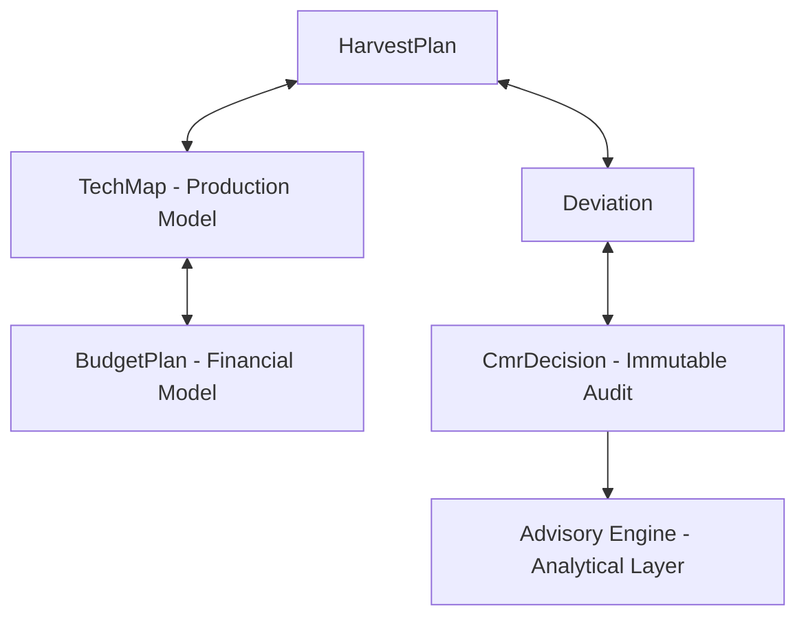

# 🧭 MASTER PLAN — RAI Consulting IA Expansion

## Текущий статус (Baseline)
Уже реализовано:
- [x] HarvestPlan FSM
- [x] Deviation FSM
- [x] Immutable CmrDecision
- [x] DomainRules
- [x] RBAC
- [x] Season + Company isolation
- [x] Optimistic locking

**Это Consulting Core v1.**

---

## 🟦 TRACK 1 — TechMap Integration (Production Gate) [DONE]
**Цель:** Сделать TechMap обязательным производственным контуром для активации Harvest Plan. Нельзя перевести план в ACTIVE без валидной TechMap.

### Фаза 1 — Data Layer
- [x] Добавить / проверить модель `TechMap`:
    - `id`, `planId`, `seasonId`, `companyId`
    - `status` (DRAFT | APPROVED | ACTIVE | ARCHIVED)
    - `crop`, `fieldId`
    - `operations[]`, `resourceNorms[]`
    - `approvedAt`
- [x] Ограничения:
    - `planId + seasonId + companyId` (Unique)
    - Один `ACTIVE` TechMap на план

### Фаза 2 — TechMap FSM
- [x] Реализовать переходы: `DRAFT` → `REVIEW` → `APPROVED` → `ACTIVE` → `ARCHIVED`
- [x] RBAC:
    - `CREATE`: MANAGER
    - `APPROVE`: CEO / ADMIN
    - `ACTIVATE`: CEO / ADMIN

### Фаза 3 — Интеграция в DomainRules
In `ConsultingDomainRules.canActivate(planId)`:
- [x] Проверка наличия `ACTIVE` TechMap
- [x] Проверка отсутствия `CRITICAL` Deviations
- [x] Проверка статуса `APPROVED`
- [x] Если TechMap отсутствует → `ForbiddenException`

### Фаза 4 — Контроллеры
- [x] `POST /consulting/techmaps`
- [x] `PATCH /consulting/techmaps/:id/transition`
- [x] `GET /consulting/techmaps`

### Фаза 5 — Тесты
- [x] Нельзя активировать план без `ACTIVE` TechMap
- [x] Нельзя иметь 2 ACTIVE TechMap для одного fieldId + crop + seasonId + companyId
- [x] Негативные сценарии RBAC
- [x] Season isolation

**Итог Track 1:** HarvestPlan становится зависимым от Production Model.

---

## 🟩 TRACK 2 — Budget Vertical Slice
**Цель:** Добавить финансовый управленческий контур. Связка: `HarvestPlan` ↕ `TechMap` ↕ `BudgetPlan`.

### Фаза 1 — Budget Data Model
- [x] `BudgetPlan`:
    - `id`, `planId`, `seasonId`, `companyId`
    - `totalBudget`
    - `status` (DRAFT | APPROVED | LOCKED | EXECUTING | CLOSED)
- [x] `BudgetItem`:
    - `id`, `budgetId`
    - `category` (SEEDS | FERTILIZER | FUEL | LABOR)
    - `plannedAmount`, `actualAmount`, `deviation`

### Фаза 2 — Budget FSM
- [x] Реализовать переходы: `DRAFT` → `APPROVED` → `LOCKED` → `EXECUTING` → `CLOSED`
- [x] `LOCKED` = нельзя менять `plannedAmount`
- [x] `EXECUTING` = допускается фиксация факта

### Фаза 3 — Интеграция с HarvestPlan
- [x] При `APPROVED` → `ACTIVE` проверять существование `LOCKED` BudgetPlan

### Фаза 4 — Budget Deviations
- [x] Если `actualAmount > plannedAmount` → Создавать Deviation с типом `FINANCIAL_DEVIATION`
- [x] Логировать в `CmrDecision`

### Фаза 5 — API
- [x] `POST /consulting/budgets`
- [x] `PATCH /consulting/budgets/:id/transition`
- [x] `GET /consulting/budgets`

### Фаза 6 — Тесты
- [x] Нельзя активировать план без `LOCKED` бюджета
- [x] Финансовые отклонения создаются автоматически
- [x] Isolation
- [x] Optimistic locking

**Итог Track 2:** Вы получаете управляемый финансовый контур. [DONE]

---

## 🔷 TRACK 3 — Advisory Engine поверх CmrDecision
**Цель:** Создать аналитический слой над audit trail. Rule-based аналитика (не ML пока).

### Фаза 1 — AdvisoryService
- [x] `analyzePlan(planId)`
- [x] `analyzeSeason(seasonId)`
- [x] `analyzeCompany(companyId)`

### Фаза 2 — Базовые правила
- [x] 1. **Частота критических отклонений**: Если > 3 CRITICAL за 30 дней → Warning.
- [x] 2. **Среднее время закрытия Deviation**: > X дней → Efficiency alert.
- [x] 3. **Повторяющиеся решения**: → Pattern detection.

### Фаза 3 — AdvisoryRecord (read-only)
- [x] Генерация `AdvisoryResponseDTO` динамически (в памяти Strategic Read-Model)

### Фаза 4 — API
- [x] `GET /strategic/advisory/plan/:id`
- [x] `GET /strategic/advisory/company/:id`

### Фаза 5 — UI
- [x] Блок "Рекомендации Advisory" (Frontend)

**Итог Track 3:** Платформа начинает не только фиксировать решения, но и анализировать их. [DONE]

---

## 🔷 Общий порядок реализации
1. **TechMap Integration** (Потому что TechMap усиливает DomainRules)
2. **Budget Vertical Slice** (Потому что Budget зависит от TechMap)
3. **Advisory Engine** (Потому что Advisory требует данных)

## 🧠 Финальная архитектурная картина

**Это уже: Полноценная Enterprise Consulting IA Platform.**
