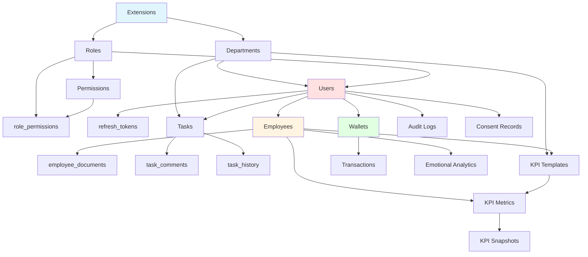

# MatrixGin v2.0 - Database Migrations Overview

> **Полный обзор PostgreSQL миграций для MatrixGin v2.0**

---

## 📋 Содержание

- [Статистика](#статистика)
- [Список миграций](#список-миграций)
- [Схема зависимостей](#схема-зависимостей)
- [Партиционирование](#партиционирование)
- [Индексы и оптимизация](#индексы-и-оптимизация)
- [Triggers и Functions](#triggers-и-functions)
- [Seed данные](#seed-данные)

---

## 📊 Статистика

### Общая информация

| Метрика | Значение |
|---------|----------|
| **Миграций** | 14 |
| **Seed файлов** | 4 |
| **Таблиц** | 20 |
| **Партиционированных таблиц** | 4 |
| **Партиций (2025)** | 52 |
| **Индексов** | 60+ |
| **Constraints** | 30+ |
| **Triggers** | 8 |
| **Functions** | 6 |
| **Views** | 1 |

### Размер данных (оценка)

| Таблица | Тип | Ожидаемый размер (1 год) |
|---------|-----|--------------------------|
| `audit_logs` | Партиционированная | ~10 GB |
| `transactions` | Партиционированная | ~5 GB |
| `emotional_analytics` | Партиционированная | ~2 GB |
| `task_history` | Партиционированная | ~3 GB |
| `tasks` | Обычная | ~500 MB |
| `users` | Обычная | ~100 MB |
| Остальные | Обычные | ~1 GB |
| **ИТОГО** | | **~21.6 GB** |

---

## 📝 Список миграций

### 1. Extensions (20250121000001)

**Цель:** Инициализация PostgreSQL расширений

**Расширения:**
- `uuid-ossp` - Генерация UUID
- `pgcrypto` - Криптографические функции
- `ltree` - Иерархические структуры
- `pg_trgm` - Полнотекстовый поиск

**Зависимости:** Нет

---

### 2. Roles Table (20250121000002)

**Цель:** Создание таблицы ролей для RBAC

**Таблицы:**
- `roles` - Роли пользователей

**Особенности:**
- Иерархия уровней (0-100)
- Trigger для `updated_at`
- Валидация имени роли (snake_case)

**Зависимости:** Extensions

---

### 3. Departments Table (20250121000003)

**Цель:** Создание таблицы департаментов с иерархией

**Таблицы:**
- `departments` - Департаменты компании

**Особенности:**
- Ltree для иерархии
- Материализованный путь
- Trigger для автообновления пути
- Self-referencing foreign key

**Зависимости:** Extensions

---

### 4. Users Table (20250121000004)

**Цель:** Основная таблица пользователей

**Таблицы:**
- `users` - Пользователи системы

**Особенности:**
- Email + password authentication
- Telegram integration
- Full-text search (GIN index)
- Soft delete
- Email/phone validation
- Foreign key к `departments.head_id` (добавляется в этой миграции)

**Зависимости:** Roles, Departments

---

### 5. Permissions Tables (20250121000005)

**Цель:** Разрешения и связь с ролями

**Таблицы:**
- `permissions` - Разрешения
- `role_permissions` - Many-to-many связь

**Особенности:**
- Resource + Action модель
- Уникальность (resource, action)
- Каскадное удаление

**Зависимости:** Roles

---

### 6. Refresh Tokens Table (20250121000006)

**Цель:** JWT refresh токены

**Таблицы:**
- `refresh_tokens` - Refresh токены

**Особенности:**
- SHA-256 hash токена
- Metadata (IP, User-Agent)
- Expiration tracking
- Index для cleanup

**Зависимости:** Users

---

### 7. Employees Table (20250121000007)

**Цель:** Расширенная информация о сотрудниках

**Таблицы:**
- `employees` - Сотрудники

**Особенности:**
- One-to-one с `users`
- Автогенерация `employee_number` (EMP000001)
- Sequence для номеров
- Self-referencing для менеджеров
- Rank и employment type enums

**Зависимости:** Users

---

### 8. Employee Documents Table (20250121000008)

**Цель:** Кадровые документы

**Таблицы:**
- `employee_documents` - Документы сотрудников

**Особенности:**
- КЭДО (электронная подпись)
- JSONB metadata
- GIN index для metadata
- Document type enum

**Зависимости:** Employees

---

### 9. Tasks Tables (20250121000009)

**Цель:** Smart Task Management

**Таблицы:**
- `tasks` - Задачи
- `task_comments` - Комментарии
- `task_history` - История (партиционировано)

**Особенности:**
- Full-text search
- Tags (array)
- JSONB metadata (NLP results)
- MC rewards
- Партиционированная история (12 партиций на 2025)
- Composite indexes

**Зависимости:** Users, Departments

---

### 10. KPI Tables (20250121000010)

**Цель:** KPI и аналитика

**Таблицы:**
- `kpi_templates` - Шаблоны KPI
- `kpi_metrics` - Метрики сотрудников
- `kpi_snapshots` - Снимки (партиционировано)

**Особенности:**
- Вычисляемое поле `achievement_percentage` (GENERATED ALWAYS AS)
- Партиционирование по кварталам для snapshots
- Calculation formulas
- Period-based metrics

**Зависимости:** Employees, Departments

---

### 11. Economy Tables (20250121000011)

**Цель:** MatrixCoin экономика

**Таблицы:**
- `wallets` - Кошельки (MC + GMC)
- `transactions` - Транзакции (партиционировано)

**Особенности:**
- Автосоздание кошелька при регистрации (trigger)
- Автообновление балансов при транзакциях (trigger)
- Safe mechanism (заморозка MC)
- Партиционирование транзакций по месяцам (12 партиций на 2025)
- Проверка баланса в trigger

**Зависимости:** Users

---

### 12. Compliance Tables (20250121000012)

**Цель:** Юридическое соответствие

**Таблицы:**
- `audit_logs` - Журнал аудита (партиционировано)
- `consent_records` - Согласия 152-ФЗ

**Особенности:**
- Партиционирование audit_logs по месяцам (12 партиций на 2025)
- Request tracing (request_id)
- Severity levels
- JSONB changes tracking
- Consent versioning

**Зависимости:** Users

---

### 13. Emotional Analytics Table (20250121000013)

**Цель:** Эмоциональная аналитика

**Таблицы:**
- `emotional_analytics` - Эмоциональный анализ (партиционировано)

**Views:**
- `v_employee_emotional_state` - Средний эмоциональный тон за 30 дней

**Особенности:**
- Tone score (0.0-4.0 по шкале Хаббарда)
- ML model versioning
- Confidence scores
- Партиционирование по месяцам (12 партиций на 2025)
- Keywords array

**Зависимости:** Employees

---

### 14. Utility Functions (20250121000014)

**Цель:** Вспомогательные функции

**Functions:**
- `create_monthly_partitions()` - Создание партиций
- `drop_old_partitions()` - Удаление старых партиций
- `get_user_permissions()` - Получить разрешения пользователя
- `user_has_permission()` - Проверить разрешение
- `calculate_employee_tenure()` - Рассчитать стаж
- `get_department_hierarchy()` - Получить иерархию департамента

**Зависимости:** Все предыдущие таблицы

---

## 🔗 Схема зависимостей



---

## 🗂️ Партиционирование

### Партиционированные таблицы

| Таблица | Стратегия | Период | Партиций (2025) | Retention |
|---------|-----------|--------|-----------------|-----------|
| `audit_logs` | RANGE | Месяц | 12 | 24 месяца |
| `transactions` | RANGE | Месяц | 12 | Бессрочно |
| `emotional_analytics` | RANGE | Месяц | 12 | 12 месяцев |
| `task_history` | RANGE | Месяц | 12 | 24 месяца |
| `kpi_snapshots` | RANGE | Квартал | 4 | 12 месяцев |

### Автоматическое управление

```sql
-- Создать партиции на 2026 год
SELECT create_monthly_partitions('audit_logs', '2026-01-01', '2027-01-01');
SELECT create_monthly_partitions('transactions', '2026-01-01', '2027-01-01');
SELECT create_monthly_partitions('emotional_analytics', '2026-01-01', '2027-01-01');
SELECT create_monthly_partitions('task_history', '2026-01-01', '2027-01-01');

-- Удалить старые партиции (retention policy)
SELECT drop_old_partitions('audit_logs', 24);
SELECT drop_old_partitions('emotional_analytics', 12);
SELECT drop_old_partitions('task_history', 24);
```

---

## 🚀 Индексы и оптимизация

### Типы индексов

| Тип | Использование | Количество |
|-----|---------------|------------|
| **B-tree** | Primary keys, Foreign keys, Equality/Range queries | ~40 |
| **GIN** | Full-text search, JSONB, Arrays | ~10 |
| **GIST** | Ltree (иерархия) | 1 |
| **Partial** | Filtered indexes (WHERE clause) | ~9 |
| **Composite** | Multi-column queries | ~5 |

### Ключевые индексы

#### Full-text Search
```sql
-- Users
CREATE INDEX idx_users_fulltext ON users USING GIN(
    to_tsvector('russian', coalesce(first_name, '') || ' ' || ...)
);

-- Tasks
CREATE INDEX idx_tasks_fulltext ON tasks USING GIN(
    to_tsvector('russian', coalesce(title, '') || ' ' || ...)
);
```

#### JSONB
```sql
-- Employee documents metadata
CREATE INDEX idx_employee_documents_metadata ON employee_documents USING GIN(metadata);

-- Tasks metadata (NLP results)
CREATE INDEX idx_tasks_metadata ON tasks USING GIN(metadata);
```

#### Partial Indexes
```sql
-- Active users only
CREATE UNIQUE INDEX idx_users_email ON users(email) WHERE deleted_at IS NULL;

-- Active tasks
CREATE INDEX idx_tasks_status ON tasks(status) WHERE status != 'completed';

-- Safe wallets
CREATE INDEX idx_wallets_safe ON wallets(safe_active, safe_unlock_at) 
    WHERE safe_active = TRUE;
```

#### Composite Indexes
```sql
-- Common task queries
CREATE INDEX idx_tasks_assignee_status ON tasks(assignee_id, status) 
    WHERE status IN ('pending', 'in_progress');

-- KPI queries
CREATE INDEX idx_kpi_metrics_employee_period ON kpi_metrics(
    employee_id, period_start, period_end
);
```

---

## ⚙️ Triggers и Functions

### Triggers

| Trigger | Таблица | Функция | Назначение |
|---------|---------|---------|------------|
| `trg_*_updated_at` | Все основные | `update_updated_at_column()` | Автообновление `updated_at` |
| `trg_create_wallet` | `users` | `create_wallet_for_user()` | Создание кошелька при регистрации |
| `trg_generate_employee_number` | `employees` | `generate_employee_number()` | Генерация номера сотрудника |
| `trg_update_wallet_balances` | `transactions` | `update_wallet_balances()` | Обновление балансов |
| `trg_update_department_path` | `departments` | `update_department_path()` | Обновление ltree пути |

### Functions

#### 1. `update_updated_at_column()`
```sql
-- Автоматически обновляет updated_at при UPDATE
CREATE TRIGGER trg_users_updated_at
    BEFORE UPDATE ON users
    FOR EACH ROW
    EXECUTE FUNCTION update_updated_at_column();
```

#### 2. `create_wallet_for_user()`
```sql
-- Автоматически создает кошелек при создании пользователя
CREATE TRIGGER trg_create_wallet
    AFTER INSERT ON users
    FOR EACH ROW
    EXECUTE FUNCTION create_wallet_for_user();
```

#### 3. `generate_employee_number()`
```sql
-- Генерирует уникальный номер сотрудника (EMP000001)
-- Использует sequence employee_number_seq
```

#### 4. `update_wallet_balances()`
```sql
-- Автоматически обновляет балансы при транзакции
-- Проверяет достаточность средств
-- Поддерживает MC и GMC
```

#### 5. `update_department_path()`
```sql
-- Автоматически обновляет ltree путь при изменении parent_id
-- Рассчитывает level
```

#### 6. Utility Functions
```sql
-- Управление партициями
create_monthly_partitions(table_name, start_date, end_date)
drop_old_partitions(table_name, retention_months)

-- RBAC
get_user_permissions(user_id) RETURNS TABLE(permission_name)
user_has_permission(user_id, permission_name) RETURNS BOOLEAN

-- Business Logic
calculate_employee_tenure(employee_id) RETURNS INTEGER
get_department_hierarchy(department_id) RETURNS TABLE(...)
```

---

## 🌱 Seed данные

### 1. Roles & Permissions (01_seed_roles_and_permissions.sql)

**Роли:**
- `admin` (level 100)
- `hr_manager` (level 80)
- `department_head` (level 60)
- `branch_manager` (level 50)
- `employee` (level 10)

**Разрешения:** 40+ разрешений по модулям:
- Employees (5)
- Tasks (8)
- Economy (4)
- KPI (5)
- Departments (4)
- Legal (3)
- Emotional (2)
- Social (2)
- Ethics (2)
- Admin (4)

**RBAC Matrix:** Полная матрица разрешений для всех ролей

---

### 2. Departments (02_seed_departments.sql)

**Департаменты:**
- Коммерческий (COMM) - 5,000,000₽
- Производственный (PROD) - 8,000,000₽
- Финансовый (FIN) - 2,000,000₽
- Развития (DEV) - 3,000,000₽
- Квалификации (EDU) - 1,500,000₽
- HR (HR) - 2,500,000₽
- IT (IT) - 4,000,000₽

**Итого бюджет:** 26,000,000₽

---

### 3. Test Users (03_seed_test_users.sql)

**Пользователи:**

| Email | Роль | Департамент | Должность | Зарплата |
|-------|------|-------------|-----------|----------|
| admin@photomatrix.ru | Admin | IT | Генеральный директор | 150,000₽ |
| hr@photomatrix.ru | HR Manager | HR | HR Менеджер | 80,000₽ |
| manager@photomatrix.ru | Dept Head | COMM | Руководитель | 100,000₽ |
| photographer@photomatrix.ru | Employee | PROD | Фотограф | 60,000₽ |
| sales@photomatrix.ru | Employee | COMM | Менеджер по продажам | 50,000₽ |

**Пароль для всех:** `Test123!@#`

**Особенности:**
- Автоматически созданы кошельки
- Установлены связи менеджеров
- Назначены руководители департаментов

---

### 4. Test Data (04_seed_test_data.sql)

**Задачи:** 3 задачи (in_progress, pending, completed)

**Транзакции:** Приветственные бонусы
- Admin: 1000 MC + 10 GMC
- Manager: 800 MC + 5 GMC
- Others: 500 MC

**KPI Templates:** 3 шаблона
- Количество фотосессий (PROD)
- Выручка от продаж (COMM)
- Конверсия лидов (COMM)

**KPI Metrics:** Текущие метрики для сотрудников

**Emotional Analytics:** Тестовые записи с tone scores

**Consent Records:** Согласия на обработку ПДн для всех пользователей

---

## 🔍 Проверка миграций

### Проверить все таблицы
```sql
SELECT schemaname, tablename, tableowner
FROM pg_tables
WHERE schemaname = 'public'
ORDER BY tablename;
```

### Проверить партиции
```sql
SELECT 
    parent.relname AS parent_table,
    child.relname AS partition_name,
    pg_size_pretty(pg_total_relation_size(child.oid)) AS size
FROM pg_inherits
JOIN pg_class parent ON pg_inherits.inhparent = parent.oid
JOIN pg_class child ON pg_inherits.inhrelid = child.oid
ORDER BY parent.relname, child.relname;
```

### Проверить индексы
```sql
SELECT 
    schemaname,
    tablename,
    indexname,
    indexdef
FROM pg_indexes
WHERE schemaname = 'public'
ORDER BY tablename, indexname;
```

### Проверить constraints
```sql
SELECT 
    conname AS constraint_name,
    contype AS constraint_type,
    conrelid::regclass AS table_name,
    pg_get_constraintdef(oid) AS definition
FROM pg_constraint
WHERE connamespace = 'public'::regnamespace
ORDER BY conrelid::regclass::text;
```

### Проверить triggers
```sql
SELECT 
    tgname AS trigger_name,
    tgrelid::regclass AS table_name,
    proname AS function_name,
    tgenabled AS enabled
FROM pg_trigger
JOIN pg_proc ON pg_trigger.tgfoid = pg_proc.oid
WHERE tgisinternal = FALSE
ORDER BY tgrelid::regclass::text;
```

---

## 📈 Производительность

### Ожидаемые показатели

| Операция | Время (оценка) |
|----------|----------------|
| Вставка пользователя | < 10ms |
| Создание задачи | < 15ms |
| Транзакция MC | < 20ms |
| Поиск по full-text | < 50ms |
| Запрос KPI dashboard | < 100ms |
| Audit log запись | < 5ms |

### Рекомендации

1. **Регулярное обслуживание:**
   ```sql
   VACUUM ANALYZE;
   REINDEX DATABASE matrixgin_dev;
   ```

2. **Мониторинг размера партиций:**
   ```sql
   SELECT 
       schemaname,
       tablename,
       pg_size_pretty(pg_total_relation_size(schemaname||'.'||tablename)) AS size
   FROM pg_tables
   WHERE schemaname = 'public'
   ORDER BY pg_total_relation_size(schemaname||'.'||tablename) DESC;
   ```

3. **Автоматическое создание партиций:**
   - Настроить cron job для создания партиций на будущие месяцы
   - Настроить cron job для удаления старых партиций

---

## 🎯 Следующие шаги

1. ✅ Применить миграции
2. ✅ Загрузить seed данные
3. ⏳ Интегрировать с Prisma
4. ⏳ Создать NestJS сервисы
5. ⏳ Настроить автоматическое управление партициями
6. ⏳ Настроить мониторинг производительности

---

**Версия:** 1.0  
**Дата:** 2025-01-21  
**Статус:** Production Ready ✅
