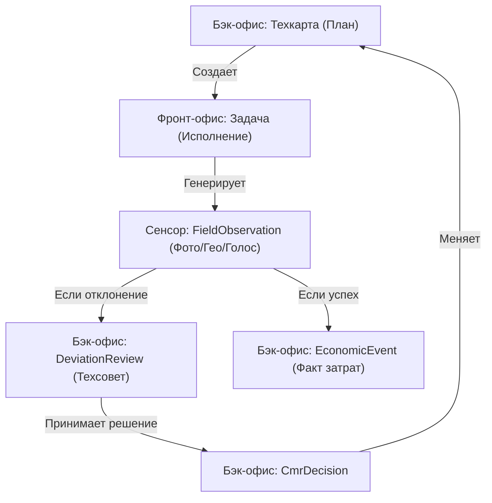

# Матрица Системной Целостности RAI_EP

Согласно принципу "Единого тела", каждая функция Фронт-Офиса (поле) должна иметь "отклик" в Бэк-Офисе (система управления).

| Функция Фронт-Офиса (Поле) | Событие (Data Flow) | Реакция Бэк-Офиса (Офис) | Модели Prisma |
| :--- | :--- | :--- | :--- |
| **Выполнение задачи** | Отправка Гео + Фото | Генерация транзакции затрат | `Task` -> `EconomicEvent` |
| **Инцидент / SOS** | Голос / Фото проблемы | Открытие тикета Техсовета | `Observation` -> `DeviationReview` |
| **Смена Исполнителя** | Переназначение в боте | Обновление кадровой нагрузки | `Task.assigneeId` -> `EmployeeProfile` |
| **Голосовой отчет** | Фиксация звонка | Пометка в истории отклонений | `Observation(Type:CALL)` -> `CmrDecision` |
| **Замер (например, Сорняки)** | Ввод цифр | Корректировка Техкарты / Заказ СЗР | `Observation` -> `MapOperation` -> `Deal` |

## Механизм сквозного контроля (Traceability)

**Результат:** Никакое действие в поле не остается "просто сообщением". Оно всегда либо подтверждает план, либо меняет его через контур управления.
